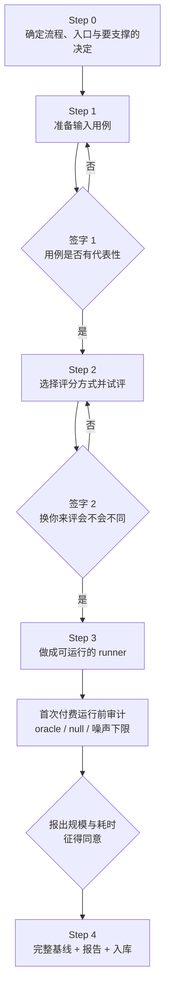
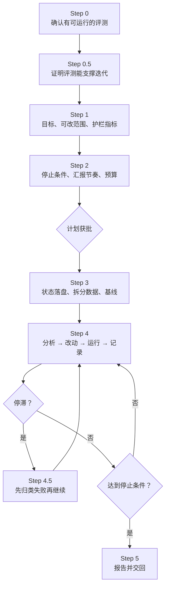
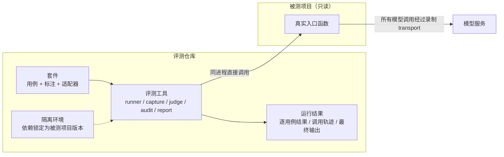

# 用 claude-api 为 AI Agent 建立评测并迭代优化

改一次 prompt、换一个模型、加一个工具之后，Agent 是变好了还是变差了？大多数团队的做法是挑几个例子手工试一试，看着差不多就上线。这种做法在 Agent 越来越复杂、调用链越来越长时很快失效：一次运行要十几次模型调用，同一输入两次结果不同，问题往往藏在没被试到的那 10% 里。

Anthropic 在 [Automating eval design and hillclimbing with Claude](https://claude.dev/blog/automating-eval-design-and-hillclimbing) 中总结了评测设计和迭代优化（hillclimbing）的原则，并把它们做进了 claude-api skill：用 `/claude-api build-eval` 为一个功能建立评测，用 `/claude-api hillclimb` 在评测上逐轮改进，并用留出集防止过拟合。

本文说明如何使用这两个流程：claude-api 是什么、如何安装和调用、它遵循哪些评测原则、build-eval 和 hillclimb 每一步做什么以及为什么，最后是在自己的项目中落地时需要注意的问题。这套流程与模型厂商无关，同样适用于运行在 Azure OpenAI 等其他平台上的 Agent。

## 目录

- [一、claude-api 是什么](#一claude-api-是什么)
- [二、安装、调用与工作方式](#二安装调用与工作方式)
- [三、claude-api 遵循的评测原则](#三claude-api-遵循的评测原则)
- [四、用 build-eval 建立评测](#四用-build-eval-建立评测)
- [五、用 hillclimb 迭代优化](#五用-hillclimb-迭代优化)
- [六、在自己的项目中落地](#六在自己的项目中落地)
- [七、结论与建议](#七结论与建议)

---

## 一、claude-api 是什么

### 1.1 评测是决策工具

评测的产出是一个数字，但它存在的意义是帮人做决定：

| 决策 | 评测要回答的问题 |
|---|---|
| 上线一个改动 | 新版本比旧版本好吗？好多少？差距是否超出噪声？ |
| 换模型或降低推理强度 | 质量不降的前提下，成本和延迟能降多少？ |
| 防止退化 | 改了代码、模型供应商升级之后，以前修好的问题有没有回来？ |
| 确定自动化边界 | 系统在哪类输入上会错？哪些场景必须保留人工复核？ |
| 自动优化 | 能否让 AI 在可信的分数上迭代 prompt，而不是凭感觉改？ |

判断一个评测有没有用，最简单的标准是：**它的结果有没有改变你的决定。** 建评测不难，难的是建一个人们真正信任、能用来做决定的评测，以及在上面迭代而不自欺欺人。claude-api 的两个流程就是为这两件事设计的。

### 1.2 claude-api 与评测相关的子命令

claude-api 是 Anthropic 在 [anthropics/skills](https://github.com/anthropics/skills) 仓库中发布的官方 skill（Apache-2.0 许可），主体是 Claude API / Anthropic SDK 的参考资料：模型、参数、流式输出、工具调用、缓存、模型迁移等。它通过 `/claude-api <子命令>` 调用，与评测直接相关的有两个子命令，另有两个常与它们配合使用：

| 子命令 | 作用 |
|---|---|
| `build-eval` | 访谈式地为一个功能建立评测：确定对象、准备用例、选择评分方式、做成可运行的脚本、跑基线 |
| `hillclimb` | 在已有评测上迭代优化：确定目标和可改范围、拆分数据、逐轮“分析 → 改动 → 运行 → 记录” |
| `cost-optimize` | 在质量不降的前提下降低成本；有评测时，每个降本手段都作为一轮迭代来验证 |
| `prompt-audit` | 审查 prompt、工具描述、skill 中过时、冗余或相互矛盾的内容 |

### 1.3 评测部分的组成

claude-api 的评测部分由四类内容组成：

- **流程说明**：分别描述 build-eval 和 hillclimb 的每一步——问什么、等谁确认、产出什么。Agent 被要求“执行它，而不是总结它”。
- **体检清单**：分为任务设计、harness 设计、指标规范、评分器设计、能否检测到目标变化、如何向人报告六部分。构建评测时它是“必须满足的要求”，接手已有评测时它是“检查清单”，第一次付费运行前和迭代第一轮前都要再过一遍。以降本为目标的迭代另有一套推进顺序和规则。
- **runner 脚手架**：一个 Node 脚本，已经内置了续跑、退避重试、单用例超时、实际模型校验、失败分类、harness 完整性校验等属性，复制到项目中补全“加载用例、运行用例、评分”三个函数即可使用。
- **结果格式与报告生成器**：规定每轮运行的结果目录和字段，并据此生成报告页。只要结果符合格式，评测和迭代的每一轮都可以直接生成同一份报告。

---

## 二、安装、调用与工作方式

### 2.1 在 Claude Code 中使用

把 claude-api skill 的目录放到项目或用户的 skill 目录下（也可以按 anthropics/skills 仓库的说明以插件方式安装），然后在会话中调用：

```text
/claude-api build-eval <要评测的功能，例如某个 Agent 的审查准确率>
/claude-api hillclimb
```

`build-eval` 后面的文字会被当作第一个问题“你要评测什么”的答案；`hillclimb` 会先确认已有可运行的评测，没有的话会转到 `build-eval`。

### 2.2 在其他编码 Agent 和非 Claude 的 Agent 中使用

**其他编码 Agent**：把同一个目录放到该 Agent 的 skill 目录下（例如 OpenCode），在对话中要求 Agent 按 claude-api 的 build-eval 或 hillclimb 流程执行。流程说明本身是纯文本，任何能读文件、跑命令、向用户提问的编码 Agent 都可以执行。

**非 Claude 的 Agent**：claude-api 规定，被测项目使用 OpenAI 等其他厂商时，不应套用其中的 Anthropic SDK 写法。但评测部分的方法论、体检清单、runner 脚手架和报告生成器与模型厂商无关，可以直接使用，需要注意几点：

- 不依赖斜杠命令触发，直接要求 Agent 按 build-eval / hillclimb 的流程执行；
- SDK 示例、Claude 模型定价、裁判模型推荐等内容不适用，换成项目实际使用的平台和模型；
- runner 中与供应商相关的部分需要适配，例如实际服务模型的校验规则（Azure 的 Responses API 需要读取 `x-ms-served-model` 响应头）、token 用量字段的映射；
- 裁判模型的选择仍然遵循“不能是被测模型、最好不同家族、同族必须校准”的规则。

### 2.3 工作方式

claude-api 规定了 Agent 在流程中的行为方式，这些规定本身就是方法论的一部分：

- **推荐优先**：每个决定都以选择题提问，把推荐项放在第一位并标注“（推荐）”。信任默认值的人点几下就能走完，想调整的人可以在关心的地方改。
- **两个签字点必须等明确的“可以”**：用例和评分方式。沉默不算同意，Agent 自己觉得没问题也不算。
- **花钱之前先征得同意**：报出“N 个用例 × R 次 × 哪个模型，预计多少分钟”；被问到成本时，只能用试跑的实测用量来估算。
- **沟通简洁**：每一步只给结论、关键数字和要看的路径，细节放在报告里。
- **harness 批准权属于人**：runner 的完整性校验要求人执行 `--approve-harness`，Agent 不能替人批准。

---

## 三、claude-api 遵循的评测原则

build-eval 和 hillclimb 的每一步，都是为了让评测满足下面这些原则。理解它们，才能在 Agent 提问时做出正确的选择。

### 3.1 一个评测只测一个流程

一个应用可能有十个值得评测的功能：分类、摘要、抽取、Agent 循环……它们的输入不同、评分方式不同。claude-api 的原则是 **one flow per eval**：每个评测只覆盖一个流程，有一个明确的入口，接收一份输入，产出一份可以判断对错的输出。

| 粒度 | 示意 | 是否合适 |
|---|---|---|
| 单独一段 prompt 或子步骤 | 只测某一句指令 | 一般不合适，脱离真实链路 |
| 单次调用的功能 | 分类、字段抽取 | 合适，最容易起步 |
| 多步链路 | 解析 → 抽取 → 校验 → 结构化输出 | 合适，测端到端输出 |
| Agent 任务 | 带工具、多轮，修改环境 | 合适，按最终状态评分 |
| 整个产品 | “系统好不好” | 不合适，无法归因、太慢 |

判断粒度是否合适，可以看四点：输出能判断对错，两个懂行的人会得出同一结论；对应一个具体的决定或可调的对象；跑得起，一轮在几分钟到几十分钟之内；需要诊断原因时，一个用例只考一种能力。

### 3.2 好评测的四个特征

1. **任务贴近生产**。选的是你在生产中真正关心的任务，而不是因为容易生成或容易评分。
2. **更强的模型、更多的思考得分更高**。如果不是这样，通常是任务有歧义或评分器没校准。
3. **最强配置下仍有可用的提升空间**。最强模型在最高推理强度下也应明显低于 100%，而且差距不能来自无解或歧义的题目。一个典型信号是：某道题在所有运行中都失败，无论重复多少次。好的题目应满足两个条件：两位领域专家会得出同一结论；评分器检查的内容都在任务中写明了。
4. **运行之间波动小**。波动大往往来自歧义题目、对同一输出给出不同判定的评分器，或者残留状态（上一次运行留下的文件、git 历史）。

### 3.3 分数低不等于有提升空间

一个常见的误判是：基线分数不高，就认为有很大的优化空间。需要先确认失败来自哪里：

- **任务本身难**：这是真正的提升空间。
- **输入里缺少完成任务所需的信息**：例如业务规则没有写进 prompt。补全信息后分数会迅速饱和，这样的评测只能衡量“信息是否写全”，无法区分模型能力。
- **评测自身有缺陷**：歧义的题目、错误的标注、不一致的评分器。

一个有效的检查是**天花板探测**：给系统提供完成任务所需的全部信息，用最强配置跑一遍。如果所有模型都接近满分，说明用例不够难，应先加入更难的用例，而不是开始 hillclimb。另一个信号是结果两极分化：大量用例在所有运行中都失败、另一大批全部通过，中间很少。

### 3.4 对抗式采样的陷阱

模型的能力是参差不齐的。如果专门挑当前模型做错的题，采到的只是这个模型能力曲面上的“低谷”，评测最终衡量的是这个模型的失败指纹，而不是任务本身的难点。

正确的做法是：**由人判断一道题为什么难，能说出原因才收进来**。可以纳入生产流量、bug 报告、工单中真实出现过的失败，但也不要完全依赖用户流量——用户往往只尝试他们认为能成功的操作，纯粹从流量采样会偏简单。

### 3.5 最出人意料的结果，先怀疑评测

在有缺陷的评测上迭代，只会把错误放大：你会“改进”一个测量误差，宣布成功，却什么也没交付。因此 claude-api 在第一次付费运行前、迭代第一轮前都要求重新体检，并要求逐条核对失败原因，而不是只看汇总数字。

---

## 四、用 build-eval 建立评测

`/claude-api build-eval` 把评测设计拆成 Step 0–4，其中有两个**必须停下来等人确认**的签字点。开始之前，Agent 会先读入体检清单，在整个过程中把清单中的每一项当作构建要求。



### 4.1 Step 0：弄清评测对象

Agent 首先会问：你要评测哪一个功能？这个评测要支撑什么决定？然后确认：

- **一个功能**：一个应用有多个功能时，先挑出最需要一个数字的那个。
- **真实入口**：哪个函数、接口或脚本接收输入、产出要评的结果。
- **调用细节**：模型、供应商、系统提示、工具、输出格式。
- **输入内容**：一次请求除了文本还携带什么——附件、用户元数据、历史对话、工作区。
- **外部状态**：如果流程依赖数据库、搜索、实时行情，要准备固定的数据快照，否则评测无法复现。对依赖外部数据的 Agent，可以在工具层录制返回结果，评测时回放；再故意改动快照中的某个数值，检查输出是否随之变化，以确认 Agent 真的在使用工具数据，而不是凭记忆作答。

### 4.2 Step 1：准备输入用例

Agent 会先问是否已有用例、评分器或 runner。原则是“已有的就用，只补缺的部分”：先用体检清单检查已有的用例和评分，再决定复用多少；还要问清楚期望答案的来源——如果标准答案来自被比较的模型之一，按参考答案打分只会奖励“模仿这个模型”。

需要新建用例时，按以下优先级寻找来源，用第一个可用且合规的：

1. **生产日志或对话记录**。保真度最高。使用前先确认数据保留政策和是否含个人信息——用了不能保留的数据，下个季度就无法重跑。
2. **bug 报告、工单、投诉**。往往是最有价值的用例。
3. **人工手写 5–10 个**。作为种子。
4. **基于代码库合成**。保真度最低，而且不要凭空合成：先拿到几个真实例子和“这个领域什么样的情况算难”，再在此基础上做变体。

用例数量建议 15–100 个。少于 15 个，一个不稳定的用例就能让分数大幅波动；远超 100 个，人就不会真的逐条审核。如果后续要 hillclimb，还要按想检测的改进幅度来定规模（见 4.8 节的噪声下限）。

**签字 1**：Agent 会把所有用例完整展示出来，问三个问题：这些是否代表真实流量？有没有明显缺失的类型？有没有不重要的用例？必须得到明确的“可以”才能继续。

### 4.3 Step 1 补充：合成用例的做法

当必须合成用例时，以下做法可以提高用例质量，并让后续修正成本更低：

**组合式生成。** 先写若干份“干净”的基础样本（例如条款均衡的文档、行为正确的输入），再建立一个“植入改动”库：每处改动是对基础样本的一次精确修改，并且自带标注。用例 = 基础样本 + 若干改动。发现标注或样本有问题时，**修生成器，而不是修个例**，所有相关用例一起更新。

**正反两个方向都要覆盖。** 只测“该报的有没有报”，一个什么都报的系统也能拿满分。对审查、检测类任务，可以用三类标注：

| 标注类型 | 含义 | 违反时 |
|---|---|---|
| 必须发现 | 正确的输出必须报告的问题 | 漏报，影响召回率 |
| 不得报告 | 本身没有问题、或对当前视角有利的内容 | 误报 |
| 不得声称缺失 | 实际存在、但可能放在意料之外位置的内容 | 错报缺失 |

**按“为什么难”分组。** 每个用例写明它难在哪里，并把难点作为主分组标签，例如：措辞隐蔽、需要跨段落对照、真正缺失与“其实存在”的对照、无问题的对照组、同一输入的不同视角、需要领域规则、长输入尾部的问题。报告时按组统计，比只看总分更能看出系统弱在哪里。

**独立盲标。** 由不接触标注的独立标注者（可以是另一个 Agent）只看输入和任务要求，独立给出答案，再与标注逐条比对。分歧交给负责人裁定；裁定记录要保留，作为标注来源的一部分。

**合成数据要完整。** 合成样本中被引用但没有给出的内容（例如只写了标题的附件），会让系统合理地指出“内容缺失”，进而被误判为错误。生成器应保证样本自洽。

### 4.4 Step 2：选择评分方式

Agent 会先给出一份可记录的附带指标清单，让你选择需要的：输出长度、工具调用数、是否拒答、是否被截断、格式是否合规、成本、延迟。

然后按输出的形态推荐**最便宜但能真正衡量目标**的评分方式：

| 方式 | 适用 | 注意 |
|---|---|---|
| 程序判分 | 输出受限：标签、数值、结构化数据、测试通过 | 规范化后再比较（空白、大小写、单位、千分位） |
| 两两盲比 | 质量标准模糊、天然是比较问题（v1 对 v2） | 随机 A/B 顺序；允许平局和“都不好”；冻结基线输出 |
| LLM 打分 | 开放输出，无基线，有明确质量标准 | 标准写成可核对的陈述，而不是 1–5 分 |
| 人工抽评 | 连评分标准都难写 | 限制了评测能跑的频率 |

对 Agent 来说，**评最终状态而不是评过程**：在一次性环境中运行，然后检查留下了什么（测试是否通过、文件是否正确、有没有动不该动的东西）。评对话记录只适合用于过程约束，比如“删除前是否确认”。

程序判分和 LLM 裁判可以组合使用：程序负责能确定判断的部分，并为需要语义判断的部分筛出候选，再由裁判复核。例如先用关键词找出“可能在声称某项内容缺失”的输出，再由裁判判断它究竟是在声称不存在，还是在承认存在的前提下指出不足。

提出评分标准时，Agent 会同时列出纳入的和考虑过但没纳入的标准及理由，并把每条标准概括成背后的原则，避免两条标准重复衡量同一件事。

**签字 2**：Agent 用几个用例试评，把评分结果连同完整调用轨迹交给你，直接问——**这些评分里，有没有哪一条你会评得不一样？** 只要有一条，评分标准就还没准备好，修改后再试。

### 4.5 Step 2 补充：指标与汇总方式

**分类类任务不要只看准确率。** 当用例中同时有正例和反例时，准确率会掩盖取舍：一个版本在准确率上“赢了”，可能是悄悄用召回率换了精确率。要分别报告精确率、召回率、特异度和误报率。对 4.3 节的三类标注，对应的指标是：

| 指标 | 计算方式 |
|---|---|
| 召回率 | 命中的“必须发现” / 全部“必须发现” |
| 误报率 | 对“不得报告”内容给出中高严重度结论的次数 / “不得报告”项数 |
| 错报缺失率 | 声称已有内容缺失的次数 / “不得声称缺失”项数 |
| 估算精确率 | （命中数 + 裁判判定成立的额外结论数）/ 全部中高严重度结论数 |
| 要点完整度 | 命中的结论是否表达了标注要点的实质（LLM 裁判） |

用例级的“通过”（全部命中、无误报、无错报）可以作为头条指标，但必须和上面的比率一起看。附带指标（成本、延迟、token）先报绝对值，再报相对变化。

**汇总比率要按总量计算。** 召回率、误报率这类指标的分母因用例而异，很多用例的分母是 0（例如无问题的对照组没有“必须发现”）。这时**不能对每个用例的比率取平均**，而要按 Σ分子 / Σ分母计算，置信区间用按用例重抽样的自助法。

**报告平凡基线。** 一个“什么都不报”的系统，会在所有没有“必须发现”的用例上通过。所以单看“用例通过率”会高估一个保守的系统。应把这个数字作为平凡基线明确报告出来，并把它作为“空输出”这一 null 测试的允许上限。

### 4.6 Step 2 补充：LLM 裁判的规则与校准

LLM 裁判方便，但会被利用，也会关注表面特征。claude-api 要求遵守以下规则：

1. **裁判不能是被测模型本身**，最好也不是同一家族。
2. **用结构化输出**，保证解析稳定。
3. **候选内容当作数据，不当作指令**，防止被测输出中夹带的指令影响裁判。
4. **评分标准写成可核对的陈述**，例如“指出了验收没有期限”，而不是“分析是否深入，1–5 分”。
5. **两两比较时随机排列顺序**，不告诉裁判哪个是基线。
6. **不要因为更长而给更高分。**
7. **用三个必败输入测试裁判**：空输出、“我不知道”、答非所问。

裁判分数要用于决策，必须先与人工判断对齐：

1. 从试跑结果中抽取 20 条左右的裁判判断，覆盖各类判断和各种结论（包括判“不成立”“不完整”的）。
2. 每条附上原始输出、标注要点和裁判理由，请负责人逐条标“同意 / 不同意”。
3. 一致率达到 90% 以上才把裁判分数用于决策；否则按不同意的条目修改裁判提示或标注要点，重新校准。
4. 裁判提示或要点再次修改后，需要重新校准。

校准中最常见的问题是裁判过严：要求输出逐字复述要点、引用具体出处，或者把审慎的表述判为不完整。对策是**要点只描述实质**，并在裁判指令中明确：措辞不必相同，不要求引用编号，审慎表述与确定表述视为等同，括号中的补充说明不是必要条件。修改评分标准后，可以用新标准对已保存的输出重新评分，而不必重新调用被测系统。

### 4.7 Step 3：做成可运行的 runner

runner 必须调用应用的**真实入口**，不能在评测脚本里重新拼一遍模型调用——那样测的是另一个系统。可选的方式按接近生产的程度排列：直接调用真实入口；用测试账号调用真实接口；在真实入口外包一层只替换有副作用依赖的测试封装。

没有现成 runner 时，Agent 会从 claude-api 的 runner 脚手架开始：复制到项目中，补全加载用例、运行用例、评分三个函数；项目没有 Node 时，用项目自己的语言按同样的属性和结果格式重写。这些属性每一条都对应一种“事后才发现、代价很高”的问题：

| 属性 | 防止的问题 |
|---|---|
| 每完成一个用例就写盘，按（用例，第几次运行）续跑且幂等 | 中途崩溃丢失已完成的结果；续跑产生重复行 |
| 单个用例的总时长上限，与流式连接是否活跃无关 | 挂起的连接一直发心跳，永远占住并发槽位 |
| 遇到 429 / 过载时抖动退避，并记录重试次数 | 零延迟重试在限流下放大成本，且看不见 |
| 每次失败的尝试单独记录并标注失败类别，不写入评分结果 | 基础设施故障被当成模型失败计 0 分 |
| 被截断的输出标记为 `truncated`，不计入均值 | 截断的回答被当作错误答案 |
| 校验每次调用实际服务的模型 | 供应商静默换模型，分数衡量的不是你以为的模型 |
| 记录完整轨迹和应用最终输出 | 分数异常时无法追溯 |
| harness 完整性校验：代码或用例变化后需要人重新批准 | 无人值守的迭代中，被修改过的 harness 未经审核就运行 |
| 每次（用例，运行）使用全新的状态（检查点、缓存、工作区） | 上一次运行的结果被复用，重复运行不再独立 |

几个容易出错的细节：

- **应用自身的质量失败要计分。** 应用在自身重试和修复之后仍然因输出无效、引用无效等原因失败，用户看到的是一次失败的结果，应计为该用例得分为 0；而网络错误、认证失败、预算耗尽属于基础设施问题，单独记录，不计分。
- **实际服务的模型要以权威来源为准。** 部分接口的响应体只回显部署别名，带日期的快照版本在响应头中（例如 Azure 的 `x-ms-served-model`）。
- **模型不符时立即中止。** 在第一次调用时就校验，而不是整个用例跑完再判失败，避免付费运行作废。

runner 写好后，先在少量用例上跑一次，**读 runner 写出的那一行结果，而不只是它打印的数字**：模型、用量、轨迹、附带指标是否都存在且不为零。一行缺了什么，全量运行的每一行都会缺。

### 4.8 Step 3 补充：首次付费运行前的审计

第一次完整运行之前，Agent 会按体检清单再检查一遍刚建好的评测：

| 检查 | 方法 | 期望 |
|---|---|---|
| Oracle | 把标准答案送进完整的 runner + 评分器 | ≈ 100% |
| Null | 空输出、固定答案、“全部乱报”、应用失败 | ≈ 0%，或不高于设计上的平凡基线 |
| 评分器确定性 | 同一输出评两次 | 结果一致 |
| 标签泄漏 | 被测应用能否读到答案 | 不能（结构上不可达，而非提示词约束） |
| 噪声下限 | 通过率约为 `1/√(n·R)` | 小于想检测的改进幅度 |
| 管道 | 超时、API 错误、截断是否被区分 | 进入错误类别，不计 0 分 |

噪声下限的量级：25 个用例 × 2 次约 ±14 个百分点；40 × 2 约 ±11；100 × 2 约 ±7。用例数和重复次数是同一个旋钮的两种调法，要在设计时一起定。比较两个变体时用**配对差值**（同一用例在两个变体上的分数差），比分别比较两个置信区间更灵敏。

也可以用一个本地的模拟模型服务，把标准答案、空输出、限流、截断、模型被替换等情况完整走一遍 runner、评分器和报告，确认管道本身没有问题，全程不花钱。

审计通过后，Agent 会报出“N 个用例 × R 次 × 哪个模型，预计多少分钟”——耗时按试跑的实测时间推算——得到同意才开始完整运行。如果你问成本，Agent 只会用试跑的实测用量来估算，并给出计算过程。

### 4.9 Step 3 补充：试跑，逐条核对失败原因

完整运行之前，先用少量用例（5–10 个，每个跑 1–2 次）试跑。试跑的目的不是看分数，而是**逐条核对评分器判定的每个失败和每个额外结论**：

- 是模型真的错了，还是评分器判错了？
- 是标注有问题，还是样本本身不完整？
- 是被测系统的行为，还是评测环境与生产不一致造成的假象？

如果超过约十分之一的失败是评分器或评测环境的问题，先修评测，再跑全量。每一类问题的修复都要回到源头：评分器的问题改评分器，标注的问题改生成器，环境的问题改 runner 或适配器。修复后用 oracle / null 再审计一次。

### 4.10 Step 4：完整基线、报告与入库

Agent 会主动跑完整基线，用 claude-api 的报告生成器生成报告页，先自己检查报告（变体数量对不对、每列都有数字、点进几个用例看轨迹是否完整），再交给你。交付时只给报告路径和一句话结论，逐例的细节都在报告里。

拿到基线后，再做一轮运行后的检查：

- 每个用例两次运行结果是否一致（运行间波动）。
- 是否有用例在所有运行中都失败（可能有歧义或已损坏）。
- 基线是否已经 ≥ 95%（饱和，只能优化成本或延迟）。
- 更强的模型是否得分更高；如果一个明显更弱的配置在某些用例上胜过更强的配置，先检查这些用例。
- 错误是否集中在少数几个用例或条目上。
- 头条数字能否从原始行重新算出来。

如果多个变体的错误高度集中在同一个条目上，而这个条目的标注本身两位专家可能判断不同，那么变体之间的差距可能主要来自这条歧义标注。先做敏感性分析：排除这些条目后重新计算，看结论是否改变；再从生成器把这类样本改写得没有歧义，重跑受影响的用例。**结论如果依赖于一两条有争议的标注，就不能拿去做决定。**

最后，Agent 会问是否把评测（runner、用例、评分器）入库，调用轨迹和报告等派生内容默认不入库。入库之后，下一次换模型、改 prompt 时可以直接复用。

---

## 五、用 hillclimb 迭代优化

有了可信的评测，就可以用 `/claude-api hillclimb` 让 Agent 在上面迭代：读失败、改一处、再运行、决定保留还是回滚。hillclimb 把这个过程拆成了 Step 0–5。循环本身很简单，决定成败的是纪律：读真实的调用轨迹而不是只看汇总数字，清楚每个改动带来了什么效果，完整记录尝试过什么，以及**不在用来打分的用例上调参**。最终有意义的数字是 **test 集相对起点的提升**。



### 5.1 Step 0：确认有可运行的评测

没有评测就迭代，只是“改了再祈祷”。如果还没有可运行的评测和基线数字，hillclimb 会转到 build-eval。已有的评测要确认每个用例都记录了完整轨迹、实际模型、token 用量和评分字典，而且轨迹和分数来自同一次模型调用；不是由 build-eval 建立的评测，要先按体检清单检查。

### 5.2 Step 0.5：证明评测能支撑迭代

能跑的评测不等于可信的评测。第一轮之前必须通过以下检查，每一项都曾让一次迭代白费：

- **评测能看到你想要的提升**。把三个数字放在一起：当前用例数 × 重复次数下的噪声下限（配对差值置信区间的半宽）、提升空间（上限减基线）、你愿意采纳的最小改进。噪声下限比后两者任何一个大，迭代就不可能显示真实的提升，应先增加重复次数、用例，或换更细的指标。
- **机制真的接上了**。分数依赖的东西——Agent 要写入的存储、要调用的工具、要读取的文件——先用一次性探测确认它端到端生效。如果评测结果显示这个机制毫无作用，先查接线，再下“模型做不到”的结论。
- **从原始行重新计算头条数字**。不要相信汇总字段，用每个用例的原始分数自己重算。好得难以置信的数字，在人工核对之前都当作测量错误。
- **抽查基线失败的评分**。读几个得分最低用例的实际输出、裁判理由和期望值：裁判是否公平、标准答案是否正确。发现问题就修评分标准或标准答案，并用已保存的轨迹**原地重新评分**，不需要重新调用模型；同时把所有得 0 分的基线用例分成“harness 错误”和“评分判定”两类。
- **确认实际服务的模型和重试方式**。跑一个用例，从响应中读取实际模型；确认重试有退避且被计数。
- **生成步骤带来的方差**。如果被调的对象先“生成”某个产物（记忆、索引、语料），评测再对这个产物打分，要先在不改 prompt 的情况下重复生成两三次，测出生成本身的波动。

### 5.3 Step 1：目标、可改范围与护栏

- **目标**：先问这次迭代要优化什么——质量分、成本还是延迟。目标决定每轮分析的方向和停止条件；其他已记录的指标都成为**护栏**，不得超出噪声地退化。目标是成本时，按以下顺序推进：缓存健康度 → prompt 审查 → 模型 × 推理强度的阶梯 → 固定模型后再调 prompt。
- **可改范围**：系统提示、skill、工具描述、模型与推理强度、harness 代码中，哪些可以改、哪些不能改（例如评分器和用例永远不能改）。
- **选择信号最强的评测或子集**：关闭被调的机制后分数应明显下降；少量重复下波动小；能看出“为什么赢了”的机制优于黑盒差值。

原文给出的选择原则可以作为这一步的判断依据：改起来便宜（prompt、skill、工具描述这类文本最合适）、分数变化可以归因、目标范围明确。评测已经饱和时，一个普遍有效的目标是在效果持平的前提下降低成本。

### 5.4 Step 2：停止条件与预算

Agent 会先报出“全量跑一轮是 N 个用例 × R 次 × 哪个模型，约多少分钟”，再约定汇报节奏和停止条件：

| 方式 | 含义 |
|---|---|
| 直到平台期（推荐） | 目标指标连续 K 轮（K ≥ 3）提升小于阈值，或某个护栏指标超出噪声地退化，就停下报告 |
| 每轮一次 | 提出、运行、报告、再问，适合想逐步把控方向时 |
| 固定 N 轮 | 跑 N 轮后报告并询问是否继续 |

停止阈值必须大于 Step 0.5 测出的噪声下限，否则永远不会诚实地触发。成本重要时，还要用实测的单轮成本约定预算。计划获批是循环开始前的最低授权。

### 5.5 Step 3：状态落盘、拆分数据、取基线

- **状态落盘**：迭代可能跨越多个会话，所有状态（状态文件、每轮的结果目录、改动说明、diff、改动后的完整对象快照、逐轮分数）都写在磁盘上，中断后可以继续，人也能看到完整历史。
- **拆分数据**：按主分组标签分层**随机**拆分 train / test，绝不能按基线分数挑选——专挑最差的用例做 train，会让分析者只看到病态样本，并因“回归均值”获得虚假的提升。拆分后检查两部分的基线均值是否在噪声范围内一致。
- **基线**：在 train 和 test 上都取得基线分数，作为之后每一轮的对照。

### 5.6 Step 4：循环

每一轮是 **分析 → 改动 → 运行 → 记录**，有两条不可违反的规则：只读 train 的轨迹；评测集和预算的任何变化都要回到人那里确认。

- **分析**：由一个全新的分析子代理读取上一轮 **train 部分**的轨迹（只给它 train 用例的具体轨迹），找出目标指标上表现最差的几个用例和几个最好的作对照，指出最常导致失分的一种行为，提出**一处**改动。主会话自己不读轨迹，只看分数——这是 test 集不泄漏进改动的保证。
- **泛化，不要记忆**：改动描述的是失败的**行为**，而不是失败的**内容**。把 train 用例中的具体名词或句子粘进 prompt，是过拟合最快的路径。
- **只在评测看得见的改动上花一轮**：效果小于噪声下限的改动，保留还是回滚基本靠运气。从根上修复目标行为（重写导致问题的段落、补上缺失的规则或能力），而不是改一句措辞；衡量标准是效果，不是 diff 的长短。
- **去除空话**：每轮应用改动前删掉空泛的套话（“请仔细思考”“务必小心”），这类内容会一句一句地累积。
- **记录**：保存针对真实源文件的 diff、改动说明和改动后的完整对象；改动触及 harness 时，必须由人重新批准后才能运行。
- **决定去留**：

| 结果 | 处理 |
|---|---|
| train 与 test 都提升 | 保留 |
| 只有 train 提升，test 持平 | 疑似过拟合，回滚 |
| 任一下降，或护栏退化 | 回滚 |

每轮结束后重新生成报告，汇报本轮分数和下一步计划。

### 5.7 Step 4.5：停滞时先归类，再继续

连续两三轮没有进展时，暂停修改，把剩余的每个 train 失败逐条按原因归类：真实的能力缺口、歧义的用例、错误的评分标准或标准答案、harness 错误、运行波动。如果单个改动可能带来的提升本来就小于噪声，也应提前做这一步，并建议增加重复次数或用例，而不是继续花轮次在测不出来的改动上。只有真实的失败才进入后续轮次。

### 5.8 Step 5：报告并交回

循环结束时，Agent 会把代码库留在 **test 上表现最好**的版本，报告包括：

- **头条结论**：test 集上基线与最优版本的分数，各带置信区间，以及差值。train 的提升只是旁证。**如果 test 差值在噪声范围内，就直接说明，并建议不要合并。**
- **逐轮表**：每轮的改动说明、train 分数、test 分数、护栏指标；只突出超出噪声的变化。train 与 test 逐轮分化时要明确指出。
- **实际应用的改动**：每处附一句“为什么”，并标注是修复错误（必须）还是调优（可以拒绝），方便人选择性接受。
- **失败分类**：拒答、harness 或服务错误、超时、真实能力缺口各有多少；对比多个模型时，先按模型分别归类，只有某个模型会触发的失败往往是 harness 问题而不是能力差异。
- **其他模型的复核**：如果改动后的对象会服务多个模型，用最优版本在其他模型上再跑一次。
- **两三组前后对照的轨迹**：同一输入在基线和最优版本下的输出，让人亲眼看到变化。
- **下一步可以尝试什么**，以及是否把评测和结果入库。

### 5.9 防止过拟合

评测很少能和生产分布完全一致，迭代很容易让系统在评测上变好、在生产上不变：评测中的特点会以各种方式“泄漏”进被优化的系统，例如为评测特有的输入类型增加专门的工具或处理，为评测里出现过的边缘情况逐个打补丁。三条防护贯穿整个循环：

1. **拆分用例**：train 提升而 test 持平，就是过拟合的警告信号。
2. **绝不把失败用例的内容粘进 prompt**。
3. **让答案在结构上不可达**：模型有时会直接去找评测答案（reward hacking），靠提示词禁止是不够的。

---

## 六、在自己的项目中落地

claude-api 的流程可以直接在项目里执行。当需要评测的功能变多、被测项目和评测分开维护、或者被测 Agent 不是 Node 项目时，值得把固定机制沉淀成一个工具。

### 6.1 工具负责机制，人负责判断

claude-api 里的内容可以分成两类：

| 类型 | 内容 | 由谁负责 |
|---|---|---|
| 需要判断 | 确定决策、选用例、两次签字、评分标准设计、解读结果、迭代中的失败分析 | 人 + 编码 Agent，按 build-eval / hillclimb 流程执行 |
| 固定机制 | 并发、续跑、重试、超时、模型校验、结果格式、程序评分、裁判调用、置信区间、审计、报告 | 工具 |

claude-api 明确要求“不要强行套用评测框架，要适配项目的代码库”，所以工具必须薄：每个被测功能只写一个套件适配器，适配器只实现三个函数，不要求被测项目改造结构。



套件接口：

```python
class Suite:
    def load_cases(self) -> list[Case]: ...                 # 用例 + 标注
    async def run_case(self, case, ctx) -> Run: ...         # 调真实入口
    async def grade_case(self, case, run, ctx) -> Grade: ...  # {metric: number}
```

结果沿用 claude-api 规定的格式：每个变体（基线、第 1 轮、第 2 轮……）一个目录，其中有逐用例的结果、调用轨迹和失败记录，另有一个记录指标定义、数据拆分和 harness 批准状态的状态文件。这样 claude-api 的报告生成器和 hillclimb 流程可以直接使用。如果项目可以运行 Node，最简单的做法是直接使用 runner 脚手架；需要和被测代码同进程调用（例如被测项目是 Python）时，再按它的属性移植。

工具可以提供的命令：

| 命令 | 作用 |
|---|---|
| `env` | 按被测项目的锁文件建立隔离环境 |
| `run` | 运行一个变体（`--variant / --model / --reps`） |
| `audit` | 运行前与运行后的审计 |
| `summary` | 置信区间、配对差值、分组统计、汇总比率、成本 |
| `report` | 调用 claude-api 的报告生成器 |
| `split` | 分层随机拆分 train / test |
| `regrade` | 用当前评分标准对已保存的输出重新评分 |

### 6.2 在 HTTP 层采集轨迹

Agent 框架各有各的回调机制，但几乎都建立在 httpx 等 HTTP 客户端之上。在 HTTP 层包一层录制 transport，就能在**不修改被测代码**的情况下记录每次模型调用的请求和响应，同时统计 token、读取实际服务的模型、判断是否截断，并把 Chat Completions 和 Responses API 两种格式统一转换成标准轨迹（system / user / assistant / tool_call / tool_result）。

多次调用串成一份轨迹时，Agent 循环每次都会重发历史，需要去掉已经出现过的输入轮次，并在每次调用之间加上分隔标记（第几次调用、模型、token、耗时），便于阅读。

### 6.3 被测代码只读，配置与生产一致

评测和被测项目分开维护时，要注意三点：

- **依赖版本与生产一致，且不触碰被测项目的环境。** 从被测项目的锁文件导出精确依赖，装到评测自己的隔离环境里；导入被测源码时关闭字节码写入。不要直接在被测项目的环境里运行评测，包管理器可能会重建它的虚拟环境。
- **被测代码版本记录在每一行结果中。** 记录被测项目的 commit、是否有未提交改动、关键文件的哈希。被测仓库有未提交改动时默认拒绝运行；对比两个变体时，如果被测代码版本不同要显式提示。
- **调用参数与生产一致。** 包括模型限额、并发、推理强度等配置，应直接读取被测项目自己的配置；也包括那些看起来无关紧要的标识符，例如文档 ID、版本 ID 的格式。模型会读到这些标识符，一个形如 `v1` 的版本号就可能让模型误以为还缺少“版本 2”，从而改变行为。

### 6.4 多个功能的评测组织

按 one flow per eval 的原则，一个产品的多个功能分别建评测：

| 情况 | 做法 |
|---|---|
| 不同入口、不同设置或不同输入 | 新建一个套件，单独走一遍 build-eval |
| 同一次运行，想评估输出的另一部分 | 在原套件中加指标，用已保存的输出重新评分，不增加模型调用 |
| 流水线中的某一步 | 新建组件级套件，便宜，用于定位主评测的失败原因 |
| 另一个项目 | 新建套件，声明自己的被测项目 |

每个套件有独立的用例、标注、两次签字、指标、harness 批准和报告，结论不能互相推广：一个模型在某个流程上表现相当，不代表在另一个流程上也如此。同一个被测项目的多个套件应共享适配代码和隔离环境，否则多份适配代码会逐渐漂移，任何一份与生产不一致都会污染结果。

日常回归不需要每次全量运行：为每个套件挑一个小而便宜的子集（只用程序评分），在每次代码变更后运行；全量运行留给需要做决定的时候，或者开始一轮 hillclimb 之前。

---

## 七、结论与建议

关于使用 claude-api：

1. 用 `/claude-api build-eval` 建立评测、`/claude-api hillclimb` 迭代优化；非 Claude 的 Agent 直接要求编码 Agent 按这两个流程执行，只替换与供应商相关的部分
2. 认真对待两个签字点：用例是否有代表性，评分换你来评是否相同；签字本身就是评测的产出
3. 授权花钱和批准 harness 是人的职责，不要交给 Agent

用 build-eval 建立评测时：

4. 先回答“这个评测要支撑什么决定”；一个评测只测一个流程，调用真实入口
5. 用例优先来自生产数据和真实失败；合成时用组合式生成器，正反两个方向都覆盖，发现问题修生成器
6. 能用程序判分就不用 LLM 裁判；分类类任务分别报告召回率、精确率、误报率，比率按总量计算，并报出平凡基线
7. LLM 裁判用可核对的陈述、结构化输出、随机顺序；与人工判断校准到 90% 以上再用于决策
8. 首次付费运行前跑 oracle 和 null；试跑时逐条核对失败原因；最出人意料的结果先怀疑评测
9. 分数低不等于有提升空间：做天花板探测；结论依赖少数争议标注时，先做敏感性分析

用 hillclimb 迭代优化时：

10. 先证明评测能看到你想要的提升：噪声下限必须小于提升空间和最小可采纳改进
11. 只在改动便宜、可归因的对象上迭代；评测饱和时转向成本优化
12. 分层随机拆分 train / test，分析者只读 train；每轮一处改动，train 与 test 都提升才保留
13. 停滞时先按原因归类失败；最终提升在噪声内就不合并

在自己的项目中落地时：

14. 工具负责可复用的机制，判断留给人；适配器要薄，不改造被测项目
15. runner 要能续跑、限时、退避重试、区分失败类别、校验实际服务的模型、保存完整轨迹和最终输出
16. 在 HTTP 层采集轨迹，被测代码零修改；被测项目只读，调用参数和标识符与生产一致

---
