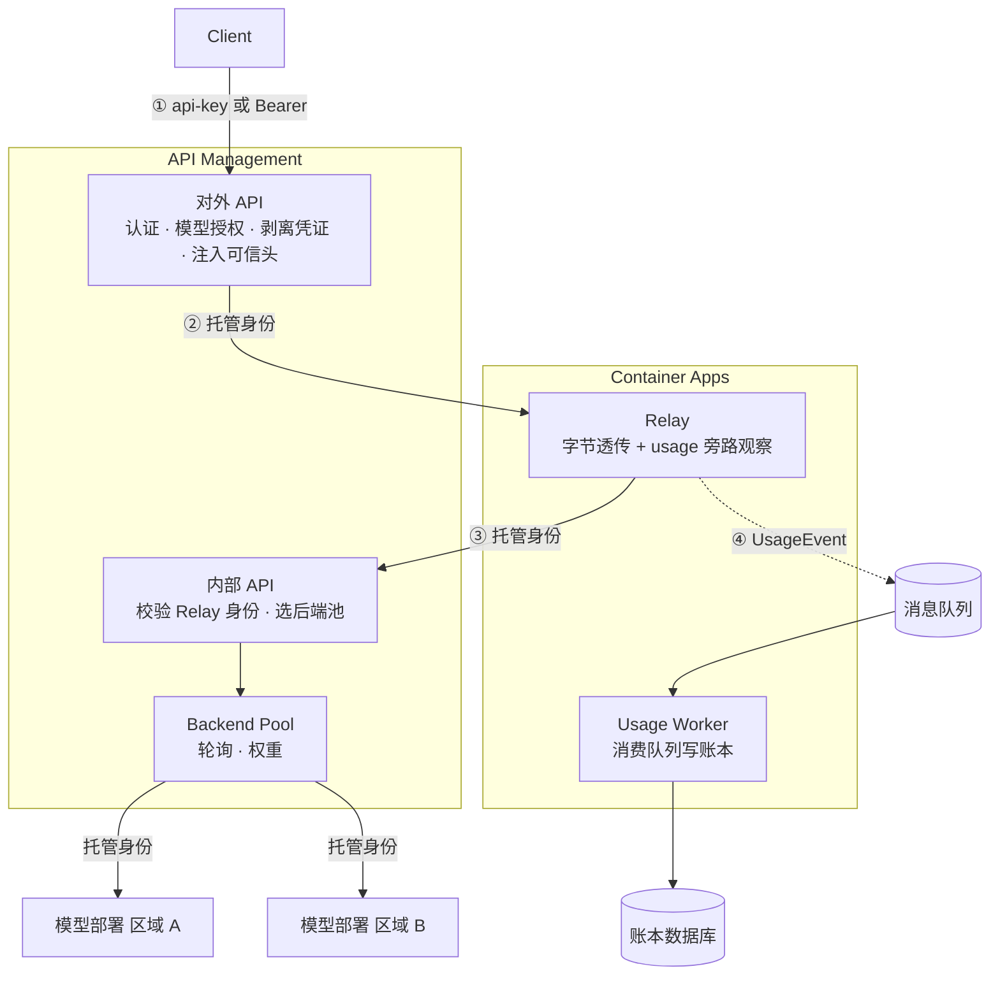
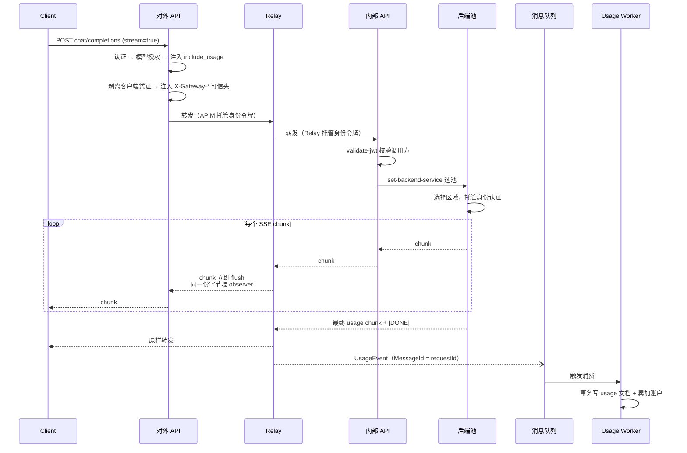

# 使用 Azure API Management 和 Container Apps 对模型进行流式记账

## 目录

- [一、问题：流式响应下 token 记不准](#一问题流式响应下-token-记不准)
- [二、为什么用 API Management 做网关](#二为什么用-api-management-做网关)
- [三、为什么还要加一个 Relay](#三为什么还要加一个-relay)
- [四、整体架构](#四整体架构)
- [五、对外 API 与内部 API](#五对外-api-与内部-api)
- [六、网关端点格式](#六网关端点格式)
- [七、记账数据模型](#七记账数据模型)
- [八、方案边界](#八方案边界)

---

## 一、问题：流式响应下 token 记不准

给多个用户共用一套模型资源时，通常要按用户记录 token 消耗。非流式请求很简单，usage 就在响应 JSON 里：

```json
{
  "choices": [{ "message": { "content": "..." } }],
  "usage": { "prompt_tokens": 1200, "completion_tokens": 350, "total_tokens": 1550 }
}
```

网关在 outbound 阶段读一下 body 就能拿到真实用量。

流式请求则完全不同。SSE 响应里，token 统计只出现在**最后一个事件**：

```text
data: {"choices":[{"delta":{"content":"..."}}]}
data: {"choices":[{"delta":{"content":"..."}}]}
...
data: {"choices":[],"usage":{"prompt_tokens":1200,"completion_tokens":350}}
data: [DONE]
```

模型服务不会把这个 usage 另外推送到别的地方，没有按请求的 webhook 回调。**要准确记账，就必须读到流的最后一个事件。**

而 API Management 的策略引擎读不了它。原因有两个：

1. 在 outbound 里调用 `context.Response.Body.As<JObject>()` 会**先缓冲完整响应再转发**，客户端首 token 延迟会从毫秒级变成整个生成时长，流式体验直接消失。
2. APIM 没有"逐 chunk 回调"这类扩展点，无法边转发边观察。

结果就是：APIM 转发流式响应时是一根纯管道，管道两端只有模型服务和客户端。

---

## 二、为什么用 API Management 做网关

在讨论怎么解决流式记账之前，先说清楚为什么网关这一层值得用 APIM，而不是自己写一个反向代理。

### 2.1 每个用户一个 Subscription

APIM 的 Subscription 是天然的用户凭证载体和记账主体：

- 每个用户一把独立密钥，签发、轮换（primary/secondary 双槽位无停机切换）、吊销都是平台能力
- Subscription 的稳定名称可以直接作为账本的分区键和身份标识
- 停用一个用户只需要把 Subscription 置为 suspended，网关层原生拦截，不需要业务代码参与

这意味着「谁用了多少」这个问题，在请求进入网关的第一时间就已经有确定答案。

### 2.2 用 Product 管理模型发布

Product 是 APIM 里介于 API 和 Subscription 之间的授权单元。一个 Product 关联若干 API，一个 Subscription 归属某个 Product。

这个结构很适合模型发布：

| 场景 | 做法 |
| --- | --- |
| 按模型分组授权 | 每个模型一个 Product，用户订阅哪个 Product 就只能用哪个模型 |
| 灰度发布新模型 | 新建 Product，先放少量用户，验证后再扩大 |
| 模型下线 | 把 Product 置为 not published，已有订阅自然失效 |
| 差异化参数 | Product 策略里注入模型 ID、后端池 ID、默认最大输出等变量 |

关键在于**这些参数由 Product 策略注入，通用 API 策略里不出现任何模型专属的分支**：

```xml
<!-- Product 策略：只做变量注入 -->
<inbound>
  <base />
  <set-variable name="allowedModel" value="gpt-x-mini" />
  <set-variable name="backendPoolId" value="gptxmini-backend-pool" />
  <set-variable name="defaultMaxOutputTokens" value="4096" />
</inbound>
```

通用策略继承这些变量后做校验，请求的模型和授权的模型不一致就返回 403：

```xml
<choose>
  <when condition="@(!string.Equals((string)context.Variables["requestedModel"],
                                   (string)context.Variables["allowedModel"],
                                   StringComparison.Ordinal))">
    <return-response>
      <set-status code="403" reason="Model Not Allowed" />
      <set-body>{"error":{"code":"model_not_allowed"}}</set-body>
    </return-response>
  </when>
</choose>
```

新增一个模型时，只需要加一份模型配置、建一个 Product 和一个后端池，不用改任何策略代码。

### 2.3 统一入口与凭证剥离

客户端只面对一个域名。APIM 在 inbound 阶段完成认证后，把客户端凭证全部删掉，再用托管身份去访问模型服务：

```xml
<set-header name="api-key" exists-action="delete" />
<set-header name="Authorization" exists-action="delete" />
<set-header name="Ocp-Apim-Subscription-Key" exists-action="delete" />
<set-query-parameter name="api-key" exists-action="delete" />
```

模型服务侧可以完全禁用本地密钥认证（`disableLocalAuth`），只接受 Entra 身份。整条链路上不存在长期有效的静态密钥。

### 2.4 后端池：多区域 active-active

APIM 的 Backend Pool 可以把多个区域的模型部署组成一个负载均衡组，支持轮询、权重和优先级分组：

```bicep
resource pool 'Microsoft.ApiManagement/service/backends@2024-06-01-preview' = {
  name: poolId
  properties: {
    type: 'Pool'
    pool: {
      services: [
        { id: '/backends/model-region-a', priority: 1, weight: 1 }
        { id: '/backends/model-region-b', priority: 1, weight: 1 }
      ]
    }
  }
}
```

策略里只需要引用池 ID，具体打到哪个区域由 APIM 决定：

```xml
<set-backend-service backend-id="@((string)context.Variables["backendPoolId"])" />
```

这几项能力——密钥生命周期、Product 授权、凭证剥离、后端池—从0实现还是相当复杂的。

---

## 三、为什么还要加一个 Relay

### 3.1 谁能读到 usage

回到第一节的结论：token 统计只存在于响应流的最后一个事件里。**谁要读到它，谁就必须在响应字节的路径上。**

### 3.2 Relay 做什么

Relay 是一个串在 APIM 和模型服务之间的透明转发组件。它对同一份字节做两件事，统计用量则在旁路中：

```text
上游字节 ──→ 原样写给下游并立即 flush   （主路径，零修改）
        └─→ 同一份字节喂给 usage 解析器 （旁路，只读）
```

核心循环大致是这样：

```csharp
using var upstream = await client.SendAsync(
    request, HttpCompletionOption.ResponseHeadersRead, token);

await using var body = await upstream.Content.ReadAsStreamAsync(token);
var buffer = new byte[16 * 1024];
int read;
while ((read = await body.ReadAsync(buffer, token)) > 0)
{
    await response.Body.WriteAsync(buffer.AsMemory(0, read), token);
    await response.Body.FlushAsync(token);
    observer.Feed(buffer.AsSpan(0, read));   // 旁路观察，不修改字节
}
```

几个必须注意的点：

- 用 `ResponseHeadersRead`，拿到响应头就开始读，不等 body 读完
- 每收到一块就立刻写下游并 flush，不做任何缓冲
- observer 必须按行增量重组 SSE，因为一个事件可能在任意字节位置被网络切开
- observer 绝不修改、绝不延迟主路径的字节

对 Chat Completions，网关在 inbound 阶段注入 `stream_options.include_usage`，保证最后一定有一个带 usage 的 chunk：

```xml
<when condition="@((bool)context.Variables["isStreaming"])">
  <set-body>@{
    var body = (JObject)context.Variables["requestBody"];
    var options = body["stream_options"] as JObject ?? new JObject();
    options["include_usage"] = true;
    body["stream_options"] = options;
    return body.ToString(Formatting.None);
  }</set-body>
</when>
```

对 Responses API，usage 在 `response.completed` 事件的 `response.usage` 字段里。

### 3.3 为什么不让 Relay 直连模型服务

最直觉的做法是 `APIM → Relay → 模型服务`。但这样 Relay 就要自己实现：

- 后端选择与权重分配
- 失败切换与熔断
- 对模型服务的托管身份认证

第二节刚说过，这些都是 APIM 已经提供的能力。把它们复刻一遍既浪费又容易出错。

所以更好的做法是让 Relay **回调 APIM 上的另一个 API**，由这个内部 API 去选后端池：

```text
Client → APIM 对外 API → Relay → APIM 内部 API → 后端池 → 模型服务
```

代价是流式请求在 APIM 上过两次，多一跳延迟。收益是后端池拓扑、权重和模型服务的 RBAC 一行都不用动。

---

## 四、整体架构

### 4.1 组件与调用流向



请求路径是 ①②③，记账路径是 ④，两者解耦：Relay 把 usage 事件投递到队列就返回，账本写入由 Worker 异步完成，不影响客户端延迟。

### 4.2 流式请求时序



### 4.3 身份链

客户端凭证在对外 API 的 inbound 阶段就被删除，之后全链路只有托管身份：

| 跳 | 凭证 | 验证方 |
| --- | --- | --- |
| Client → 对外 API | Subscription Key 或 Bearer | APIM Subscription |
| 对外 API → Relay | APIM 托管身份 | Relay 的 JWT 校验 |
| Relay → 内部 API | Relay 托管身份 | APIM `validate-jwt` |
| 内部 API → 模型服务 | APIM 托管身份 | 模型服务 RBAC |
| Relay → 消息队列 | Relay 托管身份 | 队列 RBAC |
| Worker → 队列/账本 | Worker 托管身份 | RBAC |

---

## 五、对外 API 与内部 API

同一个 APIM 实例上有两个职责完全不同的 API。分清楚它们是理解这套方案的关键。

### 5.1 职责对比

| 维度 | 对外 API | 内部 API |
| --- | --- | --- |
| 调用方 | 客户端 | 只有 Relay |
| 路径 | `/openai`、`/openai-compatible/v1` | `/internal-forward` |
| 认证方式 | Subscription Key / Bearer | Entra 令牌（托管身份） |
| 关联 Product | 是 | 否 |
| 需要订阅密钥 | 是 | 否 |
| 模型授权校验 | 有 | 无（上游已做） |
| 请求体改写 | 有 | 无 |
| 后端 | Relay | 后端池 |
| 策略长度 | 完整业务逻辑 | 十几行 |

内部 API 的策略几乎只做两件事：确认调用方是 Relay，然后选池转发。

### 5.2 内部 API 如何防止被外部使用

内部 API 不关联 Product、不要求订阅密钥，从 APIM 的角度看它是"匿名"的。**这不等于它对外开放**——它由 Entra 令牌保护，而且是多层校验。

```xml
<inbound>
  <base />

  <!-- 第一层：必须持有本租户签发的、面向内部 API 受众的令牌 -->
  <validate-jwt header-name="Authorization"
                failed-validation-httpcode="401"
                failed-validation-error-message="Unauthorized relay caller.">
    <openid-config url="https://login.microsoftonline.com/{tenant-id}/.well-known/openid-configuration" />
    <audiences>
      <audience>api://{internal-app-id}</audience>
    </audiences>
    <!-- 第二层：调用方必须正是 Relay 的托管身份 -->
    <required-claims>
      <claim name="appid" match="any">
        <value>{relay-managed-identity-client-id}</value>
      </claim>
    </required-claims>
  </validate-jwt>

  <!-- 第三层：只允许白名单内的后端池 ID -->
  <set-variable name="requestedPool"
                value="@(context.Request.Headers.GetValueOrDefault("X-Gateway-Pool-Id", ""))" />
  <choose>
    <when condition="@(!"pool-a,pool-b".Split(',').Contains((string)context.Variables["requestedPool"]))">
      <return-response>
        <set-status code="400" reason="Bad Request" />
        <set-body>{"error":{"code":"invalid_pool"}}</set-body>
      </return-response>
    </when>
  </choose>

  <!-- 转发前删掉 Relay 的令牌，后端池自己用 APIM 托管身份认证 -->
  <set-header name="Authorization" exists-action="delete" />
  <set-backend-service backend-id="@((string)context.Variables["requestedPool"])" />
</inbound>
<backend>
  <forward-request timeout="240" buffer-response="false" />
</backend>
```

四层防护逐条说明：

1. **受众校验**：令牌的 `aud` 必须是为内部 API 单独注册的应用 ID URI。拿其他资源（比如 Graph 或存储）的令牌来调用会被拒。
2. **调用方校验**：`appid` 声明必须等于 Relay 托管身份的客户端 ID。即使租户内其他服务拿到了同受众的令牌，也过不了这一关。
3. **后端池白名单**：池 ID 来自请求头，如果不做校验，调用方可以指定任意 backend，构成 SSRF 风险。白名单把可选值限死在配置内。
4. **令牌剥离**：转发到后端池之前删掉 `Authorization`，避免把内部令牌泄露给模型服务。

还有两个设计上的自然屏障：

- **不会递归**。内部 API 只做校验和选池，不做认证、不做授权、不做记账，也不会把请求再转回 Relay，所以 `对外 API → Relay → 内部 API` 这个回环不存在无限递归的可能。
- **可信头不可伪造**。`X-Gateway-Subscription-Id` 这类头由对外 API 注入。客户端即便自己塞了同名头，也会在对外 API 的 inbound 阶段被覆盖。

Relay 侧同样做校验：只接受 APIM 托管身份签发的、面向 Relay 受众的令牌。所以即使有人拿到 Relay 的公网地址，也调不通。

### 5.3 为什么内部 API 要用 `buffer-response="false"`

这是整个方案成立的前提。流式请求在 APIM 上过两次，**两跳都必须关闭响应缓冲**，否则任何一跳缓冲都会让流式退化成一次性返回。

上线前务必用一个"故意慢速输出"的测试后端实测：确认第一个 chunk 在上游生成完成之前就到达了客户端。

---

## 六、网关端点格式

对外 API 提供两套兼容面，共用同一套授权和记账逻辑。下文用 `{gateway-host}` 代表你的 APIM 网关主机名。

### 6.1 Azure OpenAI 兼容面

认证用 `api-key` 请求头。

```text
POST https://{gateway-host}/openai/deployments/{model}/chat/completions?api-version={api-version}
POST https://{gateway-host}/openai/responses
```

```bash
curl -X POST "https://{gateway-host}/openai/deployments/{model}/chat/completions?api-version={api-version}" \
  -H "api-key: sk-XXXXXXXX" \
  -H "Content-Type: application/json" \
  -d '{
    "model": "{model}",
    "messages": [{ "role": "user", "content": "Hello" }],
    "max_completion_tokens": 128,
    "stream": true
  }'
```

### 6.2 OpenAI 兼容面

认证用 `Authorization: Bearer`，可以直接对接官方 OpenAI SDK 或任何支持自定义 Base URL 的客户端。

```text
GET  https://{gateway-host}/openai-compatible/v1/models
POST https://{gateway-host}/openai-compatible/v1/chat/completions
POST https://{gateway-host}/openai-compatible/v1/responses
```

```python
from openai import OpenAI

client = OpenAI(
    api_key="sk-XXXXXXXX",
    base_url="https://{gateway-host}/openai-compatible/v1",
)

stream = client.chat.completions.create(
    model="{model}",
    messages=[{"role": "user", "content": "Hello"}],
    stream=True,
)
for chunk in stream:
    if chunk.choices and chunk.choices[0].delta.content:
        print(chunk.choices[0].delta.content, end="")
```

`/models` 由网关本地应答，只返回该订阅被授权的模型，不透传模型服务的完整目录：

```json
{
  "object": "list",
  "data": [{ "id": "{model}", "object": "model", "owned_by": "gateway" }]
}
```

### 6.3 双凭证设计

一个用户只有一个逻辑密钥，但 APIM Subscription 的两个槽位存不同形式：

| 槽位 | 值 | 用途 |
| --- | --- | --- |
| primary | `sk-XXXXXXXX` | Azure 兼容面的 `api-key` 头 |
| secondary | `Bearer sk-XXXXXXXX` | OpenAI 兼容面的 `Authorization` 头 |

因为 OpenAI 兼容面把 `Authorization` 配置成了订阅键的载体，而 SDK 会自动加 `Bearer ` 前缀，所以 secondary 槽位直接存带前缀的完整值，APIM 才能匹配上。两个槽位指向同一个 Subscription，共用同一份账本。

### 6.4 错误码

| 条件 | HTTP | `error.code` |
| --- | ---: | --- |
| 缺少或无效凭证 | 401 | APIM 原生响应 |
| 请求了未授权的模型 | 403 | `model_not_allowed` |
| Product 未正确配置 | 403 | `product_not_authorized` |
| Relay 不可达 | 503 | `relay_unavailable` |

---

## 七、记账数据模型

### 7.1 两类文档

账本按订阅分区，只有两类文档，都不设 TTL：

```text
account            { subscriptionId, modelId, consumedInputTokens,
                     consumedOutputTokens, consumedTotalTokens,
                     requestCount, state, updatedAtUtc }

usage:{requestId}  { subscriptionId, requestId, modelId, apiSurface, streamed,
                     inputTokens, outputTokens, cachedInputTokens, totalTokens,
                     usageSource, responseStatus, clientDisconnected,
                     backendHost, durationMs, createdAtUtc }
```

计费口径始终是：

```text
chargedTokens = inputTokens + outputTokens
```

缓存命中的输入已经包含在 `inputTokens` 里，单独记在 `cachedInputTokens` 只作分析用，不重复计费。

### 7.2 幂等

Worker 在同一个分区内用一个事务批次同时写两个文档：

```csharp
var batch = container.CreateTransactionalBatch(new PartitionKey(subscriptionId))
    .CreateItem(usageRecord)                                  // 主键是 usage:{requestId}
    .ReplaceItem("account", updatedAccount,
        new TransactionalBatchItemRequestOptions { IfMatchEtag = etag });
```

- `CreateItem` 在 requestId 重复时冲突，整批回滚，视为幂等成功，绝不会重复扣费
- `IfMatchEtag` 保证并发写账户时不会丢更新，冲突则退避重试

消息投递时把 `MessageId` 设成 requestId，队列层也能去重。

### 7.3 断流处理

不是每个流都能拿到 usage。要区分记录，不能把估算值伪装成真实值：

| 情况 | `usageSource` | 处理 |
| --- | --- | --- |
| 正常收到最终 usage 事件 | `upstream` | 记真实值 |
| 客户端断开，但 usage 已到 | `upstream` | 记真实值，另标 `clientDisconnected` |
| 客户端在 usage 前断开 | `upstream`（多数情况） | Relay **不取消上游**，限时续读拿到 usage |
| 上游中断，始终无 usage | `estimated` | 按请求体和已转发字节估算 |

第三行是 Relay 相比简单代理能做得更好的地方：客户端断开时不要立刻取消上游读取，用一个独立的短超时（比如 10 秒）继续消费到 usage 事件，能把漏记率显著压低。

---

## 八、方案边界

### 8.1 会漏记的情况

如果 Relay 在响应已经完成、但 usage 事件还没投递到队列时进程崩溃，这次请求就不会被记录。后付费模式下没有预留记录可供扫描，这个丢失是静默的。

三种缓解方式，成本递增：

1. 接受少量漏记，用网关请求数与账本记录数做周期性对账，量化漏记率
2. 在转发最后一个 chunk 之前先等队列确认（增加尾部延迟，不影响首 token 延迟）
3. 完整的 outbox 模式：先写本地持久化队列，后台投递

实测一个小规模环境，正常流量下漏记率为 0。建议先用方式 1 把真实漏记率测出来，再决定要不要升级。

### 8.2 延迟代价

流式请求在 APIM 上过两跳、经 Relay 一跳。上线前应实测首 token 延迟（TTFT）相对直连的增量。如果不可接受，可以退回让 Relay 直连模型服务，代价是要在 Relay 里复刻后端选择逻辑。

Relay 本身是无状态的（后端选择留在 APIM），因此可以多副本部署，不构成单点。建议设置 `minReplicas ≥ 2` 并配健康探针。

### 8.3 超时上限

APIM 的 `forward-request` 超时上限是 240 秒。超过 4 分钟的长流会被切断。有长生成场景要提前评估。

### 8.4 APIM 层级差异

选 Consumption 层要注意两个限制：

- **不支持后端熔断器**。负载均衡和权重仍然可用，但 `circuitBreaker` 配置会被拒绝。
- **不支持 Log Analytics 请求日志**，只支持 Application Insights。做对账时要查 Application Insights 的 `requests` 表，而不是 `ApiManagementGatewayLogs`。
- **不支持 APIM User 资源**（开发者门户相关）。Subscription 可以正常创建，但不能挂 owner。

### 8.5 什么时候不需要这套方案

如果满足以下任一条件，直接用 APIM 就够了，不必引入 Relay：

- 全部是非流式请求（usage 在响应体里，outbound 读它没有任何代价）
- 只需要粗略的用量趋势，能接受估算偏差
- 可以接受按「输入估算 + 最大输出」计费

只有当「流式 + 实时 + 真实 token + 不缓冲」这四个条件必须同时成立时，才需要在响应路径上加一个观察组件。
