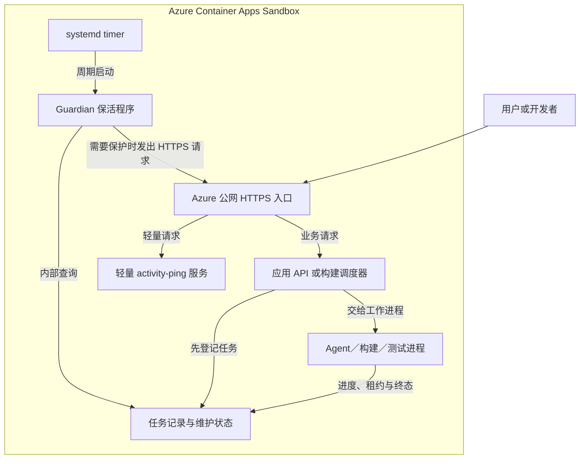

# Azure Container Apps Sandbox：长时间 Agent 任务的保活设计与实现

把构建、测试或 Agent 放进 Azure Container Apps Sandbox 后，常见的需求是：有任务时持续运行，没有任务时自动暂停。这样既能完成耗时工作，也能减少低使用率环境的计算费用。

问题在于，**任务仍在执行，不一定代表平台认为 Sandbox 仍然活跃。** 一次请求启动后台任务后，浏览器可能已经关闭，发起任务的电脑也可能已经断网；Agent 却还在调用模型、执行工具或等待测试结果。

本文先介绍哪些场景需要保活，再说明如何把应用的任务状态转换成平台可以识别的活动，并给出按需保活的实现示例。远程构建的基础流程可先阅读[《Azure Container Apps Sandbox：远程构建与测试的优势和适用场景》](../azure-container-apps-sandbox-remote-build/azure-container-apps-sandbox-remote-build.md)。

## 目录

- [一、哪些场景需要保活](#一哪些场景需要保活)
- [二、Sandbox 怎样判断闲置](#二sandbox-怎样判断闲置)
- [三、选择合适的保活方式](#三选择合适的保活方式)
- [四、按任务状态保活的整体架构](#四按任务状态保活的整体架构)
- [五、如何判断还有任务需要执行](#五如何判断还有任务需要执行)
- [六、实现一个周期运行的 Guardian](#六实现一个周期运行的-guardian)
- [七、任务结束、暂停与恢复](#七任务结束暂停与恢复)
- [八、如何验证保活确实有效](#八如何验证保活确实有效)

---

## 一、哪些场景需要保活

### 1.1 云端构建和测试：Agent 执行时间超过闲置阈值

开发者在本地修改代码，将源码上传到 Sandbox，再让云端 Agent 执行一系列工作：

1. 安装依赖和构建镜像。
2. 执行单元测试、集成测试和浏览器测试。
3. 分析错误，修改代码或调整测试环境。
4. 再次构建、测试，并整理日志和报告。

单次构建可能只要几分钟，但 Agent 反复执行工具和测试，整轮任务可能持续几十分钟。开发者提交任务后希望关闭终端、合上电脑，稍后回来查看结果。

如果任务通过一个很快返回的执行请求启动，并在后台独立运行，随后没有其他平台可识别的活动，就需要考虑保活。`nohup`、`tmux` 或后台进程可以帮助任务脱离本地连接，但不能直接替代平台的生命周期管理。

这里需要保护的是**整轮云端工作**，包括依赖安装、Agent 等待模型、构建、测试和结果归档，而不只是某一个编译命令。

### 1.2 小流量应用：用户提交后，Agent 在后台分析很久

例如，一个每天只有少量用户访问的合同分析应用：

1. 用户上传合同，API 创建任务并返回任务编号。
2. Agent 分片读取合同、构建证据图谱、调用模型并综合结果。
3. 完整分析需要 20 分钟。
4. 用户等待期间不再操作，或者直接关闭页面。

假设 Sandbox 的闲置阈值为 10 分钟，如果这段时间没有其他活动，平台可能在分析结束前触发暂停。采用 Disk 模式时，恢复会重新启动运行环境，原来正在执行的模型调用和进程不会原样继续。

这种应用适合采用：**任务执行期间保活，任务全部结束后停止保活，闲置达到阈值再自动暂停。** 下一次用户访问时，由已配置的按需入口唤醒环境。

浏览器轮询进度可能恰好让 Sandbox 保持活跃，但用户关页面、浏览器休眠或网络断开都可能使轮询停止，因此不能把它作为后台任务完成的唯一保障。

### 1.3 用三个问题判断是否需要

| 问题 | 需要关注的情况 |
| --- | --- |
| 是否启用了自动暂停？ | 启用后，任务必须与闲置策略配合 |
| 是否存在长时间没有平台活动的执行阶段？ | 后台构建、模型推理等待、多步 Agent 工作流 |
| 是否要求用户离开后仍然完成？ | 需要由云端独立管理任务和保活 |

保活需求取决于**最长可能出现的无活动时段**，不只取决于任务总时长。即使平均任务很快，模型重试、依赖下载缓慢或测试卡顿也可能拉长这个时段。

只运行短命令、始终维持有效交互会话，或者已经关闭自动暂停的环境，未必需要额外的周期保活机制。应先确认现有执行方式是否已经覆盖整个任务生命周期。

---

## 二、Sandbox 怎样判断闲置

### 2.1 平台不会自动查询业务任务表

根据微软的 [Sandboxes 概览](https://learn.microsoft.com/en-us/azure/container-apps/sandboxes-overview#lifecycle-states)，自动暂停的闲置判断涉及以下活动：

- 入口流量，即 ingress。
- 通过 execute API 执行代码。
- 交互式 Shell 会话。
- 平台文件操作。

这里的执行和文件操作指平台提供的接口或会话，不能扩大解释为来宾系统里的任意后台进程、CPU 使用率或磁盘写入。Agent 向模型服务发出的请求属于出站流量，也不能直接当作进入 Sandbox 的入口活动。

平台不知道数据库里的 `running` 是什么意思，也不知道某个 Python 进程正在分析合同。业务系统需要自己判断是否有未完成工作，再选择平台支持的活动方式。

### 2.2 保活请求是什么

一种实现方式是：Sandbox 内的控制程序定期访问这个 Sandbox 已发布的 HTTPS endpoint，让请求实际经过 Azure 入口，再到达内部的轻量服务。

```text
Sandbox 内的 Guardian
    → 已发布的公网 HTTPS endpoint
    → Azure 入口代理
    → Sandbox 内的 /internal/activity-ping
    → 返回 HTTP 204
```

`/internal/activity-ping` 是应用自行实现的路径，名字中的 `internal` 不会自动赋予访问保护。应按实际入口策略配置认证和权限。

这是一条普通的 HTTP 请求。它不执行模型分析、不查询合同、不需要返回页面内容。它与 HTTP 连接复用或 TCP keepalive 不是同一种机制。

访问 `http://127.0.0.1:3000` 可以检查本地服务是否正常，但绕过了 Azure 入口，不能把这种请求作为本文的 ingress 保活。公网 endpoint 也应直达所需入口，避免请求被上游缓存或登录页面处理后，误以为已经到达 Sandbox。

### 2.3 暂停模式决定中断后的状态

| 模式 | 平台保留什么 | 长任务受到的影响 |
| --- | --- | --- |
| Disk | 磁盘状态；恢复时重新启动运行环境 | 进程需要重启，应用必须从持久化任务和检查点恢复 |
| Memory | 包括内存在内的完整 Sandbox 状态 | 执行仍会暂停；恢复后外部连接、令牌和租约可能需要重建 |

Memory 模式不能替代持续执行要求：如果用户希望 20 分钟后获得结果，中途暂停依然会延后完成时间。官方当前还说明，挂载 Data Disk 卷时只支持 Disk 模式。

普通 Container App 的副本数量设置，例如 `minReplicas=0`、`maxReplicas=1`，与单个 Sandbox 的自动暂停策略属于不同概念。讨论保活时，需要检查目标 Sandbox 的实际 lifecycle policy、入口唤醒方式和暂停模式。

---

## 三、选择合适的保活方式

| 方式 | 适合的情况 | 需要处理的问题 |
| --- | --- | --- |
| 延长闲置阈值 | 任务时长较短、上限稳定 | 超时任务仍可能被暂停，每次空闲等待也更长 |
| 任务期间关闭自动暂停，结束后恢复 | 可以集中管理生命周期的任务系统 | 控制器崩溃后必须能恢复原策略；并发任务需要引用计数或统一调度 |
| 云端外部控制器定期检查任务并维持活动 | 已有 CI、调度服务或任务平台 | 控制器的可用性、身份和权限；不能依赖开发者电脑在线 |
| Sandbox 内部 Guardian 按任务状态发送入口请求 | 单个可复用构建环境，或小流量 Agent 应用 | 需要独立运行、正确判定任务，并验证入口请求确实产生有效活动 |

本文采用第四种方式。它保留自动暂停策略，只在需要持续工作时发出请求，适合已经有公网入口、希望提交后即可离开的环境。

没有 Web 服务的纯构建环境，也可以选择外部控制器调用受支持的执行接口，或由控制器管理自动暂停策略。若采用内部 Guardian 的 HTTP 方案，则需要增加一个独立的轻量入口服务，不能向一个没有进程监听的端口发请求。

对于强可用性、严格完成时限或高并发生产负载，还应评估 Container Apps Jobs、基于队列伸缩的工作服务，或常驻计算资源。选择 Sandbox 时，需要一并承担其暂停、恢复和状态管理工作。

---

## 四、按任务状态保活的整体架构

### 4.1 应用判断任务，Guardian 维持入口活动



图中的状态可以保存在 Sandbox 内的持久化数据库，也可以保存在外部存储。Guardian 的查询走内部路径，只有需要保护时才访问公网入口。这样，无任务时的检查本身不会持续制造 ingress 活动。

### 4.2 一轮检查的决策

```text
需要保护 = 有待执行或执行中的任务
        或 正在构建、部署、备份等维护操作
        或 无法可靠判断是否还有任务
```

| 检查结果 | 行为 |
| --- | --- |
| 有活动任务 | 发送保活请求 |
| 无活动任务，但维护操作仍在执行 | 发送保活请求 |
| 没有任务，也没有维护操作 | 不发送请求，允许平台累计闲置时间 |
| 查询超时、数据库不可用或响应无效 | 暂时保活并记录故障，交给恢复和告警流程处理 |

查询失败时保守保护，是为了避免把“看不到任务”当成“没有任务”。但不能长期静默忽略故障，否则数据库一直不可用就可能导致 Sandbox 一直运行。

### 4.3 区分三种周期请求

| 请求 | 目的 | 示例周期 |
| --- | --- | --- |
| 浏览器 → 公网业务 API | 更新页面上的任务进度 | 1.5～5 秒 |
| Agent → 内部任务 API | 续租、报告存活、验证执行身份 | 10 秒 |
| Guardian → 公网轻量入口 | 产生平台可识别的入口活动 | 60 秒 |

这些周期均由应用设计决定。Agent 心跳可以证明工作进程仍在运行，但如果它只访问内部 API，就不能直接替代平台保活请求。

---

## 五、如何判断还有任务需要执行

### 5.1 小流量应用：使用持久化任务记录

在启动 Agent 之前，先将任务写入数据库。一个简化记录可以包含：

```json
{
  "id": "run-example",
  "sandboxId": "sandbox-example",
  "status": "running",
  "active": true,
  "heartbeatAt": "2026-09-30T08:00:00Z",
  "leaseExpiresAt": "2026-09-30T08:01:30Z",
  "attempt": 1,
  "checkpoint": "review-chunk-12"
}
```

常见状态处理如下：

| 状态 | 是否继续保护 | 条件 |
| --- | --- | --- |
| queued | 是 | 该任务由当前 Sandbox 负责调度执行 |
| running | 是 | Agent 执行中，包括等待模型或工具返回 |
| cancelling | 是 | 已请求取消，但工作进程尚未确认停止 |
| succeeded／failed／cancelled | 否 | 结果或错误已持久化，工作进程已结束 |

单环境应用可以统计 `active=true` 的任务数量。多个 Sandbox 共用任务库时，还需要按归属或调度范围筛选，避免一个环境的任务让所有环境都持续保活。

`active=true` 表示“工作尚未结束”，不表示“工作正在健康推进”。应另设机制检查最后心跳、租约、最长执行时间和重试次数。发现执行者失联后，先判断是否恢复、重试或标记失败，再更新活动状态。

长时间排队也需要监控。任务一直处于 queued 而没有可用执行者时，单纯保活不会使它自动完成。

### 5.2 云端构建测试：登记整轮作业和维护操作

每轮构建分配独立任务编号，持久化源码版本、开始时间、状态、日志位置和最终退出码。只有构建、必需测试和结果归档完成后，才将任务转为终态。

构建、部署或备份还可以通过由操作进程持有的锁暴露活动状态。例如在具备 `flock` 的 Linux 环境中，由任务管理器执行：

```bash
flock /run/lock/sandbox-maintenance.lock bash /opt/jobs/run-build.sh
```

这里的路径是项目自行准备的示例。工作命令必须覆盖整轮操作，并等待它启动的子任务结束；如果脚本只是启动一个后台进程就立即退出，锁会过早释放。

Guardian 或内部活动接口可以非阻塞地探测该锁是否正在被持有。锁文件存在本身不能证明任务还活着；探测发生权限或文件系统错误时，应作为“未知”处理，不能当作正常空闲。

对于需要提交后关闭电脑的任务，应交给云端 systemd 服务或作业管理器启动。锁负责表达操作状态，进程托管负责让任务脱离本地会话，这两项要同时考虑。

### 5.3 构建期间，入口服务要先准备好

首次构建可能发生在业务 Web 镜像生成之前；部署切换期间，业务 Web 也可能暂时不可用。如果保活依赖该 Web 首页，这两个时间段就容易失去保护。

可采用以下一种安排：

- 使用独立的小型入口服务承载 `activity-ping`，生命周期独立于业务版本。
- 使用稳定的反向代理提供轻量路由，业务路径再转发到当前版本。
- 构建期间由临时服务承载同一路径，完成后受控切换到业务服务。

无论选哪种方式，都应先验证入口可用，再开始长任务。部署时保留维护状态，直到新版本服务就绪、结果记录完成。

---

## 六、实现一个周期运行的 Guardian

### 6.1 先约定两个接口

下面给出一个 Node.js 22 示例，Guardian 每次运行只检查一轮，周期由 systemd timer 管理。它依赖项目实现以下接口：

| 接口 | 访问路径 | 返回要求 |
| --- | --- | --- |
| 活动状态接口 | Sandbox 内部，例如 `http://127.0.0.1:3100/internal/activity` | HTTP 200，JSON 包含非负整数 `activeRuns` 和布尔值 `maintenance` |
| 保活入口 | Sandbox 已发布的 HTTPS endpoint 下的 `/internal/activity-ping` | HTTP 204，无响应体，`Cache-Control: no-store` |

活动接口可以由应用 API 或独立控制服务实现，内部聚合任务记录和维护锁。它应在已确认空闲时返回：

```json
{ "activeRuns": 0, "maintenance": false }
```

查询失败时应返回错误，不能兜底返回零。该接口只供控制程序访问，不应通过公共业务代理暴露给普通用户。

以上两个接口是**项目接入约定，需要自行实现**，Azure 不会自动提供。使用 Compose 时，只有明确发布到 Sandbox 回环地址的内部端口，才能被宿主侧 Guardian 通过上述 `127.0.0.1` 地址访问。

保活入口应做到：不查询数据库、不调用模型、不返回业务信息，按预期返回精确的 204。不要用“任何 2xx 都算成功”的规则把登录页 HTTP 200 误判为保活成功。

### 6.2 配置参数

示例 `/etc/sandbox-guardian.env`：

```dotenv
LOCAL_ACTIVITY_URL=http://127.0.0.1:3100/internal/activity
PUBLIC_ACTIVITY_URL=https://REPLACE_WITH_SANDBOX_ENDPOINT/internal/activity-ping
ACTIVITY_QUERY_TIMEOUT_MS=5000
HEARTBEAT_TIMEOUT_MS=10000
HEARTBEAT_RETRY_DELAY_MS=2000
GUARDIAN_STATUS_FILE=/var/lib/sandbox-guardian/activity.json
```

将域名替换成目标 Sandbox 的真实 endpoint。示例适用于轻量路径在入口策略下可以被 Guardian 直接访问的情况。如果入口要求 Entra 身份，应接入受支持的非交互式认证，或采用有认证能力的外部控制器；不要为保活而放宽整个应用的访问策略。

需要秘密时，通过受保护的运行配置注入，避免出现在源码、日志或 URL 查询参数中。若出站策略启用了 TLS 检查，也要为 Node.js 配置平台需要的可信 CA；不应关闭证书验证。

### 6.3 Guardian 示例

保存为 `/opt/sandbox-guardian/guardian.mjs`。以下代码使用 Node.js 标准库，无需 npm 依赖；它是前述两个接口之上的保活核心，不包含任务调度器、接口认证或告警投递实现。

```javascript
import { writeFileSync, renameSync } from 'node:fs';
import { setTimeout as delay } from 'node:timers/promises';

function positiveInteger(name, fallback) {
  const value = Number(process.env[name] ?? fallback);
  if (!Number.isSafeInteger(value) || value <= 0) {
    throw new Error(`Invalid setting: ${name}`);
  }
  return value;
}

function configuredUrl(name, protocols) {
  const url = new URL(process.env[name]);
  if (!protocols.includes(url.protocol) || url.username || url.password) {
    throw new Error(`Invalid URL setting: ${name}`);
  }
  return url;
}

const localUrl = configuredUrl('LOCAL_ACTIVITY_URL', ['http:', 'https:']);
const publicUrl = configuredUrl('PUBLIC_ACTIVITY_URL', ['https:']);
const queryTimeout = positiveInteger('ACTIVITY_QUERY_TIMEOUT_MS', 5000);
const heartbeatTimeout = positiveInteger('HEARTBEAT_TIMEOUT_MS', 10000);
const retryDelay = positiveInteger('HEARTBEAT_RETRY_DELAY_MS', 2000);
const statusFile = process.env.GUARDIAN_STATUS_FILE;
if (!statusFile) throw new Error('Missing GUARDIAN_STATUS_FILE');

let activeRuns = null;
let maintenance = null;
let queryFailed = false;

try {
  const response = await fetch(localUrl, {
    redirect: 'error',
    signal: AbortSignal.timeout(queryTimeout),
  });
  if (response.status !== 200) throw new Error('ACTIVITY_HTTP_ERROR');
  const activity = await response.json();
  if (!Number.isSafeInteger(activity.activeRuns) || activity.activeRuns < 0 ||
      typeof activity.maintenance !== 'boolean') {
    throw new Error('INVALID_ACTIVITY');
  }
  activeRuns = activity.activeRuns;
  maintenance = activity.maintenance;
} catch {
  queryFailed = true;
}

const protect = queryFailed || maintenance === true || activeRuns > 0;
let heartbeat = null;
let attempts = 0;
let heartbeatHttpStatus = null;

if (protect) {
  heartbeat = false;
  for (let i = 0; i < 2; i++) {
    if (i > 0) await delay(retryDelay);
    attempts++;
    try {
      const response = await fetch(publicUrl, {
        redirect: 'error',
        headers: { 'Cache-Control': 'no-cache' },
        signal: AbortSignal.timeout(heartbeatTimeout),
      });
      heartbeatHttpStatus = response.status;
      await response.body?.cancel();
      if (response.status !== 204) throw new Error('HEARTBEAT_HTTP_ERROR');
      heartbeat = true;
      break;
    } catch {
      // 下一次尝试仍受请求超时限制；最终失败交给日志和监控处理。
    }
  }
}

const status = {
  at: new Date().toISOString(),
  activeRuns,
  maintenance,
  queryFailed,
  protect,
  heartbeat,
  attempts,
  heartbeatHttpStatus,
};
// 同一 timer 不重叠执行此 service；临时文件与目标位于同一目录。
writeFileSync(statusFile + '.tmp', JSON.stringify(status) + '\n', { mode: 0o600 });
renameSync(statusFile + '.tmp', statusFile);
console.log(JSON.stringify(status));

// 即使保活成功，活动查询故障也需要被监控识别。
if (queryFailed || (protect && !heartbeat)) process.exitCode = 1;
```

`heartbeat=null` 表示这一轮没有发送请求；`false` 表示需要保护但两次尝试都没有确认成功。状态文件通过同目录临时文件和重命名更新，避免监控读到半写入内容。

启动配置损坏、Node.js 无法运行或状态目录不可写时，程序可能来不及写出状态文件。因此监控还必须检查 systemd 执行结果和状态文件更新时间，不能只读最后一次 `heartbeat=true`。

### 6.4 使用 systemd 托管

前提是 Sandbox 镜像支持并运行 systemd，已准备 Node.js、配置文件和上述脚本。创建专用的 `sandbox-guardian` 系统用户，使其可以读取配置和脚本，并写入自己的状态目录；它无需取得 Docker 管理权限，因为业务状态通过内部接口查询。

`/etc/systemd/system/sandbox-guardian.service`：

```ini
[Unit]
Description=Sandbox task activity protection
Wants=network-online.target
After=network-online.target

[Service]
Type=oneshot
User=sandbox-guardian
EnvironmentFile=/etc/sandbox-guardian.env
ExecStart=/usr/bin/node /opt/sandbox-guardian/guardian.mjs
StateDirectory=sandbox-guardian
StateDirectoryMode=0700
UMask=0077
TimeoutStartSec=55
```

将 `ExecStart` 中的 Node.js 路径替换成 Sandbox 内的实际安装位置。配置文件由管理员维护并限制读取权限，脚本不应允许业务 Agent 随意修改。

`/etc/systemd/system/sandbox-guardian.timer`：

```ini
[Unit]
Description=Check Sandbox activity every minute

[Timer]
OnBootSec=30
OnUnitActiveSec=60
AccuracySec=1
Unit=sandbox-guardian.service

[Install]
WantedBy=timers.target
```

在 Sandbox 内由管理员启用并查看：

```bash
systemctl daemon-reload
systemctl enable --now sandbox-guardian.timer
systemctl list-timers sandbox-guardian.timer
systemctl status sandbox-guardian.service
journalctl -u sandbox-guardian.service -n 20 --no-pager
```

oneshot 服务完成一轮后显示 `inactive` 可以是正常现象，应结合 timer 是否在等待下一次触发、最近执行退出码和日志判断。相同 service 仍在运行时，systemd 不会为它启动第二个重叠实例；不要再通过其他定时器或手工循环重复运行同一个脚本。

### 6.5 设置合理的时间余量

| 参数 | 示例 | 所在位置 |
| --- | --- | --- |
| 闲置阈值 | 600 秒 | Azure Sandbox lifecycle policy |
| 开机后首次检查 | 30 秒 | timer 的 `OnBootSec` |
| 检查周期 | 60 秒 | timer 的 `OnUnitActiveSec` |
| 单轮最长运行时间 | 55 秒 | service 的 `TimeoutStartSec` |
| 活动查询超时 | 5 秒 | `ACTIVITY_QUERY_TIMEOUT_MS` |
| 保活请求超时 | 每次 10 秒，最多两次 | `HEARTBEAT_TIMEOUT_MS` 和重试循环 |
| 重试间隔 | 2 秒 | `HEARTBEAT_RETRY_DELAY_MS` |

默认请求预算约为 `5 + 10 + 2 + 10 = 27` 秒，留出调度和文件写入余量后，应仍小于 service 的时间上限。检查周期也应明显短于闲置阈值，不能等快到 600 秒时才发第一条请求。

这些是示例值，不是 Azure 固定要求。调整环境变量时，应同步复核 systemd 和平台配置；systemd 的定时字段不会自动展开这里的环境变量。实际触发还会受调度和平台处理延迟影响，不能承诺精确到某一秒暂停。

---

## 七、任务结束、暂停与恢复

### 7.1 结束后要真正停止产生不必要的活动

Agent 成功、失败或完成取消后，持久化结果并关闭活动状态；构建和维护命令结束后，释放对应锁。下一轮 Guardian 看到无任务、无维护，即停止发送保活请求。

前端也要在任务进入终态后停止高频轮询。如果用户一直开着结果页面，而页面每 1.5 秒访问一次 API，即使 Guardian 已停止保活，平台仍可能持续收到入口流量。

外部可用性探测、日志采集脚本和运维工具也要一起检查。一个每分钟请求主页的外部监控，会与“无人使用时自动暂停”的目标冲突。运行健康监控可以按活动时段启用，闲置阶段则通过经确认不会刷新活动的资源状态查询或被动告警观察。

### 7.2 恢复执行依靠检查点和启动服务

保活只能降低闲置暂停造成中断的概率。进程崩溃、内存不足、平台维护或网络问题仍可能中断任务，因此需要另一层恢复机制：

- 持久化任务状态、输入、检查点和最终结果。
- 恢复后自动启动 API、调度器、Agent 和 Guardian。
- 通过租约重新领取失联任务，并限制重试次数。
- 使用执行版本或 fencing token，拒绝过期执行者继续写入。
- 对外部副作用使用幂等键，避免恢复后重复扣费、发送或创建资源。

检查点应明确保存到哪一步。尚未保存结果的模型请求可能需要重做；保留磁盘不等于保留每一次正在执行的外部调用。

### 7.3 内部 Guardian 不能唤醒自己

Sandbox 已暂停时，内部定时器和 Guardian 也无法执行。它们适合在运行期间防止被判定为闲置，不能承担暂停后的主动唤醒。

小流量 Web 应用可以配置入口的按需唤醒能力，例如目标环境支持的 `OnDemand` 策略。下一次外部请求触发恢复，应用就绪后处理用户操作；恢复耗时应纳入页面加载和客户端重试设计。

对于“没有用户访问，但外部队列来了新任务”的场景，需要外部调度器或其他云端触发器唤醒 Sandbox。只在已暂停的 Sandbox 内轮询队列，无法发现新任务。

---

## 八、如何验证保活确实有效

### 8.1 验证长任务期间可以离开

使用独立测试环境，先确认闲置策略已开启，再执行：

1. 启动一轮长于闲置阈值的后台任务，确认活动记录已写入。
2. 关闭浏览器页面，结束本地状态轮询和交互终端。
3. 保留云端 Guardian，避免其他客户端请求干扰结果。
4. 让任务跨过闲置阈值后继续运行，并自然完成。
5. 最后重新连接，收集任务进度时间戳、Guardian 日志、退出码和平台生命周期记录。

测试应证明任务在**重新连接之前**就持续推进或已经完成，避免把重连触发的恢复误认为任务从未暂停。

快速测试可以在独立环境中临时降低闲置阈值，但仍应补充与实际时长一致的长任务验证。例如业务要求支持 20 分钟无人访问的分析，就应实际执行这一时长的场景。

### 8.2 验证无任务时仍会暂停

完成任务后，确认活动计数为零、维护锁已释放，Guardian 记录 `protect=false`。随后停止浏览器轮询、外部 HTTP 探测、执行接口和文件操作，等待超过闲置阈值并留出平台处理余量。

不要在静默窗口中反复执行 `aca sandbox exec` 查看日志，也不要反复刷新公网页面。这些操作本身就可能产生活动。窗口结束后，优先读取不会改变运行状态的资源元数据，再按需要恢复环境收集内部日志。

平台状态可能短暂不一致，应结合停止原因、停止时间和相关事件判断。单个 `Running` 字段或一次请求失败，都不足以完整说明暂停过程。

### 8.3 验证恢复和故障分支

| 测试 | 预期结果 |
| --- | --- |
| 活动查询超时或数据库不可用 | Guardian 暂时保护并报告错误，恢复流程处理查询故障 |
| 入口请求超时、TLS 失败或返回登录跳转 | 重试受时间限制，最终失败可被监控发现 |
| Agent 失联，活动记录仍为 true | 调度器根据租约和重试策略处置，不永久静默保活 |
| 任务成功、失败或取消 | 在工作确实停止且结果落盘后解除保护 |
| 构建期间业务 Web 尚未启动 | 独立或临时轻量入口仍可完成保活请求 |
| Disk 暂停后再次访问 | 服务自动启动，原记录可读，必要的未完成任务可恢复 |
| Guardian 未触发或无法写状态文件 | 通过 timer 状态、退出码和过期状态文件发现故障 |

### 8.4 一个已有实测的范围

在一套采用“内部查询任务＋公网入口保活”的应用实测中，将闲置阈值临时设为 120 秒，关闭浏览器约 180 秒。期间记录到三次 Guardian 成功请求，任务在重连前仍更新进度，最终完成。

另一次无任务测试停止了保活和外部操作，平台记录了 `Idle` 停止原因；之后通过公网访问恢复，原结果和文档预览仍可读取。

这些记录说明该模式在当时的环境中可工作，但不是本文新示例的部署验收，也不是完整 20 分钟无人访问测试。示例改用独立的 204 路径后，仍需在目标环境验证网络路径、认证、暂停和恢复，不能仅以一条 HTTP 204 宣称获得了平台保证的不暂停租约。
