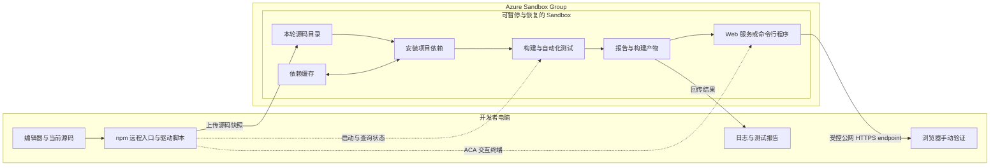

# Azure Container Apps Sandbox：远程构建与测试的优势和适用场景

开发应用时，编辑代码并不需要和安装依赖、编译、运行测试发生在同一台电脑上。对于资源有限的工作机，可以保留本地编辑器和源码，把项目的构建与测试交给云端执行。

**Azure Container Apps Sandboxes** 提供可编程控制的隔离计算环境，支持命令执行、文件传输、暂停、恢复和状态保留。它可以作为远程构建与测试环境：需要验证代码时上传当前源码，在云端运行 `npm ci`、`npm run build`、`npm test` 等命令，完成后查看结果，不用时自动暂停。

日常操作可以封装为两个本地入口：`npm run build:remote` 提交源码并在云端构建、测试；`npm run run:remote` 构建最新代码后，在云端启动 Web 服务或进入命令行环境。Web 应用通过公网 HTTPS endpoint 访问测试，非 UI 程序通过 ACA 的 Bash 终端操作。

本文介绍产品定位、优势和适用场景，并给出上述 npm 命令的完整驱动代码。核心分工是：**本地编辑代码、发起任务，Azure Sandbox 安装项目依赖、构建、运行程序并执行自动化测试。** 这种方式不要求使用 AI Agent，也不要求每次验证前先提交代码。

## 目录

- [一、什么是 Azure Container Apps Sandbox](#一什么是-azure-container-apps-sandbox)
- [二、用于远程构建和测试的优势](#二用于远程构建和测试的优势)
- [三、本地编辑与云端执行的架构](#三本地编辑与云端执行的架构)
- [四、适合哪些场景](#四适合哪些场景)
- [五、用 npm 命令驱动远程构建和运行](#五用-npm-命令驱动远程构建和运行)
- [六、环境复用与运行管理](#六环境复用与运行管理)

---

## 一、什么是 Azure Container Apps Sandbox

### 1.1 一个可以通过程序控制的云端执行环境

Azure Container Apps Sandboxes 是 Container Apps 中的一种计算选项，与 Apps、Jobs 和 Dynamic Sessions 并列。每个 Sandbox 是一个隔离的轻量级虚拟机环境，拥有自己的 CPU、内存、磁盘和网络边界，可以从磁盘镜像或快照创建。

开发者可以通过门户、ACA CLI 或 SDK 管理环境，在其中执行 Shell 命令、操作文件、配置网络访问，以及控制暂停和恢复。官方将开发环境、CI/CD 构建测试、交互式会话和代码执行列为适用场景，使用范围并不限于 Agent。

对于远程构建，可以把它理解成：**一套运行在 Azure 上、按项目准备、需要时启用的构建与测试环境。** 它负责执行项目命令，源码同步和结果管理则由脚本或上层工具负责。

### 1.2 几个关键概念

| 概念 | 作用 | 在远程构建中的用途 |
| --- | --- | --- |
| Sandbox Group | 位于资源组和区域中的管理边界 | 按团队或项目组织 Sandbox、镜像、快照等资源 |
| Sandbox | 独立的计算实例 | 安装依赖、编译代码、运行测试 |
| Disk Image | 基于 OCI 镜像准备的根文件系统 | 提供 Node.js、Python、JDK、系统库等基础工具 |
| Snapshot | 保存环境状态，具体内容取决于模式 | 暂停恢复，或从已知环境创建新的 Sandbox |
| Volume | 挂载的持久化存储 | 保存依赖缓存、较大的工作数据或产物 |
| Lifecycle Policy | 自动暂停、暂停模式和自动删除策略 | 控制闲置时的资源使用与数据保留 |

### 1.3 它不是一个完整的 CI 平台

Sandbox 提供的是执行环境，不会自动具备代码评审、合并门禁、任务队列、审批和发布流水线。开发者仍需决定上传哪些文件、执行哪些命令、如何判定成功，以及如何保留结果。

它也不等于把 Web 应用正式部署到 Azure。`npm run build` 生成发布文件，测试验证行为；把产物部署到生产环境是后续的独立步骤。

与本地 Sandbox 的关键区别是计算位置：本地隔离环境仍然消耗本机资源，Azure Sandbox 的构建进程和测试进程则使用云端资源。本机只保留源码、编辑器，以及必要的认证、打包和传输工具。

---

## 二、用于远程构建和测试的优势

### 2.1 将计算负载从本机移走

安装依赖、编译、批量测试和无头浏览器都可能占用较多 CPU、内存与磁盘。把这些进程放到云端，可以减少它们与本机 IDE、浏览器、会议软件等应用的资源竞争。

收益不一定表现为每次构建更快，也可以是本机保持流畅、减少交换内存使用，以及不必关闭其他应用才能完成测试。前提是所选 Sandbox 的规格足够承载项目。

### 2.2 减少本地工具链维护

项目所需的构建工具、系统库和测试浏览器可以统一准备在 Sandbox 中。本机不必为了构建而维护相同的项目依赖、`node_modules` 和浏览器测试环境。

本文选用 npm 作为本地入口，因此本机仍需安装 Node.js 和 npm，但仅用于启动轻量的远程驱动脚本，不执行本地 `npm ci`、编译或自动化测试。云端 Node.js 版本可以单独按项目要求配置。

多个项目使用不同版本的运行时，也可以分别使用独立的云端环境。编辑器语言服务可能仍需要本地组件，但这与实际执行构建和测试是两回事。

### 2.3 直接验证未提交的代码

源码可以按当前工作区打包上传，包括已保存但尚未提交的修改和新增文件。开发者不必先推送远端仓库，就能获得云端构建和测试结果。

这种方式适合日常修改过程中的验证。正式提交之后，仍可由团队 CI 执行共享检查和合并门禁；提交前验证与正式 CI 可以并存。

### 2.4 更容易统一执行环境

在 Mac 上编辑、在 Linux 上构建，可以提前发现路径大小写、权限、Shell 命令和原生依赖方面的差异。固定镜像、运行时版本和依赖锁文件，也能减少对某台开发电脑历史配置的依赖。

环境一致性需要主动维护。长期复用一个被反复手工修改的 Sandbox，仍然可能产生环境漂移，不能仅凭“都在云端运行”就认为完全可复现。

### 2.5 复用环境，用完暂停

同一个 Sandbox 可以承载多轮构建。保留运行时、工具和依赖下载缓存，可以减少重复准备；闲置时暂停，下次恢复继续使用。

官方说明，Sandbox 停止时不收取 CPU 和内存运行费用，但存储、快照和其他关联费用仍需单独核对。是否更经济，取决于实际运行时间、数据保留和运维开销。

---

## 三、本地编辑与云端执行的架构

### 3.1 本地只提交任务，云端完成验证



本地的 `npm run build:remote` 和 `npm run run:remote` 只启动驱动脚本。该脚本上传源码并调用 ACA；真正的 `npm ci`、`npm run build`、`npm test` 和应用服务在 Sandbox 中执行，不需要在本机补跑构建或测试。

### 3.2 修改代码后如何再次构建

一次远程任务可以包含以下步骤：

1. 收集当前已保存的源码，排除依赖目录、旧产物和敏感文件。
2. 找到已有 Sandbox；如果已经暂停，先恢复。
3. 上传源码包，校验哈希，解压到本轮独立目录。
4. 在该目录安装依赖，执行构建和要求的测试。
5. 记录退出码，回传日志与报告，按需下载或归档成功产物。
6. 仅构建时返回结果；需要运行时，启动 Web 服务或打开云端 Bash。退出会话且没有其他活动后，按闲置策略暂停环境。

云端收到的是一次源码快照，不会自动看到后续本地改动。再次修改代码后，重新提交任务即可。每轮使用新目录，可以避免本地已删除的文件残留在云端；Sandbox 和依赖下载缓存仍然可以复用。

### 3.3 回传结果不等于在本地执行

日志用于排查依赖安装、编译和测试失败；报告可以包含测试结果、覆盖率、截图和浏览器跟踪文件。构建产物则是用于交付或部署的文件，例如 Vite 的 `dist/`。

开发者可以只查看报告，不下载构建产物。Web 应用在云端启动后，可以通过 Sandbox 发布的公网 HTTPS endpoint 直接访问；不需要在本机启动开发服务器或配置本地端口转发。正常的网页渲染和前端 JavaScript 仍由访问者的浏览器执行。

非 UI 程序不需要发布 Web 端口。通过 `aca sandbox shell` 进入云端 Bash 后，可以运行命令行工具、传入参数、查看输出和执行测试。这里是 ACA 的交互终端，不是 `aca bash` 子命令，也不是标准 SSH 登录。

---

## 四、适合哪些场景

| 场景 | 主要价值 | 使用前需要确认 |
| --- | --- | --- |
| 工作机资源有限，但仍希望在本地编辑代码 | 构建和测试不再与本机应用争抢资源 | Sandbox 规格能容纳任务 |
| 不希望维护完整的本地开发依赖 | 工具链集中在云端，本机保留编辑和控制能力 | 镜像及准备脚本覆盖项目所需工具 |
| Mac 开发、Linux 部署 | 提交前验证目标平台差异 | 云端架构、运行时和部署环境相匹配 |
| 批量单元测试、集成测试或浏览器测试 | 将测试进程、测试服务和浏览器放到云端 | 数据库、测试数据及系统依赖可用 |
| 多个项目使用不同版本的工具链 | 按项目隔离环境，减少版本冲突 | 合理管理环境数量、权限和费用 |
| 频繁验证尚未提交的改动 | 不必先推送代码即可进行远程检查 | 源码快照正确包含新增、修改和删除 |
| 构建任务间歇发生 | 复用缓存，闲置暂停 | 生命周期策略与任务持续时间相适应 |

它尤其适合“需要一套云端执行环境，但不想把整个编辑过程搬到云端”的工作方式。除了 Node.js，也可以承载 Python、Java、.NET 等工具链，前提是镜像、操作系统和资源规格满足要求。

如果任务需要超大内存、GPU、特定操作系统或特殊内核能力，应先检查产品支持范围。支持 OCI 镜像也不代表默认具备完整 Docker Engine、特权容器或任意 Docker Compose 工作流。

---

## 五、用 npm 命令驱动远程构建和运行

### 5.1 两个本地入口分别做什么

| 本地命令 | 驱动脚本做什么 | 云端做什么 |
| --- | --- | --- |
| `npm run build:remote` | 打包当前源码、恢复 Sandbox、上传并查询结果 | 安装依赖 → 构建 → 执行自动化测试；返回结果后任务结束，产物留在云端，不启动应用 |
| `npm run run:remote`，`kind=web` | 提交最新代码、监控构建，再显示已配置的公网 endpoint 并连接终端 | 先重新安装依赖、构建并执行自动化测试；全部通过后执行 `npm start` 启动 Web 服务，通过公网 HTTPS endpoint 访问测试 |
| `npm run run:remote`，`kind=cli` | 提交最新代码、监控构建，再连接交互终端 | 先重新安装依赖、构建并执行自动化测试；全部通过后进入本轮项目目录的 Bash，由用户手动运行命令行程序和测试，不自动启动程序 |

`run:remote` 包含一次完整的远程构建，所以想直接运行最新代码时只需执行它，不必先执行 `build:remote`。两个命令都不会调用本机的项目构建工具。

以下以 Vite + Vitest Web 项目为例，将这些字段合并到项目根目录的 `package.json`，保留原有依赖和其他脚本：

```json
{
  "scripts": {
    "build": "vite build",
    "test": "vitest run tests/unit",
    "start": "vite preview --host 0.0.0.0 --port 4173 --strictPort",
    "build:remote": "node scripts/remote.mjs build",
    "run:remote": "node scripts/remote.mjs run"
  }
}
```

`start` 监听 `0.0.0.0:4173`，让 Sandbox 的入口代理能够访问；`--strictPort` 防止端口被占用时静默换端口。`test` 使用一次性测试模式，不进入持续监听。

### 5.2 准备目标环境和源码清单

本地需要 Node.js、npm、Bash、tar、Azure CLI 和 ACA CLI，并已完成 `az login`。驱动代码只使用 Node.js 标准库，本机无需安装项目依赖。示例面向 macOS/Linux；Windows 可使用 WSL。

提前创建好 Sandbox Group 和 Sandbox，配置相应数据面权限与自动暂停策略。Sandbox 内需要 Bash、Node.js/npm、tar、sha256sum，以及对 `/workspace/remote-build` 的写权限。项目依赖必须在 `package.json` 和 `package-lock.json` 中声明；示例不负责创建 Azure 资源或安装系统工具。

在项目根目录保存 `sandbox.remote.json`，替换目标资源信息：

```json
{
  "subscription": "YOUR_SUBSCRIPTION_ID",
  "resourceGroup": "YOUR_RESOURCE_GROUP",
  "sandboxGroup": "YOUR_SANDBOX_GROUP",
  "region": "YOUR_REGION",
  "sandboxId": "YOUR_SANDBOX_ID",
  "kind": "web",
  "include": [
    "package.json", "package-lock.json", "index.html",
    "src", "public", "tests", "scripts",
    "vite.config.ts", "vite.config.js", "tsconfig.json"
  ]
}
```

`include` 是允许上传的源码清单；不存在的可选路径会跳过，`package.json` 和 `package-lock.json` 必须存在。应按项目补全配置文件、工作区包和数据，例如 `tsconfig.app.json`、`vitest.config.ts` 或 `packages/`，不要把整个用户目录作为输入。

脚本会排除 `.git`、`node_modules`、`dist`、`.env*` 和常见密钥文件，但文件名过滤不等于秘密扫描。应检查所选目录，不把凭据或生产数据放入上传范围。源码以当前已保存的文件为准，不要求先提交 Git。

### 5.3 Web 应用：配置公网 HTTPS endpoint

Web 项目需要一次性发布与 `start` 对应的 4173 端口。下面是本地配置命令，目标参数与 JSON 配置保持一致：

```bash
aca sandbox port add \
  --subscription "<订阅 ID>" \
  --resource-group "<资源组>" \
  --group "<Sandbox Group>" \
  --region "<区域>" \
  --id "<Sandbox ID>" \
  --port 4173 \
  --email "developer@example.com"
```

命令会返回生成的 HTTPS endpoint。**公网可达不等于匿名公开**：这里限制指定账号访问，访问者通过身份检查后测试页面。只有明确需要匿名演示、确认没有敏感内容时，才考虑将 `--email` 换成 `--anonymous`。如果端口已经发布，复用现有入口，无需每次构建重复添加。

Vite 还可能检查请求的 Host。将实际 endpoint 的主机名填入 `preview.allowedHosts`，只填域名，不包含 `https://` 或路径；把这段配置合并到已有 `vite.config.ts`，不要丢掉原来的 plugins 等设置：

```typescript
import { defineConfig } from 'vite';

// Merge preview into your existing config; preserve plugins and other settings.
export default defineConfig({
  preview: {
    allowedHosts: ['REPLACE_WITH_YOUR_ENDPOINT_HOSTNAME'],
  },
});
```

不要为了省事设置 `allowedHosts: true`。入口访问策略与 Vite 的主机名检查解决的是不同问题，两者都需要正确配置。这里的 Vite preview 用于开发验证，不作为生产部署方案。

### 5.4 完整驱动脚本

将以下内容保存到项目的 `scripts/remote.mjs`。`package.json` 的两个远程入口均调用此文件：

```javascript
import { execFileSync, spawnSync } from 'node:child_process';
import { readFileSync, existsSync, mkdtempSync, rmSync } from 'node:fs';
import { tmpdir } from 'node:os';
import { join, isAbsolute } from 'node:path';
import { createHash, randomUUID } from 'node:crypto';
import { setTimeout as delay } from 'node:timers/promises';

const cfg = JSON.parse(readFileSync('sandbox.remote.json', 'utf8'));
const action = process.argv[2];
if (!['build', 'run'].includes(action) || !['web', 'cli'].includes(cfg.kind)) {
  throw new Error('Use build/run; configuration kind must be web/cli.');
}
for (const key of ['subscription', 'resourceGroup', 'sandboxGroup', 'region', 'sandboxId']) {
  if (typeof cfg[key] !== 'string' || !cfg[key] || cfg[key].startsWith('YOUR_')) {
    throw new Error(`Configure ${key} in sandbox.remote.json first.`);
  }
}
const env = {
  ...process.env,
  ACA_SUBSCRIPTION: cfg.subscription,
  ACA_RESOURCE_GROUP: cfg.resourceGroup,
  ACA_SANDBOX_GROUP: cfg.sandboxGroup,
  ACA_REGION: cfg.region,
};
const quote = value => "'" + value.replaceAll("'", "'\"'\"'") + "'";
const call = (bin, args) => execFileSync(bin, args, {
  env, encoding: 'utf8', timeout: 120_000, maxBuffer: 16 * 1024 * 1024,
});
const aca = (...args) => call('aca', args);
const remote = script => aca('sandbox', 'exec', '--id', cfg.sandboxId,
  '-c', `bash -lc ${quote(script)}`);

async function ensureRunning() {
  const get = () => JSON.parse(aca('sandbox', 'get', '--id', cfg.sandboxId, '-o', 'json'));
  if (get().state === 'Stopped') aca('sandbox', 'resume', '--id', cfg.sandboxId);
  for (let i = 0; i < 40; i++) {
    if (get().state === 'Running') return;
    await delay(3000);
  }
  throw new Error('Sandbox did not become Running.');
}

async function build() {
  await ensureRunning();
  const folder = `/workspace/remote-build/runs/${randomUUID()}`;
  const temp = mkdtempSync(join(tmpdir(), 'aca-source-'));
  try {
    const archive = join(temp, 'source.tar.gz');
    if (!Array.isArray(cfg.include) || cfg.include.some(p =>
      typeof p !== 'string' || !p || isAbsolute(p) ||
      p.startsWith('-') || p.includes('\\') || p.split('/').some(x => x === '..' || x === '.'))) {
      throw new Error('include must contain explicit project-relative files/directories.');
    }
    const files = cfg.include.filter(p => existsSync(p));
    for (const required of ['package.json', 'package-lock.json']) {
      if (!files.includes(required)) throw new Error(`Missing ${required}.`);
    }
    call('tar', ['--exclude=.git', '--exclude=node_modules', '--exclude=dist',
      '--exclude=.env*', '--exclude=*.pem', '--exclude=*.key',
      '-czf', archive, ...files]);
    const digest = createHash('sha256').update(readFileSync(archive)).digest('hex');
    remote(`mkdir -p ${quote(folder + '/source')}`);
    aca('sandbox', 'fs', 'cp', archive, `${cfg.sandboxId}:${folder}/source.tar.gz`);
    remote(`cd ${quote(folder)} && printf '%s  source.tar.gz\n' ${quote(digest)} | sha256sum -c - && tar -xzf source.tar.gz -C source`);
  } finally {
    rmSync(temp, { recursive: true, force: true });
  }

  console.log(`Remote source: ${folder}/source`);
  const task = `set -e
cd ${quote(folder + '/source')}
export CI=1
export npm_config_cache=/workspace/remote-build/npm-cache
npm ci --include=dev
npm run build
npm test`;
  // Outer shell records the exit code even when a build/test command fails.
  const worker = `set +e
bash -lc ${quote(task)}
code=$?
printf '%s\n' "$code" > exit.tmp
mv exit.tmp exit.code
exit "$code"`;
  // The marker prevents a retried launch request from starting another build.
  remote(`cd ${quote(folder)}
if mkdir dispatched 2>/dev/null; then
  nohup bash -c ${quote(worker)} > build.log 2>&1 < /dev/null &
fi`);

  const deadline = Date.now() + 30 * 60_000;
  while (Date.now() < deadline) {
    const state = remote(`cd ${quote(folder)}; if [ -f exit.code ]; then cat exit.code; else echo PENDING; fi`).trim();
    if (/^\d+$/.test(state)) {
      console.log(remote(`cat ${quote(folder + '/build.log')}`));
      if (Number(state) !== 0) throw new Error(`Remote build/test failed: exit ${state}.`);
      return folder + '/source';
    }
    if (state !== 'PENDING') throw new Error(`Unknown job status: ${state}`);
    await delay(3000);
  }
  throw new Error(`Monitoring timed out; remote work may still be running. Inspect ${folder}.`);
}

try {
  // run also builds a fresh snapshot: never silently run an older build.
  const source = await build();
  if (action === 'run') {
    if (cfg.kind === 'web') {
      console.log('Open the configured HTTPS endpoint once the server is ready:');
      console.log(aca('sandbox', 'port', 'list', '--id', cfg.sandboxId));
      console.log('Keep this terminal open. Ctrl+C stops the preview server.');
    } else {
      console.log('Entering cloud Bash. Run npm start -- --help, npm test, or other commands.');
    }
    const command = cfg.kind === 'web' ? 'exec npm start' : 'exec bash --noprofile --norc -i';
    const session = spawnSync('aca', ['sandbox', 'shell', '--id', cfg.sandboxId,
      '-c', `bash -lc ${quote(`cd ${quote(source)} && ${command}`)}`], { env, stdio: 'inherit' });
    if (session.error) throw session.error;
    process.exitCode = session.status ?? 1;
  } else {
    console.log('Build and tests passed in Azure. Artifacts remain in the remote source directory.');
  }
} catch (error) {
  console.error(error.message);
  console.error('No local build/test fallback. On network failure, inspect the remote run before retrying.');
  process.exitCode = 1;
}
```

这段代码负责完整的源码打包、恢复、上传、哈希校验和任务执行，不依赖一个未给出的 `uploadSource()` 函数。每轮创建独立目录，避免已经删除的源码残留；依赖下载缓存保存在另一个目录中。

耗时的构建采用后台作业加短轮询，最终根据远端退出码判断成功。日志回传到本地终端，产物保留在打印出的云端源码目录，不会再下载到本机执行。示例的监控窗口是 30 分钟；超时或网络错误不表示远端已取消，应先检查该轮状态。

这是单开发者、单任务的参考实现，不提供并发排队、历史产物清理或完整任务托管。大日志可以改为文件下载或分段读取。不要在同一端口并行运行两个 Web 会话。

可直接取用配套文件：[remote.mjs](examples/remote.mjs)、[sandbox.remote.json](examples/sandbox.remote.json)、[package.json 脚本片段](examples/package-scripts.json)、[Vite 配置片段](examples/vite.config.ts)。

### 5.5 Web 应用的日常操作

如果只想构建并执行自动化测试，在本地运行：

```bash
npm run build:remote
```

如果需要启动 Web 应用并手动查看效果，在本地运行：

```bash
npm run run:remote
```

第二条命令会构建最新源码，列出已经发布的端口及 HTTPS endpoint，然后在云端交互会话中执行 `npm start`。等待终端显示服务器就绪后，直接用浏览器打开该 endpoint。

此时，本机没有运行 Vite 服务，也没有进行端口转发；网页请求发送到 Azure Sandbox。保持该终端会话打开，完成查看后用 `Ctrl+C` 停止预览服务。修改源码后重新执行 `npm run run:remote`，就会上传并运行新版本。

通过公网页面手动检查并不等于自动化端到端测试。需要 Playwright 时，应在 Sandbox 中准备浏览器依赖，并把相应的一次性测试命令接入云端 `test` 流程。

### 5.6 非 UI 程序：进入云端 Bash 运行

对于命令行项目，将 `sandbox.remote.json` 的 `kind` 改为 `cli`，不需要发布端口。根据项目修改 `build`、`test` 和 `start`，保留两个远程入口。例如 TypeScript 命令行项目可以使用：

```json
{
  "scripts": {
    "build": "tsc",
    "test": "node --test",
    "start": "node dist/cli.js",
    "build:remote": "node scripts/remote.mjs build",
    "run:remote": "node scripts/remote.mjs run"
  }
}
```

确保 TypeScript 已声明为项目依赖，`tsconfig.json` 的输出目录和实际入口与 `start` 一致。驱动方式仍然相同：

```bash
npm run run:remote
```

远程构建和测试通过后，脚本会通过 `aca sandbox shell` 进入本轮项目目录的 Bash。下面这些命令是在**云端 Bash**中输入，而不是在本机执行：

```bash
npm start -- --help
npm start -- --input ./data/example.json
npm test
exit
```

参数和数据文件按实际程序调整；需要上传 `data/` 时将其加入 `include`。自动化测试在构建阶段已经执行，进入 Bash 后仍可按需要补充手工验证。

如果只想进入现有环境，不上传或重建，也可以在配置好 ACA 目标上下文后直接执行：

```bash
aca sandbox shell --id "<Sandbox ID>" -c /bin/bash
```

这种直接连接不会自动切换到某轮源码目录，需要自行 `cd` 到脚本先前打印的路径。所谓“通过 ACA 进入 Bash”，对应的命令是 `aca sandbox shell`，不是 `aca bash`。

---

## 六、环境复用与运行管理

### 6.1 暂停模式与缓存保留

Sandbox 支持自动暂停，并可以选择不同的状态保留方式：

- **Disk 模式**：保留磁盘状态，不保留运行中的进程，适合两次任务之间暂停并复用工具和缓存。
- **Memory 模式**：保存磁盘和内存状态，用于需要恢复执行上下文的场景；外部连接等状态仍需应用自行处理。

如果挂载了 Data Disk 卷，当前只支持 Disk 模式，应在设计缓存存储时一并考虑。

自动暂停与自动删除是不同策略。希望长期复用环境时，应分别设置闲置阈值和删除规则，同时清理旧源码、报告与产物。重要数据应另行归档，不能把 Sandbox 内的文件当成备份。

### 6.2 长任务与闲置策略需要配合

一种常见设计是通过短请求启动后台构建，再周期性查询状态，结束后读取退出码与结果。每个任务应有唯一编号，避免启动请求重试造成重复构建。

闲置判断涉及执行接口、交互式 Shell、文件操作和入口流量，不应假定“后台进程仍在耗用 CPU”就一定不会被暂停。应按照官方生命周期规则设计任务活动与监控，避免长任务被闲置策略中断。

如果监控和保持活动依赖本地脚本，断网或合盖后可能影响任务。需要提交后即可关电脑时，应将生命周期管理和结果归档也交给云端控制程序，而不只是把构建命令放到后台。

### 6.3 权限、数据与成功判据

Azure Sandbox 使用 Microsoft Entra ID 身份访问。官方要求创建和管理 Sandbox 的主体具备 **Container Apps SandboxGroup Data Owner** 角色；权限应限制在所需范围。

上传源码时，应排除 `.env`、私钥、访问令牌及无关数据，必要的测试凭据单独提供。依赖仓库和测试数据库的网络访问也要提前配置；生产数据不应默认复制到构建环境。

本地驱动脚本应以远端构建和测试退出码判断结果，不能把“上传成功”或“命令已启动”当作通过。缺少浏览器或数据库时，应明确报错，不应静默跳过必需测试或退回本机执行。
