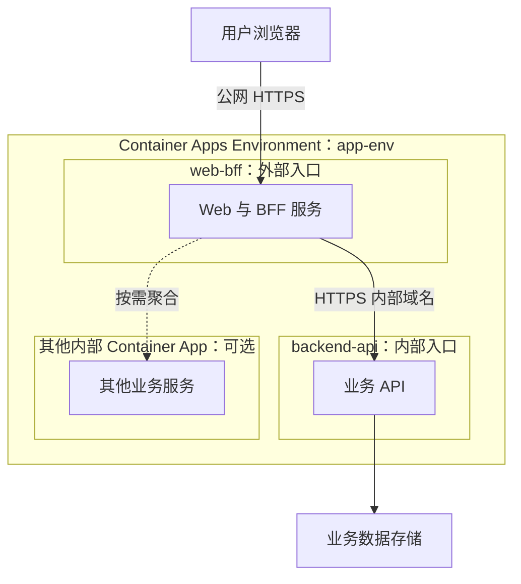
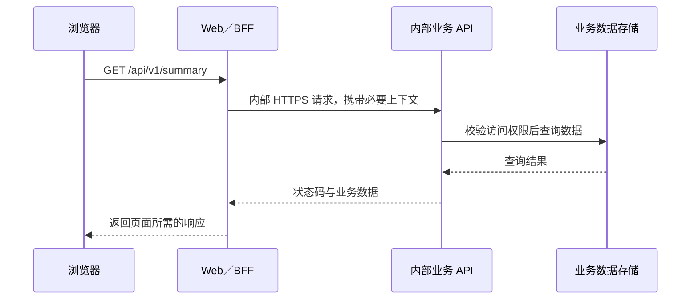

# Azure Container Apps 中的 BFF 设计：Web 统一入口与内部 API

在一个前后端分离的应用中，浏览器需要调用 API 才能获取数据。但这并不要求业务 API 直接开放公网。可以让浏览器始终访问 Web 域名，再由 Web 服务端把请求转发给内部 API。

Azure Container Apps 的 Environment 为这种架构提供了服务间通信基础：把 Web 和 API 部署在同一个 Environment 中，为 Web 开启外部入口，为 API 配置内部入口。浏览器访问 Web，Web 通过环境内部网络调用 API。

**BFF（Backend for Frontend，面向前端的后端）** 为特定客户端提供服务端接口，可以承担请求转发、数据聚合和响应格式适配。它可以与服务端 Web 框架一起部署，也可以成为独立服务。本文介绍如何在 Azure Container Apps 中组织 Web／BFF 与内部 API，以及这种设计的优势和使用边界。

## 目录

- [一、Web 不只有浏览器里的页面](#一web-不只有浏览器里的页面)
- [二、Environment 下的整体架构](#二environment-下的整体架构)
- [三、一次 API 请求如何完成](#三一次-api-请求如何完成)
- [四、这种架构的优势](#四这种架构的优势)
- [五、入口和服务地址如何配置](#五入口和服务地址如何配置)
- [六、BFF、网关与业务 API 的分工](#六bff网关与业务-api-的分工)
- [七、长任务、流式响应与文件下载](#七长任务流式响应与文件下载)

---

## 一、Web 不只有浏览器里的页面

理解这种架构，首先要区分 Web 的两个部分：

| 部分 | 运行位置 | 主要职责 |
| --- | --- | --- |
| 浏览器中的页面与 JavaScript | 用户电脑或手机 | 展示界面、接收操作、发起请求 |
| Web／BFF 服务器 | Azure 的 Web Container App | 提供页面或客户端接口、处理服务端路由、调用内部 API |

当页面执行 `fetch('/api/v1/summary')` 时，请求先到 Web／BFF 服务器。服务端处理这个路径，再向内部业务 API 发起另一条 HTTP 请求。

因此，“浏览器发起 API 调用”和“业务 API 只允许内部访问”可以同时成立。浏览器调用的是 Web 暴露的接口入口，内部业务 API 的连接由 BFF 建立。

这一设计不绑定具体技术栈。BFF 可以使用 Node.js、ASP.NET Core、Java 或其他具备服务端 HTTP 能力的框架；后文仅用 Next.js 路由展示一次请求转发。

如果使用的只是纯静态页面托管，没有服务端路由能力，就需要另外部署代理、网关或 BFF 服务，才能实现相同的转发链路。

---

## 二、Environment 下的整体架构

### 2.1 一个 Environment，独立的 BFF 与内部 API

下面使用通用资源名称：`app-env` 是 Environment，`web-bff` 提供外部入口，`backend-api` 承载内部业务接口。需要聚合多个服务时，可以继续增加内部 API：



数据存储可以使用适合业务的数据库或对象存储，不限定具体产品。它们不会因为被应用引用，就自动成为 Environment 内部的容器。

### 2.2 Environment 提供什么

Environment 为其中的 Container App 提供共同的网络环境、服务发现、入口路由和日志接入配置。应用之间可以使用平台分配的域名或受支持的应用名称进行调用，不需要自己维护每个副本的 IP 地址。

本例通过 HTTPS FQDN 调用内部 API。平台将请求路由到可用的 API 副本，并按应用的 Revision 流量配置处理版本切换。同一 Environment 内通过这些平台地址调用时，流量保留在环境内。

| 概念 | 在这里的作用 |
| --- | --- |
| Resource Group | 管理资源的逻辑分组；同一个资源组不代表应用天然拥有内部互访关系 |
| Environment | Container Apps 的共同运行与网络边界 |
| Container App | 独立配置入口、版本和扩缩容的应用单位 |
| Revision | 某个 Container App 的版本快照 |
| Replica | 某个 Revision 的运行副本，包含该应用定义的容器 |

Web／BFF 和各内部 API 可以独立发布和扩容。多个服务共享 Environment，并不意味着必须共享镜像、编程语言、发布版本或副本数量。

### 2.3 同一个 Environment 不等于共享 localhost

Web 调用 API，需要使用 API 的内部服务地址，例如：

```text
https://<API 应用的内部 FQDN>/api/v1/summary
```

Web 容器里的 `localhost` 指向它所在的运行副本，不会指向另一个 Container App。

只有位于同一个 Container App 副本中的容器，才可以通过共享的 localhost 通信。这种通信方式不适用于不同 Container App 之间，也不适用于同一应用的不同副本之间。

---

## 三、一次 API 请求如何完成

### 3.1 浏览器只使用网站自己的地址

假设用户正在访问 `https://app.example.com`，页面获取概览数据时执行：

```javascript
const response = await fetch('/api/v1/summary');
const summary = await response.json();
```

浏览器实际访问的是：

```text
https://app.example.com/api/v1/summary
```

这与页面属于同一个 Origin。如果应用采用 Cookie 会话，浏览器会按 Cookie 的有效范围和属性携带它，页面 JavaScript 不必读取会话凭据。

### 3.2 Web 服务端发起第二次请求

BFF 在服务端接收请求，从服务端环境变量 `API_URL` 读取内部 API 地址，再发起内部调用。可以按接口分别定义处理逻辑，也可以用受限的通用路由处理需要透传的路径。

下面用 Next.js 的只读查询路由展示核心过程，其他服务端框架也可以实现相同逻辑：

```typescript
// app/api/v1/summary/route.ts
export const runtime = 'nodejs';

export async function GET(request: Request) {
  const base = process.env.API_URL;
  if (!base) {
    return Response.json({ error: 'API_NOT_CONFIGURED' }, { status: 503 });
  }

  const response = await fetch(new URL('/api/v1/summary', base), {
    headers: {
      cookie: request.headers.get('cookie') ?? '',
    },
    cache: 'no-store',
    signal: request.signal,
  });

  return new Response(response.body, {
    status: response.status,
    headers: {
      'content-type': response.headers.get('content-type') ?? 'application/json',
      'cache-control': 'no-store',
    },
  });
}
```

代码中的第二次 `fetch` 在 Azure 的 Web 容器里执行。`API_URL` 使用服务端环境变量，不需要使用 `NEXT_PUBLIC_` 前缀，也不应注入浏览器代码。

正式的通用转发路由还需要处理查询参数、请求方法、请求体、错误、重定向和必要的响应头。上面的代码只演示一个只读查询。

### 3.3 API 处理请求，BFF 返回前端需要的数据



用户在浏览器开发者工具中看到的是第一段请求。第二段请求发生在服务器之间，需要通过 Web 和 API 的服务端日志排查。

### 3.4 转发时需要保留哪些信息

转发层应根据接口约定，用白名单保留必要的请求头。常见字段包括：

| 信息 | 作用 |
| --- | --- |
| Cookie | 在采用 Cookie 会话时，传递用户上下文 |
| Origin | 让 API 校验修改请求来自允许的网站 Origin |
| Content-Type | 让 API 正确解析请求体 |
| Idempotency-Key | 避免重复提交造成重复创建或执行 |
| If-Match | 在更新资源时检查版本是否发生冲突 |
| Last-Event-ID | 为事件流重连提供恢复位置 |

返回时，需要保留相应状态码、内容类型和缓存策略。登录还需要转发 `Set-Cookie`，导出文件需要 `Content-Disposition`，登录跳转可能需要 `Location`。

这些信息影响会话、资源更新和下载是否正常。只把响应转成 JSON 再返回，不能覆盖全部业务场景。

---

## 四、这种架构的优势

### 4.1 业务 API 可以收敛到内部入口

公网只需要接触 Web／BFF 入口，业务 API 的应用 FQDN 限制为 Environment 内部访问。外部调用者无法通过 API 自身的内部入口直接调用它。

这可以减少需要独立公开和维护的应用入口，但业务操作仍然可以通过 Web 的代理路径触达，因此 API 的身份验证和权限检查依然必需。

### 4.2 按前端需要聚合和组织数据

一个页面可能同时需要业务概览、状态统计和用户偏好。如果浏览器分别请求多个后端，页面就需要了解各服务地址、响应结构和错误处理方式。

BFF 可以并行调用这些内部接口，组合成一个面向页面的响应，也可以裁剪不需要的字段、转换格式、统一分页结构。这样，前端依赖的是适合自身展示的接口，后端继续按业务职责拆分。

聚合接口还需要定义超时与部分失败的处理方式。某个非关键数据源失败时，是返回部分数据还是让整个请求失败，应由页面需要决定。

### 4.3 同域请求简化浏览器调用

页面、API 入口、图片和下载使用同一个网站域名，浏览器侧不需要为了这条链路配置跨域 CORS，也减少了跨站 Cookie 的兼容性问题。

采用 Cookie 会话时，可以设置 `HttpOnly`，并根据部署方式配置 `Secure`、`SameSite` 和路径属性。具体身份方案可以独立选择。

同域并不会消除 CSRF 风险，修改请求仍需要相应的来源校验或其他防护。

### 4.4 后端地址可以独立变化

浏览器始终使用 `/api/v1/...`。API 的内部地址、部署位置或实现方式变化时，通常只需调整 Web 的服务端配置。

稳定的接口契约仍然重要：内部地址可以隐藏在 Web 后面，但 API 返回字段发生不兼容变化时，页面代码仍然需要适配。

### 4.5 服务端凭据可以留在服务端

内部服务需要访问令牌或其他服务凭据时，可以由 BFF 在服务端获取并附带，浏览器不需要接触原始凭据。

服务身份与用户上下文应分别处理，不能因为请求来自 BFF，就默认它有权访问所有用户的数据。这些约束需要在应用中明确实现。

### 4.6 Web 与业务处理可以独立扩容

页面访问、接口聚合、SSE 连接和文件转发主要影响 BFF；业务计算和数据库访问主要影响后端。拆成独立 Container App 后，可以分别设置资源、扩缩容规则和发布节奏。

简单转发会增加一跳请求；并行聚合则可能减少浏览器的往返次数。是否改善整体响应时间，应通过实际调用链测量。

---

## 五、入口和服务地址如何配置

### 5.1 将两个应用关联到同一个 Environment

Web 和 API 的 Container App 资源需要引用同一个 Environment ID。仅仅部署在同一个资源组或同一个 Azure 区域，并不能建立这里描述的内部访问关系。

基础设施代码可以先创建 Environment，再将其 ID 传给各应用。使用 Bicep 等方式保存这个关系，可以让环境和应用配置重复部署。

### 5.2 分别设置外部入口与内部入口

下面是两个应用的入口配置片段，分别对应 Container App 的 `properties.configuration.ingress`。

Web：

```json
{
  "external": true,
  "targetPort": 3000,
  "transport": "http",
  "allowInsecure": false
}
```

API：

```json
{
  "external": false,
  "targetPort": 8080,
  "transport": "http",
  "allowInsecure": false
}
```

`external: false` 表示启用了内部入口，不是关闭 Ingress。关闭 Ingress 后，不能继续期待通过普通 HTTP 应用地址完成这里的调用。

`targetPort` 指容器内应用监听的端口。这里假定 Web 监听 3000、API 监听 8080，应按实际应用修改。Web 请求 API 的 HTTPS FQDN 时，使用的是入口的 HTTPS 端口，不需要在 URL 后追加 `:8080`。

`transport: http` 描述 HTTP 入口处理方式，并不要求客户端使用明文 HTTP；示例通过 HTTPS 访问，由 Container Apps Ingress 处理 TLS。

### 5.3 为 Web 配置服务端 API 地址

Web 容器中的环境变量可以表示为：

```text
API_URL=https://<backend-api 的内部 FQDN>
```

实际部署时，从创建出来的 API 资源读取 FQDN，再传入 Web 配置，避免手工拼接域名或维护副本 IP。使用应用级地址，也能让平台继续处理副本路由与 Revision 流量切换。

目标地址应由服务端配置决定，不接受浏览器传入任意上游 URL。转发范围也应限制为需要的 API 路径，避免把 Web 做成一个可访问任意内部服务的代理。

### 5.4 区分应用内部入口与内部 Environment

两者控制不同的边界：

| 配置 | 控制范围 |
| --- | --- |
| Environment 的外部／内部可达性 | 整个环境通过公网入口还是 VNet 内部入口接收访问 |
| 应用 Ingress 的 `external` | 应用是否在 Environment 的对外边界上提供入口 |

本文的场景使用可从公网访问的 Environment，因此 Web 的 `external: true` 对应公网入口，API 的 `external: false` 对应环境内部入口。

如果 Environment 本身是内部环境，应用配置 `external: true` 也不会自动获得公网入口，而是允许通过环境的内部入口访问。不能把这个字段在所有环境中都理解为“是否开放互联网”。

此外，环境级 HTTP 路由也可以把请求转给内部应用。要保持本文的访问路径，应避免额外配置直接向外发布 API 的环境级路由。

---

## 六、BFF、网关与业务 API 的分工

### 6.1 BFF 应围绕客户端需求设计

BFF 的核心是为某类客户端提供合适的接口。仅做透明转发时，它的行为接近反向代理；增加页面级聚合、字段适配和错误组织后，才更能体现面向前端的价值。

| 层次 | 主要职责 |
| --- | --- |
| 平台 Ingress／反向代理 | TLS 入口、请求路由、负载分发 |
| API 网关 | 按需提供统一 API 策略、配额、流量管理等能力 |
| BFF | 面向具体客户端聚合数据、适配响应、处理客户端交互需要 |
| 业务 API | 业务规则、数据一致性、资源权限和持久化 |

这些组件可以组合使用。简单系统可以先使用 Container Apps Ingress 加 BFF，只有确有统一 API 管理需求时，再引入独立网关。

### 6.2 避免把 BFF 变成第二套业务后端

BFF 适合处理“这个页面需要哪些数据”和“以什么格式返回”。跨客户端共用的业务规则、事务约束和数据写入校验，应放在业务 API 中。

这样，即使未来增加另一个客户端或调整 BFF，业务规则仍然保持一致，也能减少多处复制规则带来的维护成本。

### 6.3 网络边界与访问权限仍需分别处理

同一 Environment 内的其他应用也可能访问 API。Environment 限制入口范围，并不能自动证明请求一定来自某个指定 BFF。

同时，外部调用者可以向公开的 BFF 地址发送请求。因此，受保护接口仍需要验证调用上下文和资源权限，不能只依赖内部入口或请求来源字段。

具体认证方式可以按系统需要选择，不影响本文所描述的网络与转发结构。

---

## 七、长任务、流式响应与文件下载

### 7.1 创建任务后尽快返回

批量数据处理、报表计算和大规模导出可能持续较长时间。适合采用“创建任务并返回任务 ID，后台继续执行”的方式，避免让浏览器的一次 HTTP 请求一直等待最终结果。

```text
提交任务 → API 返回 202 和任务标识
后台处理继续执行 → 保存任务状态
浏览器通过 SSE 或轮询查看进度
完成后读取结果或下载文件
```

持久任务状态和恢复能力由应用实现。Web 代理转发成功、SSE 已连接，都不意味着后台任务具备自动恢复能力。

### 7.2 SSE 需要逐段转发

浏览器可以连接同域事件地址：

```javascript
const stream = new EventSource('/api/v1/jobs/<jobId>/events');
```

Web 再连接内部 API 的事件流，把收到的数据逐段返回。服务端不能先将整个响应读成字符串或 JSON 后再返回，否则实时进度会被缓冲。

需要同时检查 Content-Type、缓存策略、心跳、断线重连和代理层超时。任务运行时间较长时，不能假设一次 SSE 连接会一直保持到任务完成。

### 7.3 文件访问也可以走同域入口

浏览器访问 `/api/v1/files/...`，BFF 转发给 API，API 检查权限后读取文件存储并返回内容。

这样可以统一鉴权与访问路径，但文件内容会经过 API 和 Web，两层服务都承担转发负载。文件较大或下载量较高时，可以评估由 API 授权后返回短期有效、权限受限的存储下载地址；这属于另一种访问方案，需要相应调整权限和过期策略。
