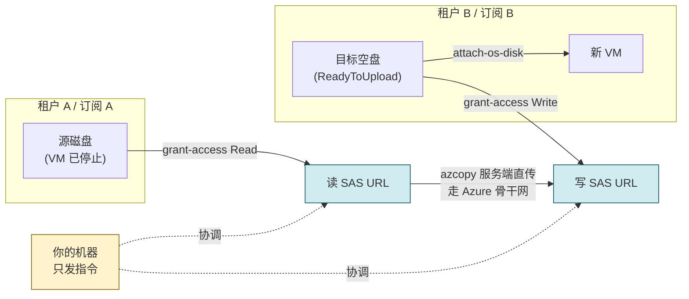

# Azure 跨租户迁移虚拟机：SAS 直传方案

> 把一台 VM 从 **租户 A 的订阅** 迁移到 **租户 B 的订阅**，全程不落本地磁盘。
> 实测 256 GiB 系统盘迁移耗时 **约 16 分钟**。

---

## 目录

- [一、为什么跨租户这么麻烦](#一为什么跨租户这么麻烦)
- [二、常见做法及其代价](#二常见做法及其代价)
- [三、SAS 直传的原理](#三sas-直传的原理)
- [四、性能与成本对比](#四性能与成本对比)
- [五、前置条件](#五前置条件)
- [六、确认源盘](#六确认源盘)
- [七、完整脚本（PowerShell）](#七完整脚本powershell)
- [八、完整脚本（Bash）](#八完整脚本bash)
- [九、迁移后验证](#九迁移后验证)
- [十、数据盘处理](#十数据盘处理)
- [十一、什么时候不该用这个方案](#十一什么时候不该用这个方案)

---

## 一、为什么跨租户这么麻烦

Azure 里复制磁盘本来有非常省事的办法：

```bash
# 同订阅、或同租户下的跨订阅，一条命令搞定，服务端复制，不传一个字节
az disk create -g <目标RG> -n <新盘名> --source <源盘的完整资源ID>
```

但这条命令**跨租户时会失败**。原因在于 Azure 的权限模型：

- `--source` 传入的是一个**资源 ID**（`/subscriptions/xxx/resourceGroups/...`）
- Azure 要用**你当前这一个访问令牌**同时读源、写目标
- 而访问令牌是**按租户签发**的 —— 租户 A 的令牌在租户 B 眼里根本不存在这个身份

同理，下面这些手段也都被同一堵墙挡住：

| 手段 | 跨订阅（同租户） | 跨租户 |
|---|---|---|
| `az disk create --source <diskId>` | ✅ | ❌ |
| 快照直接跨订阅复制 | ✅ | ❌ |
| Azure Compute Gallery 直接共享 | ✅ | ⚠️ 需 RBAC 跨租户授权，配置繁琐 |
| 共享映像库 + 多租户订阅关联 | ✅ | ⚠️ 需管理员打通，非临时方案 |

于是绝大多数人退回到最笨的办法：**下载到本地，再上传上去**。

---

## 二、常见做法及其代价

典型流程：

```
租户A 磁盘 ──下载──> 本地 VHD 文件 ──上传──> 租户B 磁盘
```

代价很实在：

1. **两倍的时间** —— 数据要完整地进出你的机器一趟
2. **两倍的流量** —— 出站（下载）+ 入站（上传），且受你本地带宽死死卡住
3. **需要等量的本地磁盘** —— 256 GiB 的盘就得腾出 256 GiB 空间
4. **多一份数据落盘** —— 系统盘明文躺在你的笔记本上，是实打实的合规风险
5. **中断代价高** —— 传到 80% 网断了，重来的成本极高

而这一切的前提假设是错的：**跨租户并不要求数据经过你的机器。**

---

## 三、SAS 直传的原理

关键在于理解 `az disk grant-access` 返回的到底是什么：

```jsonc
{
  "accessSAS": "https://md-xxxxxxxx.zNN.blob.storage.azure.net/yyyyyyyy/abcd?sv=2018-03-28&sr=b&si=<guid>&sig=<签名>"
}
```

这是一个**自带签名的、普通的 HTTPS URL**。它的性质决定了一切：

- **签名即凭据** —— URL 里的 `sig=` 就是授权本身，谁拿到谁能读/写
- **不依赖 Azure 登录态** —— 用 `curl` 都能下载，跟你登录了哪个租户毫无关系
- **因此不存在"跨租户"问题** —— 对存储服务来说，这只是两个可访问的 URL

于是迁移退化成一个再简单不过的动作：

```
把 URL-A 的内容，复制到 URL-B
```

而 `azcopy` 在两端都是 Azure 存储时，会走**服务端到服务端复制（server-to-server copy）**：

```
租户A 磁盘 ══Azure 骨干网══> 租户B 磁盘
                  ▲
            你的机器只在这里
            发指令、看进度
```

数据在 **Azure 内部骨干网**上流动，你的机器只负责协调。本地流量接近于零。



> **重要**：`azcopy` 在这个流程里**完全不需要 `azcopy login`**。
> 它只处理两个 SAS URL，不涉及任何 Azure 身份。

---

## 四、性能与成本对比

同一块 256 GiB (274,877,906,944 字节) StandardSSD 系统盘，两种方式实测：

| 指标 | 下载→上传 | **SAS 直传** |
|---|---|---|
| 下载耗时 | 37.6 分钟 | — |
| 上传耗时 | 22.0 分钟 | — |
| **总耗时** | **59.6 分钟** | **15.9 分钟** |
| 本地磁盘占用 | 256 GiB | **0** |
| 本地网络流量 | 512 GiB（收+发） | **≈ 0** |
| 数据落盘份数 | 1 份明文在本地 | **0** |

**快 3.7 倍**，而且省掉了本地磁盘和合规风险。

> 传输速度的瓶颈通常是**源盘的吞吐上限**，不是网络。
> StandardSSD 会看到 `Service may be limiting speed` 提示，属正常。
> 若要更快，可临时把源盘升到 Premium/UltraSSD，传完再降回来。

**费用提示**：跨区域会产生出站流量费（同区域内免费）。相比下载到本地再上传，
SAS 直传的出站流量**只算一次**，而前者要算一次出站（下载）；上传通常免费。

---

## 五、前置条件

**工具**

```powershell
winget install Microsoft.AzureCLI
winget install Microsoft.Azure.AZCopy.10
```

> 装完**新开一个终端**，否则 PATH 没刷新，命令会找不到。

**权限**

- 租户 A：对源磁盘有 `Microsoft.Compute/disks/beginGetAccess/action`（Contributor 即可）
- 租户 B：目标订阅的 Contributor 或 Owner

**登录两个租户**（`az login` 是**追加**账户，不会顶掉已有的）：

```powershell
az login --tenant <TENANT_A_ID> --use-device-code
az login --tenant <TENANT_B_ID> --use-device-code
az account list --all -o table          # 两个都应该在
```

> **无图形界面 / 远程终端 / 弹不出浏览器**时，一律加 `--use-device-code`。
>
> **若租户强制 MFA**，普通设备码登录可能仍被拒（报 `RequestDisallowedByAzure`）。
> 此时按报错提示补上 claims-challenge，**并同样附加 `--use-device-code`**：
>
> ```powershell
> az login --tenant <TENANT_ID> `
>   --scope "https://management.core.windows.net//.default" `
>   --claims-challenge <报错里给出的 base64 串> `
>   --use-device-code
> ```

**源 VM 必须已停止（deallocated）**

```powershell
az vm deallocate -g <源RG> -n <源VM>
```

> 系统盘在 VM 运行时无法导出。停机后磁盘状态变为 `Reserved`，
> **此时可以直接 `grant-access`，不需要额外打快照**。
>
> 若业务不允许停机，改用快照（秒级完成，不影响运行中的 VM）：
> ```powershell
> az snapshot create -g <源RG> -n <快照名> --source <源盘名>
> ```
> 之后对**快照**执行 `grant-access`，后续步骤完全相同。

---

## 六、确认源盘

**不要凭磁盘名字挑盘。** 一台 VM 的资源组里常常躺着好几块名字相似的盘：

| 磁盘名 | 创建时间 | 状态 |
|---|---|---|
| `myvm_OsDisk_1_<guid>` | 半年前 | Unattached |
| `myvm-osdisk-20240115-101530` | 3 个月前 | Unattached |
| `myvm-osdisk-20240610-084512` | 上个月 | Reserved |

这些**几乎都是 Azure Backup 恢复留下的历史层**：每次"恢复 VM"，Azure Backup 会
新建一块盘并把 VM 切过去，**旧盘故意保留**（方便你恢复错了能回退），于是越堆越多。
带 `RSVaultBackup` 标签、名字形如 `<vm>-osdisk-<日期>-<时间>` 的，就是恢复产物。

**`Unattached` 不代表"可以放心用"，恰恰是"已被弃用"的信号。**

唯一可靠的做法是**反查 VM 当前实际挂载的是哪块**：

```powershell
az vm show -g <源RG> -n <源VM> --query "storageProfile.osDisk" -o json
```

```jsonc
{
  "name": "myvm-osdisk-20240610-084512",         // ← 认这个
  "managedDisk": { "id": "/subscriptions/<订阅ID>/resourceGroups/<RG>/providers/Microsoft.Compute/disks/myvm-osdisk-20240610-084512" }
}
```

顺带把迁移必需的参数一并取出来（**Gen 和字节数后面要用**）：

```powershell
az disk show -g <源RG> -n <源盘名> `
  --query "{Bytes:diskSizeBytes, Gen:hyperVGeneration, Os:osType, SKU:sku.name, State:diskState}" -o json
```

想确认盘的来历（是原生创建还是备份恢复）：

```powershell
az disk show -g <源RG> -n <源盘名> --query "creationData" -o json
```

- `createOption: FromImage` → VM 创建时的原始盘
- `createOption: Restore` + `sourceResourceId` 含 `restorePointCollections` → **Azure Backup 恢复产物**

> 这一步只花 10 秒。跳过它的代价是：整套流程跑完、VM 建好、
> 甚至排查了半天应用故障之后，才发现迁的是几个月前的旧数据。

---

## 七、完整脚本（PowerShell）

保存为 `migrate-vm.ps1`。**所有 `<...>` 占位符替换成你自己的值。**

> **保存编码**：脚本含中文注释，请存为 **带 BOM 的 UTF-8**（VS Code 右下角选
> `UTF-8 with BOM`），否则 Windows PowerShell 5.1 用 `-File` 加载时会按 ANSI 解析，
> 中文被撑坏并报 `The string is missing the terminator`。
> 若想彻底免疫，把注释改成英文即可。

```powershell
<#
  Azure 跨租户 VM 迁移 —— SAS 直传
  数据走 Azure 骨干网，不经过本地磁盘
#>

$ErrorActionPreference = "Stop"
$env:Path = [System.Environment]::GetEnvironmentVariable("Path","Machine") + ";" +
            [System.Environment]::GetEnvironmentVariable("Path","User")

# ============ 配置区 ============
# 源（租户 A）
$SUB_A      = "<源订阅ID>"
$SRC_RG     = "<源资源组>"
$SRC_VM     = "<源VM名>"
$SRC_DISK   = ""                      # 留空则自动从 SRC_VM 反查（推荐）

# 目标（租户 B）
$SUB_B      = "<目标订阅ID>"
$DST_RG     = "<目标资源组>"
$DST_LOC    = "<目标区域，如 japaneast>"
$DST_DISK   = "<目标磁盘名>"
$DST_VM     = "<目标VM名>"
$DST_SIZE   = "<VM规格，如 Standard_D2ls_v5>"
$DST_SKU    = "StandardSSD_LRS"
$SAS_HOURS  = 24
# ================================

$sasSec = $SAS_HOURS * 3600

function Step($n, $msg) { Write-Host "`n[$n] $msg" -ForegroundColor Cyan }

# ---------- 1. 反查并校验源盘 ----------
Step 1 "Resolving source disk"
az account set --subscription $SUB_A

if (-not $SRC_DISK) {
    $SRC_DISK = az vm show -g $SRC_RG -n $SRC_VM `
                  --query "storageProfile.osDisk.name" -o tsv
    Write-Host "  resolved from VM: $SRC_DISK"
}

$d = az disk show -g $SRC_RG -n $SRC_DISK -o json | ConvertFrom-Json
$BYTES = $d.diskSizeBytes
$GEN   = $d.hyperVGeneration
$OSTYPE= $d.osType
Write-Host "  disk    : $SRC_DISK"
Write-Host "  bytes   : $BYTES"
Write-Host "  gen     : $GEN"
Write-Host "  os      : $OSTYPE"
Write-Host "  state   : $($d.diskState)"

if ($d.diskState -eq "Attached") {
    throw "源盘处于 Attached，请先 'az vm deallocate -g $SRC_RG -n $SRC_VM'，或改用快照"
}

# 上传目标盘时必须多留 512 字节给 VHD footer
$UPLOAD_BYTES = $BYTES + 512

# ---------- 2. 源盘 Read SAS ----------
Step 2 "Granting READ SAS on source"
# 注意：返回字段是 accessSAS（SAS 三个字母全大写）
$src = (az disk grant-access -g $SRC_RG -n $SRC_DISK `
          --access-level Read --duration-in-seconds $sasSec -o json |
        ConvertFrom-Json).accessSAS
if (-not $src) { throw "获取源 SAS 失败" }
Write-Host "  host: $(([uri]$src).Host)"

# ---------- 3. 目标：资源组 + 空的上传盘 ----------
Step 3 "Creating target RG and empty upload disk"
az account set --subscription $SUB_B
az group create -n $DST_RG -l $DST_LOC -o none

az disk create -g $DST_RG -n $DST_DISK -l $DST_LOC `
    --upload-type Upload `
    --upload-size-bytes $UPLOAD_BYTES `
    --hyper-v-generation $GEN `
    --os-type $OSTYPE `
    --sku $DST_SKU -o none
Write-Host "  created: $DST_DISK ($UPLOAD_BYTES bytes, $GEN)"

# ---------- 4. 目标盘 Write SAS ----------
Step 4 "Granting WRITE SAS on target"
$dst = (az disk grant-access -g $DST_RG -n $DST_DISK `
          --access-level Write --duration-in-seconds $sasSec -o json |
        ConvertFrom-Json).accessSAS
if (-not $dst) { throw "获取目标 SAS 失败" }
Write-Host "  host: $(([uri]$dst).Host)"

# ---------- 5. 服务端直传 ----------
Step 5 "Server-side copy (data never touches this machine)"
$t0 = Get-Date
azcopy copy $src $dst --blob-type PageBlob
$copyExit = $LASTEXITCODE
$mins = [math]::Round(((Get-Date) - $t0).TotalMinutes, 1)
Write-Host "  elapsed: $mins min, exit: $copyExit"
if ($copyExit -ne 0) { throw "azcopy 失败，SAS 仍有效，可用 'azcopy jobs resume <jobId>' 续传" }

# ---------- 6. 撤销两端 SAS ----------
Step 6 "Revoking SAS on both sides"
az account set --subscription $SUB_B
az disk revoke-access -g $DST_RG -n $DST_DISK -o none
az account set --subscription $SUB_A
az disk revoke-access -g $SRC_RG -n $SRC_DISK -o none

# ---------- 7. 建 VM ----------
Step 7 "Creating VM from migrated disk"
az account set --subscription $SUB_B

$state = az disk show -g $DST_RG -n $DST_DISK --query "diskState" -o tsv
Write-Host "  target disk state: $state"   # 应为 Unattached

az vm create -g $DST_RG -n $DST_VM -l $DST_LOC `
    --attach-os-disk $DST_DISK `
    --os-type $OSTYPE `
    --size $DST_SIZE `
    --security-type Standard `
    --public-ip-sku Standard -o json

# ---------- 8. 补齐 NSG 规则 ----------
Step 8 "Opening extra ports (edit as needed)"
$nsg = "$DST_VM" + "NSG"
# 示例：放通应用端口。az vm create 已自动放通 22（Linux）/ 3389（Windows）
# az network nsg rule create -g $DST_RG --nsg-name $nsg -n app `
#     --priority 1010 --access Allow --protocol Tcp --direction Inbound `
#     --source-address-prefixes "*" --source-port-ranges "*" `
#     --destination-address-prefixes "*" --destination-port-ranges <端口> -o none

Step 9 "Done"
az vm show -d -g $DST_RG -n $DST_VM `
   --query "{Name:name,IP:publicIps,Size:hardwareProfile.vmSize,Power:powerState}" -o json
```

**运行：**

```powershell
powershell -ExecutionPolicy Bypass -File .\migrate-vm.ps1
```

---

## 八、完整脚本（Bash）

保存为 `migrate-vm.sh`，适用于 Linux / macOS / WSL / Cloud Shell。

```bash
#!/usr/bin/env bash
set -euo pipefail

# ============ 配置区 ============
SUB_A="<源订阅ID>"
SRC_RG="<源资源组>"
SRC_VM="<源VM名>"
SRC_DISK=""                       # 留空则自动反查

SUB_B="<目标订阅ID>"
DST_RG="<目标资源组>"
DST_LOC="<目标区域>"
DST_DISK="<目标磁盘名>"
DST_VM="<目标VM名>"
DST_SIZE="<VM规格>"
DST_SKU="StandardSSD_LRS"
SAS_SEC=86400
# ================================

step() { printf '\n\033[36m[%s] %s\033[0m\n' "$1" "$2"; }

step 1 "Resolving source disk"
az account set --subscription "$SUB_A"
if [[ -z "$SRC_DISK" ]]; then
  SRC_DISK=$(az vm show -g "$SRC_RG" -n "$SRC_VM" --query "storageProfile.osDisk.name" -o tsv)
  echo "  resolved from VM: $SRC_DISK"
fi

read -r BYTES GEN OSTYPE STATE < <(
  az disk show -g "$SRC_RG" -n "$SRC_DISK" \
    --query "[diskSizeBytes,hyperVGeneration,osType,diskState]" -o tsv
)
echo "  disk=$SRC_DISK bytes=$BYTES gen=$GEN os=$OSTYPE state=$STATE"

if [[ "$STATE" == "Attached" ]]; then
  echo "源盘 Attached，请先 az vm deallocate，或改用快照" >&2; exit 1
fi

UPLOAD_BYTES=$((BYTES + 512))     # VHD footer

step 2 "Granting READ SAS on source"
# 字段名是 accessSAS，全大写
SRC_SAS=$(az disk grant-access -g "$SRC_RG" -n "$SRC_DISK" \
            --access-level Read --duration-in-seconds "$SAS_SEC" \
            --query accessSAS -o tsv)
[[ -n "$SRC_SAS" ]] || { echo "获取源 SAS 失败" >&2; exit 1; }

step 3 "Creating target RG and empty upload disk"
az account set --subscription "$SUB_B"
az group create -n "$DST_RG" -l "$DST_LOC" -o none
az disk create -g "$DST_RG" -n "$DST_DISK" -l "$DST_LOC" \
  --upload-type Upload \
  --upload-size-bytes "$UPLOAD_BYTES" \
  --hyper-v-generation "$GEN" \
  --os-type "$OSTYPE" \
  --sku "$DST_SKU" -o none

step 4 "Granting WRITE SAS on target"
DST_SAS=$(az disk grant-access -g "$DST_RG" -n "$DST_DISK" \
            --access-level Write --duration-in-seconds "$SAS_SEC" \
            --query accessSAS -o tsv)
[[ -n "$DST_SAS" ]] || { echo "获取目标 SAS 失败" >&2; exit 1; }

step 5 "Server-side copy"
time azcopy copy "$SRC_SAS" "$DST_SAS" --blob-type PageBlob

step 6 "Revoking SAS on both sides"
az disk revoke-access -g "$DST_RG" -n "$DST_DISK" -o none
az account set --subscription "$SUB_A"
az disk revoke-access -g "$SRC_RG" -n "$SRC_DISK" -o none

step 7 "Creating VM"
az account set --subscription "$SUB_B"
az vm create -g "$DST_RG" -n "$DST_VM" -l "$DST_LOC" \
  --attach-os-disk "$DST_DISK" \
  --os-type "$OSTYPE" \
  --size "$DST_SIZE" \
  --security-type Standard \
  --public-ip-sku Standard -o json

step 8 "Done"
az vm show -d -g "$DST_RG" -n "$DST_VM" \
  --query "{Name:name,IP:publicIps,Size:hardwareProfile.vmSize,Power:powerState}" -o json
```

---

## 九、迁移后验证

### 1. 确认数据是**你要的那个时间点**

不要只看 VM 起来了就完事。用文件时间戳做**新鲜度实证**：

```bash
# 系统日志的轮转链应当连续，且延续到源 VM 停机那天
ls -la --time-style=+%Y-%m-%d /var/log/syslog*

# 应用数据/配置的最后修改时间
find /home -maxdepth 3 -type f -newermt '<你预期的日期>' \
     -printf '%TY-%Tm-%Td %TH:%TM  %p\n' | sort -r | head -20
```

若时间戳明显早于源 VM 的停机时间，**说明你迁的是旧盘，回到第六章重新确认源盘**。

### 2. 登录方式不受影响

`az vm create --attach-os-disk` **不走 provisioning 流程**，因此：

- 不重置密码、不注入新的 SSH 公钥
- 原有的 `~/.ssh/authorized_keys` 原封不动
- **仍用你原来的密钥登录**，`--admin-username` / `--ssh-key` 参数在这里是无效的

```bash
ssh -i <原来的私钥> <原用户名>@<新公网IP>
```

### 3. 无法 SSH 时的排查通道

不必依赖 SSH，直接用 Azure 的带内通道执行命令：

```powershell
az vm run-command invoke -g <目标RG> -n <目标VM> `
   --command-id RunShellScript --scripts "@diag.sh" `
   --query "value[0].message" -o tsv
```

> 复杂脚本务必**写成 `.sh` 文件再用 `@文件名` 引用**。
> 内联 `--scripts "..."` 会被 shell 的引号解析搅乱。

### 4. 应用层检查清单

- 绑死公网 IP / 主机名的配置需要改（IP 变了）
- 依赖 Azure 托管标识（Managed Identity）的代码**会失效** —— 标识不跨租户
- Key Vault / 存储账户等资源的引用需要在新租户重建授权
- 各类 OAuth token / 设备配对凭据可能需要重新授权

---

## 十、数据盘处理

上面的脚本只迁系统盘。数据盘完全同理，只是不需要 `--os-type` / `--hyper-v-generation`：

```powershell
# 源端列出所有数据盘
az vm show -g <源RG> -n <源VM> `
   --query "storageProfile.dataDisks[].{Lun:lun,Name:name,Size:diskSizeGb}" -o table

# 对每块数据盘重复"grant-access → 建空盘 → 直传 → revoke"，然后挂载
az disk create -g <目标RG> -n <数据盘名> -l <区域> `
    --upload-type Upload --upload-size-bytes <字节数+512> --sku StandardSSD_LRS

az vm disk attach -g <目标RG> --vm-name <目标VM> --name <数据盘名> --lun <原LUN号>
```

> **保持原来的 LUN 号**，否则 `/etc/fstab` 里按设备路径挂载的条目会错乱。
> 更稳妥的做法是 fstab 里统一用 UUID。

---

## 十一、什么时候不该用这个方案

| 场景 | 更好的选择 |
|---|---|
| **同租户跨订阅** | `az disk create --source <diskId>`，一条命令，服务端复制 |
| **同订阅换区域** | 同上，`--source` 直接跨区域 |
| **需要反复分发到多个租户** | Azure Compute Gallery + 跨租户 RBAC，一次配置长期复用 |
| **整体搬迁，含网络/负载均衡等** | Azure Resource Mover 或导出 ARM/Bicep 模板重建 |
| **磁盘启用了客户托管密钥（CMK）** | 需先在目标租户配好 Key Vault 与 DES，或改用平台托管密钥导出 |
| **只想搬应用而非整机** | 直接在目标租户重建 VM + 部署应用，通常更干净 |
| **源 VM 用了 Trusted Launch / 机密计算** | 目标端安全类型需匹配；本方案示例用的是 `Standard` |
