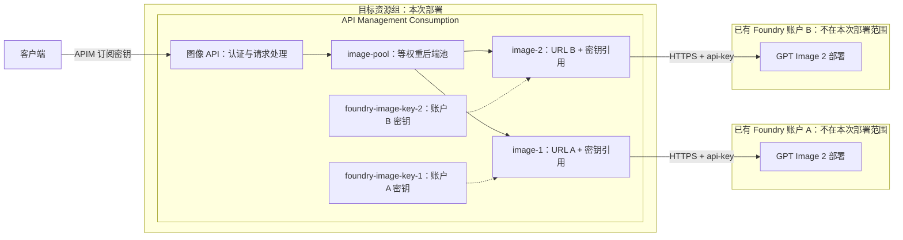

# 使用 Azure API Management 对 GPT Image 2 进行负载均衡

当多个应用共用图像生成服务时，可以通过 Azure API Management（APIM）提供统一入口，再把请求分配给不同的模型部署。客户端只需要知道网关地址和自己的访问密钥，不需要管理每个模型的地址与凭据。

本文使用 **APIM Consumption + 原生 Backend Pool**，连接多个已有 Foundry 图像模型部署。每个 Backend 使用对应账户的 URL 和密钥，组成等权重后端池，不使用托管身份进行模型调用。下图以两个账户为例，模板支持 **1–30 个后端**；增加已有 Foundry 时，只需在 JSON 参数中追加配置并重新部署，无需修改 Bicep 或 Policy。

> 本文只部署网关及其配置，**不创建 Foundry、Foundry 项目或 GPT Image 模型资源**。所有环境信息均使用占位符，需要替换为自己的配置。

## 目录

- [一、整体架构](#一整体架构)
- [二、关键配置与处理方式](#二关键配置与处理方式)
- [三、使用 Bicep 部署网关](#三使用-bicep-部署网关)
- [四、测试与验证](#四测试与验证)
- [五、通过 Azure Portal 更新配置](#五通过-azure-portal-更新配置)

---

## 一、整体架构

### 1.1 组件与调用关系

示意图中的两个 Backend 是配置示例，不是数量限制。每个数组元素对应一个已有模型部署；也可以接入同一账户下的不同部署。



一次请求经过以下步骤：

1. 客户端向 APIM 发送请求，通过 `api-key` 请求头携带 **APIM 订阅密钥**。
2. APIM 校验客户端凭据，然后删除这些凭据，避免原样发送给模型服务。
3. API 策略选择 `image-pool`，由 APIM 在已配置的 Backend 之间分配请求。
4. 被选中的 Backend 提供模型 URL，并注入 **Foundry 账户密钥**。
5. 模型返回生成结果，APIM 转发 JSON 或 SSE 响应给客户端。

### 1.2 对外提供的接口

| 功能 | 方法 | APIM 路径 | 请求格式 |
| --- | --- | --- | --- |
| 图像生成 | POST | `/images/generations` | JSON |
| 图像编辑 | POST | `/images/edits` | multipart/form-data |

完整地址的格式为：

```text
https://<apim-name>.azure-api.net/images/generations
https://<apim-name>.azure-api.net/images/edits
```

模型部署由 Backend URL 决定，示例请求不需要传 `model`。生成结果在 `data[0].b64_json` 中，是 Base64 编码的图片，不是图片下载 URL。


---

## 二、关键配置与处理方式

### 2.1 什么是 Backend，什么是 Backend Pool

**Backend 是 APIM 中的一份后端连接配置，不是新建一个模型或服务器。** 它描述“请求发到哪里、如何认证、是否校验证书”。

| 对象 | 本项目中的名称 | 保存的内容 |
| --- | --- | --- |
| API | `image-api`，显示名 `GPT Image 2` | 客户端路径、操作和订阅认证设置 |
| Backend | `image-1`、`image-2`、…、`image-N` | 每项配置对应一个 Backend，保存模型 URL、认证请求头和 TLS 校验设置 |
| Backend Pool | `image-pool` | Backend 成员、权重和优先级 |
| Named values | `foundry-image-key-1`、`foundry-image-key-2`、… | 分别保存各项配置对应账户的模型访问密钥，类型为 Secret |
| Subscription | `image-client`，显示名 `Image API client` | 客户端调用本 API 的密钥与状态 |
| Policy | API 级策略 | 请求头处理、版本参数、后端池选择和转发设置 |

Backend 和池定义在 [网关模块](modules/gateway.bicep) 中，数量随 `backends` 数组变化。每个成员的 `priority` 和 `weight` 均为 `1`，表示同一优先级下等权重分配。数组至少包含 1 项，最多 30 项（APIM 原生池的成员上限）；只有一个后端时可以转发请求，但不存在多后端分流。

[策略模板](policies/image-api.xml) 中的 `set-backend-service` 只**引用** `image-pool`，不会创建池。创建池和把请求路由到池是两件不同的事。

### 2.2 每个 endpoint 的密钥保存在哪里

使用本文的 Bicep 部署时，**不需要事先手工保存或传入模型密钥**。部署会按每项配置读取对应 Foundry 账户的现有 key1，并分别保存到 **APIM → Named values（命名值）** 中，标记为 **Secret**；Backend 中不直接写明文密钥，而是引用命名值。以前两项为例：

| Backend | Runtime URL 的作用 | 认证请求头 | 请求头的值 |
| --- | --- | --- | --- |
| `image-1` | 指向 Foundry A 的部署 | `api-key` | `{{foundry-image-key-1}}` |
| `image-2` | 指向 Foundry B 的部署 | `api-key` | `{{foundry-image-key-2}}` |

**不同账户的 endpoint 必须使用各自账户的密钥。** 密钥作用域是账户，不是模型名称；即使账户之间的部署同名，也不能互换密钥。同一账户下的不同部署可使用同一把账户密钥，模板仍按每项配置分别创建 Secret 命名值，保持对应关系明确。

部署时，密钥的传递过程为：

1. [主模板](main.bicep) 按 `backends` 数组中的源资源组和账户名，使用 `resourceId()` 定位各个已有账户，不声明创建账户资源。
2. ARM 循环调用 `listKeys(账户资源 ID, 管理接口版本).key1`，读取现有密钥，不重新生成密钥。同一账户的不同部署可以重复引用该账户资源 ID。
3. 密钥列表放入 `@secure()` 对象参数 `backendApiKeys` 的 `values` 中，按相同数组顺序传给网关模块。
4. 网关创建 N 份 Secret 命名值，每个 Backend 只引用对应项的密钥。

因此，**公开 JSON 参数、Policy XML 和部署输出不需要包含明文模型密钥**。当前实现使用 APIM Secret 命名值，并未配置 Key Vault。

`backends` 数组的第 N 个对象对应 `image-N` 和 `foundry-image-key-N`。账户信息、URL 和密钥始终按同一对象绑定；替换账户时必须一起更新，不能只改 URL。

### 2.3 客户端密钥与模型密钥不能混用

虽然两段请求都使用名为 `api-key` 的请求头，但它们的含义不同：

| 调用方向 | 使用的密钥 | 管理位置 |
| --- | --- | --- |
| 客户端 → APIM | APIM Subscription key | APIM 的 Subscriptions |
| APIM → 模型 | Foundry 账户 key | Foundry 的 Keys and Endpoint；在 APIM 中保存为 Secret 命名值 |

APIM 完成客户端认证后，策略删除客户端的 `api-key`、`Authorization`、`Ocp-Apim-Subscription-Key` 和 `subscription-key` 查询参数，再由选中的 Backend 注入正确的模型密钥。

客户端不需要持有 Foundry 密钥。若只让客户端调用 APIM，不应把后端账户密钥分发给客户端。

### 2.4 URL 与 API 版本如何组合

Backend 的 Runtime URL 必须指向**部署级路径**，末尾停在 `/images`：

```text
https://<foundry-account-name>.openai.azure.com/openai/deployments/<deployment-name>/images
```

不要填写 Foundry 项目首页地址，也不要在这里追加 `/generations` 或 `?api-version=...`。操作路径和版本由 APIM 补充，例如图像生成最终请求为：

```text
https://<foundry-account-name>.openai.azure.com/openai/deployments/<deployment-name>/images/generations?api-version=2025-04-01-preview
```

策略中的两个占位符在部署时由 Bicep 替换：

| 占位符 | 对应 JSON 参数 | 作用 |
| --- | --- | --- |
| `__API_VERSION__` | `imageApiVersion` | 覆盖转发请求中的 `api-version` 查询参数 |
| `__EXPOSE_BACKEND__` | `exposeBackendPath` | 控制是否返回实际命中的后端主机名和路径 |

开启诊断时返回 `X-Image-Backend-Host` 和 `X-Image-Backend-Path`。跨账户的部署可能同名，仅看路径无法区分，需要结合主机名判断实际命中的 Backend。

`imageApiVersion` 是**模型推理接口版本**，不是模型版本，也不是 Bicep 中 `@2024-05-01` 这样的 Azure 管理接口版本。

### 2.5 流式、超时与故障处理的边界

- `buffer-response="false"` 用于支持 SSE 转发；策略不读取或改写图像响应体。
- 转发超时设为 `120` 秒，不保证任意高分辨率或高质量请求都能在网关时限内完成。
- 非幂等图像 POST 不在超时后自动重试，避免在结果不确定时重复生成；429 等错误会传回客户端。
- Consumption 支持原生后端池，但**不支持后端熔断**。该配置不保证自动剔除故障后端，也不能仅通过不同优先级实现可靠的故障切换。
- 等权重是近似分流，多个网关实例不会同步轮询状态，不保证每两个请求严格交替。

---

## 三、使用 Bicep 部署网关

### 3.1 部署前准备

开始前应具备以下条件：

1. 同一订阅内已有要接入的 Foundry 账户及可用 GPT Image 2 部署，准备 1–30 个不同的部署 URL。若要实现多后端分流，至少配置两项。账户中的其他模型不受本次部署影响。
2. 源账户允许 API key 认证，网络设置允许 APIM 和测试客户端访问相应 HTTPS endpoint。本模板不配置 VNet 或 Private Endpoint。
3. 部署只需要 Azure CLI 和 Bicep CLI；第 4 节的独立出图示例需要 Python 3.9+，只使用标准库，无需安装第三方包。
4. 已通过 `az login` 登录，相关资源提供程序已注册。
5. 部署身份有权创建目标资源组、APIM 及其子资源，并能执行所有配置账户的 `listKeys`；订阅级部署权限与租户策略也需满足。查看 APIM 客户端密钥需要相应管理权限；使用有效客户端密钥发起图像请求本身不需要 Azure 管理权限。

#### 部署前，Foundry key 应该保存在哪里？

**不用提前保存到任何本地文件，也不用先在 APIM 中手工创建命名值。** 密钥已经由 Azure 保存在各自的 Foundry 账户中，本模板会在部署过程中自动读取并写入 APIM。

| 阶段 | 密钥在哪里 | 用户需要做什么 |
| --- | --- | --- |
| 部署前 | 各个已有 Foundry 账户的 **Keys and Endpoint** | 确认账户允许 API key 认证，且部署身份有权读取所有源账户的密钥；无需复制 key |
| 部署时 | ARM 按数组读取对应账户的 key1，通过 `@secure()` 参数传给网关模块 | 参数只填写资源组、账户名和 URL，不填写 key |
| 部署后 | APIM 的 `foundry-image-key-1` 至 `foundry-image-key-N` Secret 命名值 | 无需额外操作；需要检查时进入 **APIM → APIs → Named values** |

部署前可以在 Azure Portal 打开各个 Foundry 账户的 **Resource Management → Keys and Endpoint**，确认密钥认证相关设置。这里是密钥来源，不是要求把密钥下载到本地；也不需要点击 **Regenerate** 重新生成密钥。

通过 `az login` 登录并发起部署的身份，必须在**所有配置的源账户**上具备 `Microsoft.CognitiveServices/accounts/listKeys/action` 权限。仅能调用模型，或只有 Reader 权限，并不代表可以读取账户密钥。如果部署报 `AuthorizationFailed`，应由管理员授予所需权限，而不是把 key 粘贴到 JSON 中。

不要把 Foundry key 写入 [参数示例](parameters.prod.json)、Bicep、Policy XML、环境变量或命令行参数；**本部署入口不需要也不读取用户提供的密钥值**。它固定读取每个账户的 key1，并保存到各自的 Secret 命名值中。

下文所有命令均在**本主题目录**运行。发布包解压后，先进入对应主题目录。

### 3.2 使用哪些文件

| 文件 | 作用 |
| --- | --- |
| [main.bicep](main.bicep) | 订阅级入口，创建目标资源组，读取现有 Foundry 密钥并调用网关模块 |
| [modules/gateway.bicep](modules/gateway.bicep) | 定义 APIM、后端、池、命名值、API、策略和客户端订阅 |
| [policies/image-api.xml](policies/image-api.xml) | API 级策略模板，由 Bicep 读取并替换占位符 |
| [parameters.prod.json](parameters.prod.json) | 生产环境的公开参数示例 |

本项目只包含网关部署所需的模板和配置，直接通过 Azure CLI 部署，不创建 Foundry 账户或图像模型资源。

### 3.3 JSON 参数逐项说明

部署时复制 [参数示例](parameters.prod.json)，在私人副本中填写自己的资源组、账户和模型地址。生产或验收环境使用相同的参数结构。

先看 JSON 外层：

| 字段 | 含义 |
| --- | --- |
| `$schema` | Azure 部署参数文件的格式说明地址，用于工具校验；不是模型接口地址 |
| `contentVersion` | 这份参数文件的内容版本；不是模型版本或推理 API 版本 |
| `parameters` | 要传给 Bicep 的参数集合 |
| 每个参数的 `value` | 实际传入 Bicep 的值；保持原有字符串、数组或布尔类型 |

`parameters` 内各项含义如下：

| 参数 | 类型 | 含义与填写要求 |
| --- | --- | --- |
| `targetResourceGroup` | 字符串 | 本次创建或更新的 **APIM 所在资源组**。生产和测试建议使用不同资源组，测试组与源模型组分开 |
| `resourceGroupLocation` | 字符串 | 目标资源组的元数据区域；**不决定模型运行区域**。已存在资源组应使用其原有位置 |
| `apimLocation` | 字符串 | **APIM 服务实际部署区域**，必须支持 Consumption；可以与资源组元数据区域不同 |
| `apimName` | 字符串 | APIM 服务名，决定默认网关域名；需满足 Azure 命名和全局唯一性要求，生产与测试不能使用同名服务 |
| `publisherEmail` | 字符串 | APIM 发布者联系邮箱；不是登录账号配置，也不是认证凭据 |
| `publisherName` | 字符串 | APIM 发布者显示名称，示例为 `Image API`；不会改变模型名或 API 路径 |
| `backends` | 对象数组 | 1–30 个对象，每项描述一个已有账户及其模型部署 URL；顺序决定 `image-1` 至 `image-N` 的对应关系。添加更多 Foundry 只需追加对象并重新部署 |
| `imageApiVersion` | 字符串 | 后端图像接口的 `api-version` 值，示例为 `2025-04-01-preview`；需兼容所用模型及接口 |
| `exposeBackendPath` | 布尔值 | `true` 时返回后端主机名和路径两个诊断头，方便验证不同账户；公开示例默认 `false`，验证分流时改为 `true` 并部署。填写 JSON 布尔值，不加引号 |

`backends` 中每个对象有三个字段，里面不需要再嵌套 `value`：

| 字段 | 类型 | 含义与填写要求 |
| --- | --- | --- |
| `sourceResourceGroup` | 字符串 | 该 Foundry 账户所在的已有资源组；各账户可以在同一个或不同资源组 |
| `foundryAccountName` | 字符串 | 该 Foundry 账户名，不是项目名或部署名；可以重复引用同一账户的不同部署 |
| `url` | 字符串 | 该账户中所选部署的 HTTPS URL，以 `/images` 结尾，不带末尾斜杠、查询参数或片段；主机名必须与本对象的账户匹配 |

例如，包含两个后端的参数数组如下（占位符均需替换；可继续追加更多对象）：

```json
{
  "backends": {
    "value": [
      {
        "sourceResourceGroup": "<source-resource-group-a>",
        "foundryAccountName": "<foundry-account-a>",
        "url": "https://<foundry-account-a>.openai.azure.com/openai/deployments/<deployment-a>/images"
      },
      {
        "sourceResourceGroup": "<source-resource-group-b>",
        "foundryAccountName": "<foundry-account-b>",
        "url": "https://<foundry-account-b>.openai.azure.com/openai/deployments/<deployment-b>/images"
      }
    ]
  }
}
```

每个对象的 `sourceResourceGroup` 和 `foundryAccountName` 一起定位账户；顶层的 `targetResourceGroup` 和 `apimName` 决定要创建网关的位置，不要混淆。

**订阅 ID 不在 JSON 中**，由下文 Azure CLI 命令的 `--subscription` 显式指定。所有源账户与目标资源组需位于该订阅中。

**模型密钥不在 JSON 中，也无需提前保存到本地**，由部署时的 `listKeys()` 自动读取并写入 APIM Secret 命名值，具体见第 3.1 节。不要自行往参数文件添加 API key。

### 3.4 直接使用 Azure CLI 部署 Bicep

所有基础设施操作均直接使用 Azure CLI，无需项目脚本。

下面的命令只执行基础设施部署，不导出本地凭据，也不发起图像测试：

```bash
az deployment sub create \
  --subscription '<your-subscription-id>' \
  --location '<deployment-location>' \
  --name image-gateway-deployment \
  --template-file main.bicep \
  --parameters parameters.prod.json
```

这里使用 `az deployment sub create`，因为 [主模板](main.bicep) 的作用域是订阅。`--location` 保存的是**部署记录**，APIM 本身的区域仍由 `apimLocation` 决定。

提交前需要核对所有参数，尤其是每个 URL 是否属于对应 Foundry 账户；不要将携带账户密钥的 Backend 指向不可信域名。

部署完成后，可以用同一个部署名称查询状态和输出地址：

```bash
az deployment sub show \
  --subscription '<your-subscription-id>' \
  --name image-gateway-deployment \
  --query '{state:properties.provisioningState,outputs:properties.outputs}' \
  --output json
```

`state` 为 `Succeeded` 表示部署完成，`outputs.generationUrl.value` 是图像生成地址。修改参数或模板后，重新执行上面的 `az deployment sub create` 即可应用配置；生成调用是否成功仍需按第 4 节验证。

#### 如何添加更多 Foundry

**只需修改私人 JSON 参数，然后重新执行上面的部署命令。无需修改 Bicep 或 Policy，也无需手工创建 Backend、命名值或池成员。**

1. 确认要添加的 Foundry 和 GPT Image 2 部署已经存在，且部署身份有权读取该账户的密钥。
2. 在 `parameters.backends.value` 数组末尾追加一个对象，填写源资源组、账户名和部署 URL，例如：

   ```json
   {
     "sourceResourceGroup": "<source-resource-group-c>",
     "foundryAccountName": "<foundry-account-c>",
     "url": "https://<foundry-account-c>.openai.azure.com/openai/deployments/<deployment-c>/images"
   }
   ```

3. 保留原有配置并检查 JSON 逗号、账户与 URL 对应关系，确保总数不超过 30。
4. 使用相同订阅、目标资源组、APIM 名称重新部署。若这是第三项，模板会自动创建 `image-3`、`foundry-image-key-3`，并将它加入 `image-pool`。

追加配置是**接入已有 Foundry**，不会创建新的 Foundry 或模型。命名按数组顺序生成，建议在末尾追加，不随意重排已有项。缩短数组会更新池成员，但增量部署不会自动删除不再使用的 Backend 或 Secret 命名值；如需删除这些残留配置，应确认未被其他 API 引用后单独清理。

### 3.5 部署会生成哪些资源

以下 N 为 `backends` 数组的长度。

| 资源 | 数量 | 用途 |
| --- | --- | --- |
| 目标资源组 | 1 | 容纳网关；已存在时按增量部署更新声明 |
| APIM 服务 | 1 | Consumption，capacity 为 `0` |
| Secret 命名值 | N | `foundry-image-key-1` 至 `foundry-image-key-N`，分别保存对应项账户的现有 key1 |
| 普通 Backend | N | `image-1` 至 `image-N`，分别对应各个部署 URL |
| Backend Pool | 1 | `image-pool`，包含 N 个等权重成员 |
| API | 1 | `image-api`，显示名 `GPT Image 2`，路径前缀 `images` |
| API 操作 | 2 | POST `generations` 和 POST `edits` |
| API 级 Policy | 1 | 引用后端池并处理认证、版本和转发 |
| API 级 Subscription | 1 | `image-client`，显示名 `Image API client`，状态 Active |

此外会产生 ARM 部署记录。**不创建 Foundry 账户、项目、模型部署、Key Vault、Product 或模型访问 RBAC 角色分配。** 测试环境的目标资源组中也不应出现新建模型资源。

部署输出包含 `gatewayUrl`、`generationUrl`、`editUrl`、`apimName` 和 `backendUrls`，不包含密钥。模板不会主动重新生成 Foundry 或 APIM 客户端密钥。

---

## 四、测试与验证

### 4.1 先获取调用信息

测试只需要两项信息：

1. **图像生成 URL**：使用部署输出中的 `generationUrl`，格式为 `https://<apim-name>.azure-api.net/images/generations`。
2. **APIM 客户端密钥**：在 Azure Portal 打开目标 APIM，进入 **APIs → Subscriptions → Image API client**，确认状态为 **Active**，复制 primary 或 secondary key。

这里使用的是 **APIM 订阅密钥，不是 Foundry 模型密钥**。不要为了查看密钥而点击重新生成，也不要将密钥写入公开代码。

### 4.2 用 Python 发送一次生成请求

将下面的 `url` 替换为自己的网关地址，在 Python 环境中直接运行即可，**不依赖项目中的任何 Python 文件**。运行时按提示输入 APIM 客户端密钥，密钥不会回显到终端。

```python
import base64
import json
from getpass import getpass
from pathlib import Path
from urllib.request import Request, urlopen

url = "https://<apim-name>.azure-api.net/images/generations"
api_key = getpass("APIM 客户端密钥：")
body = {
    "prompt": "A simple blue circle on a white background, no text.",
    "n": 1,
    "size": "1024x1024",
    "quality": "low",
    "output_format": "png",
}

request = Request(
    url,
    data=json.dumps(body).encode("utf-8"),
    headers={"Content-Type": "application/json", "api-key": api_key},
    method="POST",
)
with urlopen(request, timeout=180) as response:
    print("HTTP 状态：", response.status)
    result = json.load(response)

image = base64.b64decode(result["data"][0]["b64_json"], validate=True)
if not image.startswith(b"\x89PNG\r\n\x1a\n"):
    raise ValueError("响应不是 PNG 图片")
output = Path("generated-image.png")
output.write_bytes(image)
print("图片已保存：", output.resolve())
```

看到 HTTP 200 后，打开保存的图片，确认它可以正常显示。图片保存在当前运行目录，重复运行会覆盖同名图片。HTTP 200 本身不等于出图成功，还要确认响应中有图片数据且图片可打开。

### 4.3 判断测试结果

请求返回 HTTP 200，且保存的图片可以正常打开，即完成一次网关图像生成测试。无需开启后端诊断。

这个示例只验证**一次非流式图像生成调用**，不覆盖后端分流、流式响应、图像编辑或压力测试。

如果遇到 `HTTPError: 401`，先检查是否使用了正确的 APIM 客户端密钥、订阅是否 Active，再检查后端密钥配置；`429` 表示请求受限，需要根据源模型容量和服务返回的提示调整调用频率。

---

## 五、通过 Azure Portal 更新配置

后续维护通常集中在 **Named values、Backends、API Design / Settings 和 Subscriptions**。以下均从目标 APIM 服务进入；Portal 的按钮名称可能随语言和版本略有不同。

### 5.1 查看或更新模型访问密钥

1. 在 APIM 左侧 **APIs** 分类下选择 **Named values（命名值）**。
2. 按数组位置选择对应的 `foundry-image-key-N`，确认类型为 **Secret**。
3. 更新时填入该项所指账户的密钥，不要将不同账户的密钥混用。同一账户的多份引用应一起维护。
4. 配置生效后，验证受影响的 Backend 能正常访问模型。

密钥来源是源 Foundry 账户的 **Resource Management → Keys and Endpoint**。读取或复制现有 key 不等于重新生成 key；不要为了查看密钥而点击 Regenerate。

若手工新建命名值，建议 **Name 和 Display name 使用相同名称**。`{{...}}` 引用的是命名值的 **Display name**。密钥不要直接写到 Policy、公开 JSON 或文档中，也不要通过截图、诊断日志或策略响应返回它。

**注意：当前 Bicep 始终读取源账户的 key1。** 如果在 UI 中改用 key2 或其他凭据，下次部署前应同步调整密钥来源设计，否则会被模板重新写回 key1。

### 5.2 配置 Backend 的 URL 和认证

进入 **APIs → Backends**，打开需要维护的 `image-N`。新建时选择 **Create new backend / Add**，使用 **Custom URL** 类型。

关键字段如下：

| UI 配置 | 应填写的内容 |
| --- | --- |
| Name | Backend 名称，按配置顺序为 `image-1`、`image-2` 等 |
| Runtime URL | 对应部署的 HTTPS URL，以 `/openai/deployments/<deployment-name>/images` 结尾 |
| Authorization credentials → Headers | 新增或修改请求头 `api-key` |
| Header value | 填对应的 `{{foundry-image-key-N}}`，N 替换为实际序号；不是 APIM 客户端密钥 |
| Certificate chain / name validation | 保持启用，不通过关闭证书检查解决连接问题 |

修改部署名时更新对应 URL；修改账户时还必须更新密钥引用，不能把原账户密钥发送到另一个账户或不可信主机。

密钥和 URL 按 `backends` 的索引一一对应。若修改命名值的 Display name，也要同步 Backend 引用和模板，避免下次部署恢复为原配置。

### 5.3 添加或调整后端池

1. 进入 **APIs → Backends**，切换到 **Load balancer**。
2. 选择现有 `image-pool` 查看或编辑；新建时使用 **Create new pool**。
3. 在 **Add backends to pool** 中选择需要加入的 Backend。
4. 在 **Customize weight and priority** 中配置成员权重与优先级。
5. 保存后，通过实际请求验证路由。

保持本项目结构时，池中应包含参数数组对应的全部 Backend，各成员 `Priority = 1`、`Weight = 1`。修改池成员不需要把模型密钥填到池上，密钥由各 Backend 的认证配置提供。

增加已有 Foundry 时，推荐按第 3.4 节修改 JSON 后重新部署，池会自动更新，API 策略仍引用 `image-pool`。UI 手工改动不会回写 JSON，下次部署会重新应用模板配置；若需不同权重，需要修改网关模块中的权重设置。若改了池名称，还要修改策略中的 `backend-id`。

### 5.4 编辑 API 级 Policy

1. 进入 **APIs → APIs**，选择 **GPT Image 2**。
2. 打开 **Design**，选择 **All operations（所有操作）**。
3. 点击策略区域的 **`</>`（Policy code editor）**。
4. 修改 XML 并保存。

这里编辑的是**当前 API 的策略**，同时作用于生成和编辑操作。不要误选成 **All APIs** 的全局策略，也不要只改某一个操作。

Portal 中已经部署的 XML 已完成占位符替换，不能把 [本地策略模板](policies/image-api.xml) 原样复制进去。

### 5.5 管理客户端密钥和 API 操作

**客户端密钥：**进入 **APIs → Subscriptions**，找到 **Image API client**，检查其 Scope 指向当前图像 API、状态为 **Active**。具备相应权限后，可查看或复制 primary / secondary key。这两把是 APIM 客户端密钥，不是模型密钥。

**API 认证设置：**进入 **APIs → APIs → GPT Image 2 → Settings**，确认 **Subscription required** 开启，订阅密钥的 Header name 为 `api-key`。本项目没有使用默认的 `Ocp-Apim-Subscription-Key` 作为客户端认证头。

**API 路径与操作：**确认 API URL suffix 为 `images`，在 **Design** 中检查两个 POST 操作分别为 `/generations` 和 `/edits`。更改路径后，客户端调用地址也必须同步更新。
