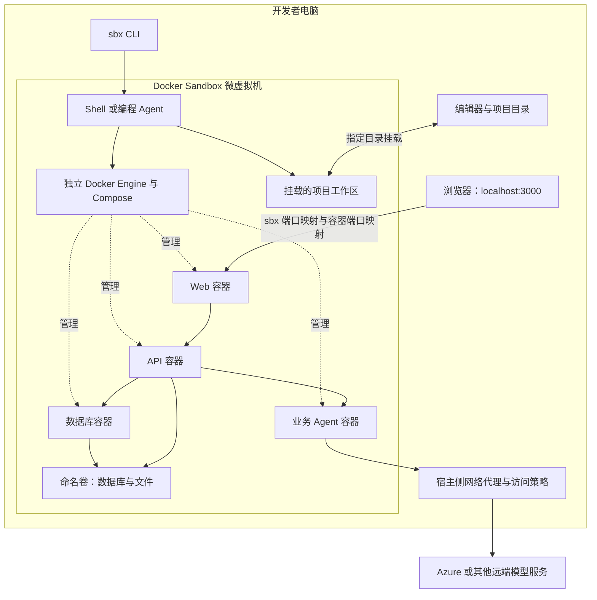

# 什么是 Docker Sandbox：优势、架构与配置方法

开发一个带有 AI Agent 的应用，通常不只需要一个运行时。前端可能使用 Node.js，Agent 使用 Python，旁边还要有数据库、文件处理工具和浏览器测试环境。如果全部安装在开发者电脑上，项目之间容易出现依赖冲突，自动执行命令的范围也很难控制。

**Docker Sandboxes** 为这类工作提供了一个独立的微虚拟机环境。开发者或编程 Agent 可以在里面安装依赖、构建镜像、启动数据库和运行测试，同时通过明确的工作区、端口和网络策略与宿主机交互。

本文介绍 Docker Sandbox 的工作方式、适用优势，以及如何配置一套可以反复使用的本地开发环境。

## 目录

- [一、什么是 Docker Sandbox](#一什么是-docker-sandbox)
- [二、Docker Sandbox 的优势](#二docker-sandbox-的优势)
- [三、理解本地架构](#三理解本地架构)
- [四、安装与创建环境](#四安装与创建环境)
- [五、配置资源、网络和环境变量](#五配置资源网络和环境变量)
- [六、使用 Compose 运行一个完整示例](#六使用-compose-运行一个完整示例)
- [七、日常开发、重建与数据保留](#七日常开发重建与数据保留)
- [八、日志查看与常见问题](#八日志查看与常见问题)
- [九、适用范围与使用代价](#九适用范围与使用代价)

---

## 一、什么是 Docker Sandbox

### 1.1 每个 Sandbox 都有自己的微虚拟机

Docker Sandboxes 是 Docker 提供的隔离执行环境，主要面向 AI 编程 Agent，也支持通过 `shell` 模式承载普通开发和测试任务。

一个本地 Sandbox 拥有独立的 Linux 微虚拟机，以及自己的文件系统、网络环境和 Docker Engine。进入环境后，可以使用 Shell、安装软件、执行构建，也可以继续通过 Docker Compose 启动多个应用容器。

这里有两个层次：

- **Sandbox 微虚拟机**负责整个开发环境与宿主机之间的隔离。
- **微虚拟机内部的容器**负责拆分 Web、API、数据库等服务。

因此，一个 Sandbox 可以包含多个容器。创建一次 Sandbox 后，通常会在其中反复构建、重启和测试应用。

### 1.2 与普通 Docker 容器有什么不同

| 方式 | 主要隔离边界 | Docker 环境 | 典型用途 |
| --- | --- | --- | --- |
| 直接在宿主机运行 | 当前用户和主机操作系统 | 使用主机配置的 Docker 环境 | 简单项目、手工开发 |
| 普通 Docker／Compose | 同一 Engine 下的容器隔离 | 容器通常由同一 Docker Engine 管理 | 服务打包、本地依赖、应用运行 |
| Docker Sandbox | 每个 Sandbox 的微虚拟机边界 | 每个 Sandbox 有独立 Docker Engine | Agent 执行、多服务开发、隔离测试 |

在 macOS 上，Docker Desktop 本身也使用 Linux 虚拟机。区别在于，Docker Sandbox 为每个 Sandbox 提供独立环境和 Docker 状态，不让其中的 Agent 直接管理宿主机的 Docker Engine。

Dev Container 则侧重定义编辑器和开发依赖。它与微虚拟机隔离解决的问题不同，不能仅凭“使用了开发容器”就认为获得了独立 Sandbox 的边界。

### 1.3 Sandbox 不负责业务 Agent 的推理

Docker Sandbox 可以启动编程 Agent，但它也可以只提供一个 Shell 环境。

例如，一个使用 Microsoft Agent Framework 的应用，可以在 Shell Sandbox 内运行自己的 Python Agent 服务。业务工作流、模型调用、会话恢复和图片审核仍由应用实现；Sandbox 负责提供运行这些服务的环境。

---

## 二、Docker Sandbox 的优势

### 2.1 隔离依赖，也隔离自动执行命令的影响

Node.js、Python、数据库客户端和文档转换工具可以安装在 Sandbox 内。不同项目可以使用不同版本，不必在宿主机上反复切换。

编程 Agent 在 Sandbox 内可以拥有安装依赖、构建镜像和启动服务的能力，其操作范围由微虚拟机、挂载目录和网络策略共同约束。对于需要频繁运行命令的 Agent，这比直接给予整个主机环境的访问能力更容易管理。

但挂载进来的工作区仍然是真实文件。默认可写挂载允许 Agent 修改和删除该目录中的文件，因此应只共享项目需要的目录。

### 2.2 可以运行完整的多服务应用

每个 Sandbox 都有自己的 Docker Engine，可以在里面构建应用镜像、启动数据库，并运行 Compose。

这适合需要 Web、API、Python Agent、MongoDB、文件转换和自动化测试协同工作的项目。开发者可以在同一个隔离环境中验证完整请求链路，也可以在环境内排查服务之间的通信问题。

### 2.3 环境可以重复建立

将安装步骤写入 Dockerfile，将服务和卷写入 Compose，将资源参数写入启动脚本，就能减少“这台机器能运行，另一台机器不能”的情况。

Sandbox 本身不会自动固定所有依赖。要提高复现能力，仍需要保存锁文件、记录 CLI 版本，并对关键镜像固定版本；要求严格复现时，可以进一步固定镜像 digest。

### 2.4 停止后可以继续使用，缓存可以保留

Sandbox 停止和重新启动后，内部安装的软件、Docker 镜像、构建缓存和数据通常仍在。因此，日常开发不必每次从一个空环境开始。

这些状态只在该 Sandbox 的生命周期内保留。删除 Sandbox 会删除其内部状态，不能把这种持久性当成外部备份。

### 2.5 本地容器环境更接近部署环境

如果线上同样使用 Linux 容器，本地可以提前发现依赖缺失、端口监听、健康检查、环境变量和服务启动顺序等问题。

不过，本地模拟不能覆盖全部云端行为。例如 SQLite 与 Azure SQL、MongoDB 与 Cosmos DB Mongo API，以及本地文件存储与 Azure Blob Storage，都存在需要线上验证的差异。

---

## 三、理解本地架构

下面是一种多服务应用的示例结构。使用 `shell` Sandbox 后，在其中通过 Compose 启动应用：



这里需要区分三个网络范围：

| 范围 | 连接方式 | 示例 |
| --- | --- | --- |
| 宿主机到 Sandbox | `sbx --publish` 或 `sbx ports` | 浏览器访问本机 3000，转发到 Sandbox 3000 |
| Sandbox 到应用容器 | Compose 的 `ports` | Sandbox 3000 转发到 Web 容器的监听端口 |
| 应用容器之间 | Compose 服务名，或显式共享网络命名空间 | `http://api:3100`；共享网络后才可使用 localhost |

默认情况下，一个容器内的 `127.0.0.1` 只指向自己。只有显式配置ben了例如 `network_mode: service:api`，Agent 与 API 才能共享网络命名空间并通过 localhost 通信。Sandbox 不会自动让所有容器共享 localhost。

---

## 四、安装与创建环境

### 4.1 安装独立 CLI

当前独立 `sbx` 不要求宿主机预先安装 Docker Desktop 或 Docker Engine。构建和运行应用容器所需的 Docker 环境位于 Sandbox 内。

以 macOS 为例，官方安装前提为 Apple silicon 和 macOS 14 或更新版本。通过 Homebrew 安装：

```bash
brew trust docker/tap
brew install docker/tap/sbx
sbx version
```

其中 `brew trust` 用于信任 Docker 的官方 tap。安装命令会选择当时发布的版本，不保证自动安装本文核对的历史版本。

Windows 和 Linux 的处理器、虚拟化与发行版要求不同，按[官方安装说明](https://docs.docker.com/ai/sandboxes/install/)准备。运行在另一台虚拟机里的 Linux 环境还需要支持嵌套虚拟化。

首次使用需要登录 Docker：

```bash
sbx login
```

Docker 登录与模型认证是两件事。登录 Docker 不会自动提供 Azure 或其他模型服务的访问权限。

### 4.2 创建一个 4 CPU、6 GiB 的 Shell Sandbox

先准备一个普通的本地项目目录。下面以 `sandbox-demo` 为例，`/path/to/sandbox-demo` 需要替换成实际路径：

```bash
cd /path/to/sandbox-demo
sandbox_project_dir="$(pwd -P)"

sbx create \
  --name sandbox-demo \
  --cpus 4 \
  --memory 6g \
  --publish 127.0.0.1:3000:3000/tcp4 \
  shell "$sandbox_project_dir"
```

| 参数 | 作用 |
| --- | --- |
| `--name sandbox-demo` | 给环境一个固定名称，后续进入、停止和查看都使用它 |
| `--cpus 4` | 为整个 Sandbox 配置 4 个虚拟 CPU |
| `--memory 6g` | 为整个 Sandbox 配置 6 GiB 内存 |
| `--publish 127.0.0.1:3000:3000/tcp4` | 将 Sandbox 3000 映射到宿主机 IPv4 回环地址 3000 |
| `shell` | 使用 Shell 环境，不在此步骤启动特定编程 Agent |
| 最后的项目路径 | 指定共享给 Sandbox 的宿主机目录 |

查看并进入环境：

```bash
sbx ls
sbx exec -it sandbox-demo bash
```

进入后执行以下命令，检查实际资源和容器工具：

```bash
nproc
free -h
docker version
docker compose version
```

来宾系统识别的总内存可能略少于配置容量。本文参考的现有开发环境中，`nproc` 返回 4，`MemTotal` 约为 5.9 GiB，与 6 GiB 的配置相符。

后续再次进入使用 `sbx exec` 即可；它会在需要时启动已停止的 Sandbox。不要每天重复执行同名 `sbx create`。如果需要启动特定编程 Agent，可以另外选择对应 Agent 模板和认证方式。

---

## 五、配置资源、网络和环境变量

### 5.1 CPU 与内存应按整套服务估算

Sandbox 的资源额度由其中所有容器共享。Web、API、数据库、构建和测试都会消耗这部分资源。

对于一个使用远端模型、包含 Web、API、Python Agent 和小型数据库的开发环境，4 CPU／6 GiB 可以作为起点。它不是所有项目的固定推荐值：大量并行构建、多个浏览器测试进程或本地模型会需要更多资源。

如果希望限制某个应用服务，可以再通过 Compose 的 `cpus`、`mem_limit` 等配置限制容器；容器限制不会扩大外层微虚拟机的总资源。

在本文核对的 CLI 中，CPU 和内存通过创建参数配置。修改启动脚本里的参数，不会自动改变已经存在的 Sandbox。需要调整时，应先备份数据，再按所用版本支持的方式重新创建或建立替代环境，并复核实际资源。

### 5.2 工作区挂载与文件边界

直接挂载的项目目录会以相同绝对路径出现在 Sandbox 内，修改会立即反映到宿主机。源码适合这样共享；数据库和体积较大的依赖缓存通常更适合放在内部命名卷中。

需要额外读取参考资料时，可以在创建时添加只读目录：

```bash
sbx create --name sandbox-with-docs --cpus 4 --memory 6g \
  shell /path/to/project /path/to/reference-docs:ro
```

上面的命令创建另一个示例环境，路径都应替换成真实目录。只读挂载可以防止写入，但仍允许读取其中的内容。

如果希望修改先留在独立副本中，可以了解 `--clone` 工作区模式；如果完全不需要宿主工作区，也可以在 `sbx create` 时省略路径。后两种模式的数据导出方式与直接挂载不同，不要假设改动已经出现在宿主机仓库中。

### 5.3 端口映射有两层

查看当前 Sandbox 发布的端口：

```bash
sbx ports sandbox-demo
```

已有 Sandbox 可以增加端口，无需重新创建微虚拟机。例如，将 Sandbox 的 3000 同时映射到宿主机 3001：

```bash
sbx ports sandbox-demo --publish 127.0.0.1:3001:3000/tcp4
```

此时浏览器可以访问 `http://127.0.0.1:3001`。如果只想保留新映射，可以移除原来的 3000 映射：

```bash
sbx ports sandbox-demo --unpublish 127.0.0.1:3000:3000/tcp4
```

下一节示例默认仍使用最初的宿主机 3000 端口；如果改了映射，请相应修改浏览器地址。

当服务运行在内部容器中时，还需要 Compose `ports` 将它发布到 Sandbox。服务应监听容器内的 `0.0.0.0` 等可达地址，而宿主机最外层映射仍可限定为 `127.0.0.1`。

### 5.4 配置出站网络访问

拉取镜像、安装依赖和调用模型都需要出站网络。先查看现有策略，再按需要给指定 Sandbox 增加规则：

```bash
sbx policy ls sandbox-demo

sbx policy check network --sandbox sandbox-demo registry.npmjs.org:443
sbx policy allow network --sandbox sandbox-demo registry.npmjs.org:443

sbx policy allow network --sandbox sandbox-demo pypi.org:443
sbx policy allow network --sandbox sandbox-demo files.pythonhosted.org:443
```

Azure 模型服务应按实际端点域名授权，例如 `your-resource.services.ai.azure.com:443`。Docker 镜像拉取还可能访问 Registry、认证服务和下载 CDN，应根据实际被拦截的地址补充规则。

添加几条 `allow` 不会自动删除已有的宽泛授权，因此需要检查最终生效策略。如果启用了组织治理，本地 `allow` 也不一定能够授予访问权限，应核对组织策略。

容器或 Sandbox 内的 `127.0.0.1` 不能直接指向宿主机的代理服务。需要访问宿主服务时，按官方说明使用 `host.docker.internal` 并配置对应端口策略；企业代理可参考 Docker 的上游代理配置。

### 5.5 分清 Sandbox 环境变量与应用环境变量

这两个层次可以分别配置：

| 配置位置 | 影响对象 |
| --- | --- |
| `sbx create --env-file` | 创建 Sandbox 时保存的环境变量 |
| `sbx exec -e KEY=VALUE` | 本次在 Sandbox 内执行的命令 |
| Compose `--env-file` | Compose 解析 `${变量}` 时使用的值 |
| Compose 服务的 `env_file`／`environment` | 注入该应用容器的环境变量 |

特别要注意：**Compose 的 `--env-file` 不等于把文件中的全部变量自动注入所有容器。** 业务服务还需要声明 `env_file` 或 `environment`。

例如，将应用配置保存在项目内、被 Git 忽略的 `.local/sandbox.env` 中。以下是已有 Compose 的局部配置示例：

```yaml
services:
  api:
    env_file:
      - .local/sandbox.env
    environment:
      NODE_ENV: development
```

此时修改项目根目录的另一个 `.env` 文件，不一定会改变 API 的实际配置。应以 Compose 引用的文件和显式覆盖项为准。

凭据应排除在 Git 之外，并限制文件读取权限。通过普通环境变量注入应用的密钥，应用进程能够读取；Docker 的宿主侧凭据注入是另一种机制，不能认为所有 `.env` 密钥都会自动被隐藏。

### 5.6 将配置保存为文件

稳定使用时，可以把上述创建参数保存到项目启动脚本，同时保存 Dockerfile、Compose 和不含密钥的环境变量示例。

`sbx` 还提供实验性的 `sbxenv.yaml`，可以作为前面 CLI 创建方式的替代。下例使用另一个 Sandbox 名称，不需要同时运行两套示例：

```text
demo-environment/
├── sbxenv.yaml
└── sandbox-demo/
    └── compose.yaml
```

```yaml
schemaVersion: "1"
name: sandbox-demo-config
agent: shell
workspace: ./sandbox-demo

sandboxOptions:
  cpus: 4
  memory: 6g

ports:
  - sandbox: 3000
    host: 3002
```

在 `demo-environment` 目录执行：

```bash
sbx env plan .
sbx env create .
```

先查看计划，再创建环境。这份文件位于挂载目录之外，避免 Sandbox 内的操作直接修改下次创建环境时使用的配置。示例使用宿主机 3002，避免与前面的 3000 冲突。

`sbx env` 的接口和格式仍可能变化。在本文核对的版本中，工作区、端口和 `sandboxOptions` 等字段的修改仅在下一次创建 Sandbox 时生效；需要立即修改已有环境的端口，仍应使用 `sbx ports`。重新创建前要先备份内部数据。

---

## 六、使用 Compose 运行一个完整示例

### 6.1 准备 Web 与 Redis

回到前面创建的 `sandbox-demo` 工作区，在项目根目录保存以下 `compose.yaml`：

```yaml
name: sandbox-demo

x-logging: &default-logging
  driver: json-file
  options:
    max-size: "10m"
    max-file: "3"

services:
  web:
    image: nginx:1.28-alpine
    ports:
      - "3000:80"
    restart: unless-stopped
    logging: *default-logging

  redis:
    image: redis:7-alpine
    command: ["redis-server", "--appendonly", "yes"]
    volumes:
      - redis_data:/data
    restart: unless-stopped
    logging: *default-logging

volumes:
  redis_data:
```

这个最小示例有意让两个服务各司其职：Nginx 用于验证浏览器访问和端口映射，Redis 用于验证内部服务和命名卷。Nginx 没有被配置为调用 Redis。

Redis 没有发布到 Sandbox 或宿主机，只用于这个隔离的本地演示。需要给其他使用者提供数据库访问时，再配置认证和明确的访问边界。

### 6.2 在 Sandbox 内启动

以下命令在宿主机终端执行，由 `sbx exec` 转到 Sandbox 的主工作区运行：

```bash
sbx exec sandbox-demo docker compose -f compose.yaml config --quiet
sbx exec sandbox-demo docker compose -f compose.yaml up -d
sbx exec sandbox-demo docker compose -f compose.yaml ps
```

在宿主机访问：

```bash
curl --fail http://127.0.0.1:3000
```

预期得到 Nginx 默认页面，也可以在浏览器打开同一地址。请求经过的是：

```text
宿主机 127.0.0.1:3000
  → sbx 发布的 Sandbox 3000
  → Compose 发布的容器 80
  → Nginx
```

再检查 Redis：

```bash
sbx exec sandbox-demo docker compose -f compose.yaml exec -T redis redis-cli ping
```

预期返回 `PONG`。这证明数据库进程能响应，不代表完整应用的数据库读写和业务流程已经测试通过。

### 6.3 构建自己的应用镜像

实际项目可以把示例服务替换成自己的 Web、API 和 Agent，并通过 Compose `build` 引用 Dockerfile。

当这些服务已经定义好时，可使用类似下面的命令：

```bash
sbx exec sandbox-demo docker compose -f compose.dev.yaml build api agent
sbx exec sandbox-demo docker compose -f compose.dev.yaml up -d
```

这里的 `compose.dev.yaml`、`api`、`agent` 是业务项目示例名称，前面的 Nginx／Redis 示例没有这些文件或服务。

构建发生在 Sandbox 的 Docker Engine 中，不会让镜像出现在宿主机 Docker 的镜像列表里。要查看，应通过 `sbx exec sandbox-demo docker images`。

---

## 七、日常开发、重建与数据保留

### 7.1 哪些修改需要重建

| 修改内容 | 通常需要做什么 | 是否需要重建 Sandbox |
| --- | --- | --- |
| 挂载源码中的普通代码 | 由开发服务器热加载，或重启对应进程 | 否 |
| 应用模型名称、日志等级等环境变量 | 重新创建读取这些变量的应用容器 | 否 |
| Dockerfile、系统依赖或构建时安装的包 | 重建受影响镜像，再重新创建容器 | 否 |
| Sandbox 对外发布的端口 | 使用 `sbx ports` 更新映射 | 否 |
| Sandbox CPU、内存或工作区挂载布局 | 按版本支持方式重新配置，通常需要建立替代环境并恢复数据 | 需要评估 |

例如，在已有业务 Compose 中修改 `.local/sandbox.env` 后，可以通过以下方式让 API 和 Agent 读取新值：

```bash
sbx exec sandbox-demo docker compose \
  --env-file .local/sandbox.env \
  -f compose.dev.yaml \
  up -d --force-recreate api agent
```

这条命令适用于配置了相应服务的业务项目。`docker compose restart` 通常只是重启原容器，不会应用刚修改的环境变量配置。

对于生成文章等长任务，应先等待活动任务结束，或确认应用具备经过验证的恢复机制，再重新创建服务。微虚拟机保留磁盘并不意味着远端模型请求或业务任务会自动恢复。

### 7.2 停止应用与停止 Sandbox

只停止示例应用容器：

```bash
sbx exec sandbox-demo docker compose -f compose.yaml stop
```

重新启动应用：

```bash
sbx exec sandbox-demo docker compose -f compose.yaml up -d
```

停止整个微虚拟机：

```bash
sbx stop sandbox-demo
```

停止 Sandbox 不会删除其中的文件、镜像和卷。下一次 `sbx exec` 可以重新启动环境；应用是否自动运行，还取决于容器的重启策略，可以再执行 Compose `up -d` 确认。

### 7.3 数据到底会保留多久

| 操作 | 直接挂载的宿主机源码 | 内部 Docker 命名卷 | 内部镜像与缓存 |
| --- | --- | --- | --- |
| 重建应用容器 | 保留 | 同名卷通常保留 | 保留，可能产生新镜像层 |
| Compose `down`，不带 `-v` | 保留 | 保留 | 通常保留 |
| Compose `down -v` | 保留 | 被该命令删除的卷会丢失 | 通常保留 |
| `sbx stop` 后再次启动 | 保留 | 保留 | 保留 |
| `sbx rm` 删除整个 Sandbox | 宿主目录本身保留 | 随 Sandbox 删除 | 随 Sandbox 删除 |

表中的“源码保留”指生命周期操作不会删除直接挂载的宿主目录；Sandbox 内对源码进行的写入或删除，仍会影响宿主文件。

例如，示例中的 Redis 数据保存在 Sandbox 内的 `sandbox-demo_redis_data` 命名卷里。它可以跨应用容器重建保留，但不能跨整个 Sandbox 的删除自动保留。

### 7.4 备份必须离开被删除的环境

重要数据需要导出到宿主机目录或外部存储。备份内容通常包括数据库、上传文件和必要的配置，并应验证能够恢复。

对于包含 SQLite、MongoDB 和文件存储的应用，可以采用：

- SQLite 使用在线备份接口或 `.backup`，避免直接复制仍在写入的裸数据库文件。
- MongoDB 使用 `mongodump` 等数据库工具；需要跨库和文件一致性时，先暂停相关写入。
- 图片、导出文件等目录单独备份，并保存校验值。

如果备份文件只是放在 Sandbox 内另一个目录，删除微虚拟机时仍会一起丢失。通过直接挂载目录写到宿主机，或用 `sbx cp` 导出，才跨过了这个生命周期边界。

---

## 八、日志查看与常见问题

### 8.1 查看容器日志

查看最近的日志：

```bash
sbx exec sandbox-demo docker compose -f compose.yaml logs --tail 100 web redis
```

持续跟踪 Web：

```bash
sbx exec sandbox-demo docker compose -f compose.yaml logs -f web
```

日志由 Sandbox 内的 Docker 日志驱动处理。第六节示例显式使用 `json-file`，每个日志文件最大 10 MiB，最多保留 3 个，目的是限制本地磁盘增长。

这些运行日志不是永久审计存储。容器删除或 Sandbox 删除后，原容器日志可能不再可查；需要长期追踪的业务记录应由应用另行持久化，必要时导出关键诊断。

### 8.2 浏览器打不开服务

按从内到外的顺序检查：

1. `docker compose ps` 中服务是否正常运行，日志是否有启动错误。
2. Web 是否监听容器内可达接口，Compose `ports` 是否指向正确端口。
3. `sbx ports sandbox-demo` 是否包含正确的外层映射。
4. 浏览器是否使用了实际发布的宿主机端口，端口是否被其他程序占用。

### 8.3 模型调用失败或依赖下载失败

先用 `sbx policy check network` 检查目标域名和端口，再检查代理、DNS、认证、配额及服务错误。网络放行只证明策略允许，不能证明 API 密钥正确或模型部署存在。

切换模型后，还应核对应用容器实际使用的环境变量，以及它是否已经重新创建。不要只根据某个 `.env` 文件的内容判断运行配置。

### 8.4 宿主机 `docker ps` 看不到容器

这是独立 Docker Engine 的正常表现。应执行：

```bash
sbx exec sandbox-demo docker ps
sbx exec sandbox-demo docker volume ls
```

同样，宿主机执行 `docker compose up` 与 `sbx exec ... docker compose up` 操作的可能是两套不同环境，不能混用来管理同一套本地服务。

---

## 九、适用范围与使用代价

Docker Sandbox 适合需要自动执行命令、安装依赖、构建镜像和运行多服务测试的工作。对于带有业务 Agent 的应用，它可以提供一个可控的本地运行环境，也便于让编程 Agent 参与开发和验证。

它的代价包括微虚拟机和 Docker Engine 的内存开销、每个 Sandbox 独立镜像缓存带来的磁盘占用，以及首次构建和拉取依赖的时间。工作区位于网络盘或云同步目录时，文件访问开销还可能更明显。

此外，本地运行不等于离线运行。使用 Azure 等远端模型时，请求仍会离开本机，网络延迟、限额和模型费用仍然存在。Sandbox 也不能直接替代生产部署、应用鉴权或数据库备份。

对于当前这类 Web＋API＋Python Agent＋数据库的系统，可以采用“一个长期复用的开发 Sandbox，内部按需重建应用容器”的方式，并为会清理数据的集成测试准备独立环境或独立 Compose 项目与数据卷。
