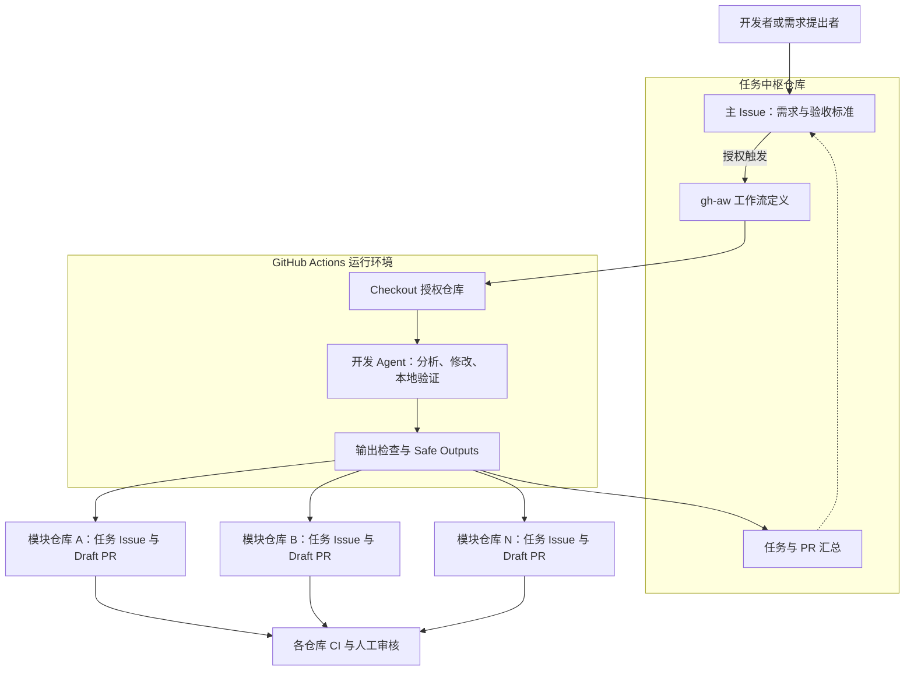

# 基于 GitHub Agentic Workflow 驱动 AI 跨仓库开发

在本地使用 AI 编程助手时，可以把多个代码仓库放到同一个项目文件夹中，让 Agent 同时读取不同模块的代码。但当开发任务搬到云端，需求入口、代码仓库、访问权限和执行环境往往是分开的。一个涉及多个模块的需求，如何让 AI 理解完整上下文，并在不同仓库中交付相互配套的代码修改？

本文介绍一种基于 **GitHub Agentic Workflows（简称 gh-aw）** 的实现方式：以一个任务中枢仓库接收需求，通过 GitHub Actions 启动 AI Agent，在授权范围内读取多个业务仓库、实现代码变更，并分别创建 Pull Request。

> 示例项目：[jacwu/gh-aw-task-board](https://github.com/jacwu/gh-aw-task-board)。其中的 `frontend`、`backend`、`database` **只是多仓库拆分的一个例子，不是本方案要求的仓库名称、数量或技术栈**。同样的设计也适用于微服务、共享 SDK、基础设施、数据处理和文档等仓库。


## 目录

- [一、AI 跨仓库开发的痛点](#一ai-跨仓库开发的痛点)
- [二、什么是 GitHub Agentic Workflows](#二什么是-github-agentic-workflows)
- [三、架构设计](#三架构设计)
- [四、技术实现细节](#四技术实现细节)

---

## 一、AI 跨仓库开发的痛点

### 1.1 本地可以打开整个项目，云端通常从一个仓库开始

在本地，开发者可以将相关仓库分别 clone 到同一个父目录，再打开这个目录或配置多根工作区。只要授予必要的目录访问权限，Agent 就可以搜索多个模块、阅读接口定义，并在各仓库中修改代码。

到了云端，情况有所不同：

- 一个 Issue 通常创建在某一个仓库中，但需求可能涉及多个仓库。
- 在某个仓库启动的执行环境，不会天然包含其他仓库的代码。
- 当前仓库的默认 `GITHUB_TOKEN` 通常不能读写其他私有仓库。
- 每个仓库拥有独立的分支、PR、CI、审核规则和发布流程。

**代码属于同一个产品，不代表它们在云端自动共享上下文和权限。** 云端并不是不能处理多个仓库，而是需要显式组织它们。

### 1.2 一个需求跨越多个仓库，不能只做局部正确的修改

例如，“给订单增加取消原因”可能需要同时修改：

| 仓库类型 | 可能涉及的变更 |
| --- | --- |
| 订单服务 | 增加字段校验、状态处理和持久化逻辑 |
| 共享接口契约 | 更新 API Schema、事件格式或客户端类型 |
| 管理端应用 | 增加输入项、错误提示和详情展示 |
| 数据分析任务 | 更新取消原因的统计逻辑 |

如果分别给每个仓库的 Agent 下达独立任务，容易出现字段名不一致、错误码不同、接口版本不兼容等问题。每个仓库的代码都能编译，并不意味着整个功能能协同工作。

因此，AI 跨仓库开发首先需要的是**统一需求、统一契约和统一变更计划**，而不只是同时运行多个 Agent。

### 1.3 分散的 PR 难以表达完整交付状态

一个功能可能对应多个 PR，但这些 PR 之间没有天然的原子性：某个 PR 可以先合并，另一个可能测试失败，还有一个尚未创建。

如果缺少统一入口，就很难回答：

1. 这个需求涉及哪些仓库？哪些不需要改？
2. 各仓库的任务和 PR 分别在哪里？
3. 哪些测试通过了，哪些检查尚未执行？
4. 应该按什么顺序合并和发布？

所以，方案需要同时解决三个问题：**让 AI 看得到相关代码，让它有边界地执行操作，让人能追踪完整结果。**

---

## 二、什么是 GitHub Agentic Workflows

### 2.1 用自然语言定义目标，用 GitHub Actions 承载执行

GitHub Agentic Workflows 是一套在 GitHub Actions 中运行 AI Agent 的仓库自动化工具。开发者使用 Markdown 描述任务目标，同时通过文件顶部的 YAML frontmatter 定义触发条件、引擎、权限、可用工具和允许的输出。

它的工作方式可以概括为：

**Markdown 工作流定义 → gh-aw 编译 → GitHub Actions 执行 → Agent 分析并生成结果 → 受控写回 GitHub。**

编译器会生成 Actions 可以执行的 lock workflow。需要注意，**编译的是运行配置和控制流程，不是将自然语言需求提前翻译成固定业务代码**；Markdown 正文在运行时交给 Agent 解释执行。

### 2.2 与传统 Actions 的分工

| 维度 | 传统 GitHub Actions | GitHub Agentic Workflows |
| --- | --- | --- |
| 描述方式 | 显式步骤、脚本和条件 | 运行配置 + 自然语言目标 |
| 执行逻辑 | 按预先编写的步骤运行 | Agent 根据上下文选择操作 |
| 适用任务 | 编译、测试、部署、固定格式检查 | 需求分析、代码修改、问题分类、跨仓库影响分析 |
| 结果验证 | 退出码、测试断言、检查结果 | 仍需要测试、规则检查和人工审核 |

两者不是替代关系。**Agent 负责需要理解和判断的部分，确定性的 Actions 步骤负责验证和执行明确规则。**

### 2.3 几个适合跨仓库开发的特点

1. **事件驱动**：可以由 Issue、标签、评论、计划任务等事件启动，不要求开发者一直保持本地会话。
2. **工作流即代码**：任务指令和运行配置放在仓库中，可以通过 PR 审核、版本管理和复用。
3. **可选择 AI 引擎**：支持 Copilot、Claude Code、Codex 等引擎；本文示例使用 GitHub Copilot CLI。
4. **显式组织上下文**：可配置多个仓库 checkout，并通过 GitHub 工具读取 Issue、PR 等信息。
5. **受控写操作**：通过 `safe-outputs` 声明允许创建哪些资源、写入哪些目标以及数量上限。
6. **可追踪执行过程**：运行记录、日志、产物和结果都可以与 GitHub Actions 及原始需求关联。

这里的 **Copilot CLI 引擎**，不等于把 Issue 直接指派给 GitHub Copilot coding agent。前者由本文的 gh-aw 工作流组织运行环境和任务步骤。

### 2.4 安全边界不是一句提示词

推荐的模式是：Agent 通过只读 GitHub 工具获取信息，在本地工作区编辑代码，再提交结构化的写操作请求，由独立的 safe-output 阶段处理。

编译后的工作流可以包含权限约束、沙箱、网络访问控制、威胁检测和输出校验。与“给 Agent 一个高权限 Token，让它自行调用任意写 API”相比，这种设计更容易限制操作范围。

但这不意味着生成的代码天然安全，也不意味着自定义步骤和额外凭据自动受到同样约束。**Token 权限、触发者身份、允许访问的仓库，以及最终测试和审核，仍然需要明确设计。**

---

## 三、架构设计

### 3.1 一个任务中枢，多个独立代码仓库

建立一个任务中枢仓库，例如 Task Board，专门保存：

- 需求 Issue 和 Issue 模板；
- gh-aw 工作流定义及编译产物；
- 仓库职责说明、跨模块契约和开发规则。

业务代码继续保留在各自仓库中，不需要迁移成 monorepo，也不需要合并各仓库的发布流程。



图中的模块可以是任意职责的仓库。`frontend`、`backend`、`database` 只是其中一种映射；核心结构是 **一个需求入口 + 一组授权仓库 + 一条受控交付链路**。

### 3.2 在一次运行中重建多仓库工作区

最直接的实现是让一个主开发 Agent 在同一次 Actions 运行中访问多个独立 checkout。

这样，Agent 可以先查看共享接口，再修改调用方和实现方，避免每个模块分别推测需求。但多个目录共享一个工作区，并不代表它们变成了一个 Git 仓库：

- 每个 checkout 仍有独立的 Git 历史、工作分支和提交。
- 生成 PR 时必须明确目标仓库。
- 不需要修改的仓库只作为上下文，不应为凑齐模块而制造空 PR。
- checkout 只代表代码可访问，不代表模型一次性读入了全部代码，仍需按需检索。

当仓库很多时，可以先做影响分析，再为选中的仓库准备执行环境，或者拆成规划 Agent 和多个实现任务。**这属于扩展架构，不是示例项目已经实现的多 Agent 调度能力。**

### 3.3 主 Issue 是需求入口，也是结果索引

推荐建立以下关系：

| 对象 | 作用 | 关联方式 |
| --- | --- | --- |
| 中枢主 Issue | 保存完整需求、验收标准和总体进度 | 汇总所有目标仓库任务和 PR |
| 目标仓库任务 Issue | 描述该模块负责的变更 | 正文引用主 Issue |
| 目标仓库 PR | 承载实际代码、测试说明和风险 | 引用模块任务及主 Issue |

例如，在模块任务中引用主需求，在 PR 中使用 `Closes` 引用对应模块任务，同时说明它与主需求的关系。

需要区分两件事：**正文中的 `Relates to owner/repo#123` 是文本关联，不会自动建立 GitHub 原生父子 Issue 关系。** 如果需要原生子任务层级，应另外配置相应的关联操作。

### 3.4 交付单位是“成组 PR”，不是“自动上线”

工作流的目标是将需求转化为一组可审核的变更，不是直接修改默认分支或部署生产环境。

跨仓库也不存在“多个 PR 同时原子合并”的保证。对于有依赖的需求，Agent 应说明：

1. 共享契约是否向后兼容；
2. 哪些模块必须先发布；
3. 是否需要版本约束、功能开关或分阶段迁移；
4. 哪些联调和人工确认还未完成。

只有各仓库 CI、必要的跨仓库验证和人工审核完成后，才能将需求视为完成。

---

## 四、技术实现细节

### 4.1 用 Issue 模板规范需求输入

Issue 模板的价值不只是收集一段需求描述，而是尽量减少 Agent 对业务范围和验收方式的猜测。建议至少包含：

| 字段 | 内容 |
| --- | --- |
| 需求描述 | 业务目标、现有行为与期望行为 |
| 可能涉及的模块 | 提交者已知的影响范围，允许 Agent 补充分析 |
| 验收标准 | 可检查的输入输出、行为和测试要求 |
| 约束与补充资料 | 兼容性、禁止修改的范围、接口文档、设计资料 |

模块列表应按实际系统维护，而不是固定要求选择前端、后端和数据库。表单中的模块选项也不会自动变成 `scope:` 标签；如果依赖标签路由，需要单独实现这种映射。

示例项目的模板会自动添加 `implement` 标签。生产使用时，也可以让普通用户只提交需求，待维护者检查后再添加该标签，形成明确的执行批准动作。相关标签需要预先在仓库中创建。

### 4.2 将触发条件和仓库范围写进配置

下面是一份以两个模块仓库演示的工作流 frontmatter。`module-a`、`module-b` 是占位名称，必须替换成真实仓库；也可以按相同模式增加更多仓库。

为了便于说明，假定中枢和两个目标仓库的默认分支均为 `main`。如分支不同，需要调整 checkout 与 PR 基础分支策略，不能直接套用。

```yaml
---
name: implement-task
description: Implement an approved task across configured repositories
on:
  issues:
    types: [labeled]
  roles: [admin, maintain, write]
if: github.event.label.name == 'implement' && github.event.issue.state == 'open'
engine: copilot
timeout-minutes: 45
permissions:
  contents: read
  issues: read
  pull-requests: read

checkout:
  - path: .
  - repository: ${{ github.repository_owner }}/module-a
    path: ./repos/module-a
    ref: main
    fetch-depth: 0
    github-token: ${{ secrets.CROSS_REPO_READ_TOKEN }}
  - repository: ${{ github.repository_owner }}/module-b
    path: ./repos/module-b
    ref: main
    fetch-depth: 0
    github-token: ${{ secrets.CROSS_REPO_READ_TOKEN }}

tools:
  github:
    toolsets: [default]
    github-token: ${{ secrets.CROSS_REPO_READ_TOKEN }}
    allowed-repos:
      - "${{ github.repository }}"
      - "${{ github.repository_owner }}/module-a"
      - "${{ github.repository_owner }}/module-b"

concurrency:
  group: implement-${{ github.event.issue.number }}
  cancel-in-progress: true

safe-outputs:
  create-issue:
    title-prefix: "[task] "
    labels: [ai-agent]
    max: 2
    allowed-repos:
      - "${{ github.repository_owner }}/module-a"
      - "${{ github.repository_owner }}/module-b"
    github-token: ${{ secrets.CROSS_REPO_WRITE_TOKEN }}
  create-pull-request:
    title-prefix: "[ai] "
    labels: [automation, ai-agent]
    draft: true
    max: 2
    base-branch: main
    allowed-repos:
      - "${{ github.repository_owner }}/module-a"
      - "${{ github.repository_owner }}/module-b"
    protected-files: fallback-to-issue
    github-token: ${{ secrets.CROSS_REPO_WRITE_TOKEN }}
  add-comment:
    max: 3
---
```

这段配置需要与下一节的任务正文组成同一份 Markdown 工作流，而不是作为普通 Actions YAML 直接运行。

几个关键点：

- `checkout` 负责准备本地代码；`tools.github` 负责读取 GitHub 上的信息；`safe-outputs` 负责最终写回。**这三者的访问范围和认证需要分别配置。**
- frontmatter 中的只读 `permissions` 不表示汇总评论也只能读。gh-aw 会为 safe-output 写回阶段生成所需的 job 权限；这里的 `add-comment` 使用中枢的默认工作流 Token，不需要给开发 Agent 开放 `issues: write`。
- `github.repository_owner` 只是同 owner 场景的简写。跨组织时应使用真实的 `owner/repo`，并确保凭据对各目标均有授权。
- `roles` 是允许触发的角色列表，不是“最低角色”。标签只是执行信号，不能替代身份检查。
- `fetch-depth: 0` 便于读取历史和计算差异，但会增加拉取成本；大型仓库应按需要缩小读取范围。
- 新增目标仓库时，要同步更新 checkout、读工具范围、输出范围、凭据授权以及任务正文中的职责说明。
- 输出的 `allowed-repos` 不会赋予 Token 新权限，且默认目标仓库仍被隐式允许。因此每次创建模块任务或 PR 时，仍应显式填写 `repo`。

与原始示例相比，这里有意只在 **添加 `implement` 标签**时触发。原始示例还监听新评论，并使用 `roles: all`；如果直接照搬，带标签 Issue 的普通评论也可能重新启动开发。需要评论驱动迭代时，应另外设计命令、身份校验和重复执行策略。

### 4.3 给 Agent 一套跨仓库执行协议

只有 checkout 配置还不够。任务正文还应告诉 Agent：如何判断影响范围、如何保持契约一致，以及何时算完成。

下面是可接在上述 frontmatter 后的正文示例。模块职责必须按真实项目补全。

```markdown
# 跨仓库开发任务

根据当前 Issue 的需求，在授权的模块仓库中实现变更并提出 Draft PR。

## 仓库范围

- ${{ github.repository_owner }}/module-a：./repos/module-a；按实际项目填写职责。
- ${{ github.repository_owner }}/module-b：./repos/module-b；按实际项目填写职责。
- 中枢仓库只保存需求与工作流，不要在中枢提交业务代码。

## 执行步骤

1. 读取主 Issue、验收标准，以及各目标仓库的开发说明和相关代码。
2. 列出受影响仓库、修改原因、共享契约和兼容性要求。
   只修改必要仓库；范围不明时说明缺少的信息，不要猜测实现。
3. 搜索已关联当前主 Issue 的任务和 PR，避免重复创建。
   若已存在待处理 PR，而工作流未配置更新能力，应报告现状并停止重复交付。
4. 在每个目标仓库自己的 checkout 内创建工作分支、修改代码、运行相关检查。
   分支建议使用 feat/task-<主 Issue 编号>-<模块名>。
   按实际变更路径进行 git add 和 git commit，不要将嵌套仓库整体提交到中枢。
5. 为每个确有变更的模块调用 create_issue，并显式填写 repo。
   正文应包含该模块的验收要求，以及对主 Issue 的 Relates to 引用。
   为新任务指定不同的 temporary_id，例如 aw_moda1 和 aw_modb1。
6. 在对应仓库已有本地提交后，调用 create_pull_request，明确 repo 和 branch。
   PR 正文引用模块任务和主 Issue，说明变更、测试结果、风险与依赖顺序。
   通过 safe-output 提交，不要自行向远端 push 或绕过限制调用写 API。
7. 使用 add_comment 向主 Issue 提交汇总：涉及仓库、任务引用、检查结果和阻塞项。
   新建资源的真实编号可能尚未产生；使用临时任务引用，不要编造 PR URL。

## 完成标准

- 不以代码分析或变更建议代替实际代码提交。
- 不将“未运行测试”写成“测试通过”。
- 不将生成补丁、请求创建 PR 或部分仓库成功，表述为整个需求已完成。
- 不自动合并 PR、发布依赖包或执行生产数据库迁移。
```

这套协议并不要求所有模块采用同一种语言或框架。相反，应先读取各仓库现有约定，再分别使用它们自己的构建、测试和代码风格规则。

注意配置名和调用名的区别：frontmatter 中使用 `create-pull-request`、`create-issue`、`add-comment`，Agent 对应调用的工具名是 `create_pull_request`、`create_issue`、`add_comment`。

### 4.4 多 checkout 不等于自动生成多个 PR

跨仓库写入时，必须把**目标仓库、工作分支和本地补丁**对应起来。

在本文参考的 v0.64.1 实现中，`create_pull_request` 显式指定 `repo` 后，会根据 Git remote 定位匹配的 checkout，并从该仓库生成补丁。配置 `max` 大于 1，才允许一次运行请求创建多个 PR。

因此正确的顺序是：

1. 进入目标 checkout，基于正确的基础分支创建工作分支。
2. 修改该仓库的文件，完成必要检查并创建本地提交。
3. 调用 `create_pull_request`，同时提供目标 `repo` 和对应 `branch`。
4. 对其他需要变更的仓库重复以上过程。

**不是在父目录执行一次提交，就能把所有子仓库的变更分发出去。** 在错误的目录提交，可能只记录嵌套仓库引用，而没有真正收集到目标仓库的代码修改。

此外，Safe Outputs 是分阶段处理的。Agent 调用工具时，主要是在记录待处理操作；真实 Issue、分支和 PR 由后续阶段创建，不能假设每次调用都会立即返回真实资源编号。

例如，为模块 A 创建任务时指定 `temporary_id: aw_moda1`，后续 PR 正文可以写 `Closes #aw_moda1`。输出处理器会将该引用替换成真实 Issue 引用；跨仓库时使用完整的 `owner/repo#编号`。不同模块应使用不同的临时 ID。

原始示例要求在主 Issue 汇总所有 PR 链接，但其提示词没有展开这种延迟写入处理。若要可靠地得到最终完整清单，应结合 safe-output 的实际创建结果，在受控的后处理步骤中回填；不要要求 Agent 在创建完成前猜测链接。

### 4.5 将模型认证与仓库权限分开

原始示例复用了 `COPILOT_GITHUB_TOKEN` 来调用模型、checkout 和创建跨仓库资源。演示时配置较少，但实际部署不能把这些权限视为一回事。

建议按职责拆分：

| 凭据或机制 | 用途 | 需要关注的权限 |
| --- | --- | --- |
| `COPILOT_GITHUB_TOKEN` | 本文参考版本的 Copilot CLI 模型访问 | 有效 Copilot 使用资格及适用的 Copilot 请求权限 |
| `CROSS_REPO_READ_TOKEN` | 目标代码 checkout、GitHub MCP 读取 | 对中枢及授权目标所需的 Contents、Issues、Pull requests 读取权限 |
| `CROSS_REPO_WRITE_TOKEN` | 目标仓库创建分支、PR 和任务 Issue | 目标仓库 Contents、Pull requests、Issues 写入权限 |
| 工作流 `GITHUB_TOKEN` | 中枢内的默认操作，例如汇总评论 | 由编译后的对应 job 权限配置约束 |

`CROSS_REPO_READ_TOKEN` 和 `CROSS_REPO_WRITE_TOKEN` 是本文自定义的 Secret 名称，只有在配置中显式引用才会生效。应在仓库或组织的 Actions Secrets 中配置，绝不能放入 Issue、提示词或代码正文。

组织级场景也可以使用 GitHub App 安装 Token 完成仓库访问，缩小安装范围并使用短期凭据；这不是把同一 Token 直接换到 Copilot 模型认证字段。模型认证与 GitHub 资源授权应分别遵循对应版本的文档。

**有 Copilot 使用权限，不等于有业务仓库写权限；列入仓库白名单，也不等于已经获得授权。**

### 4.6 保留保护文件策略和运行边界

配置中的几个限制各有用途：

| 配置或控制 | 作用 |
| --- | --- |
| `draft: true` | 强制输出为草稿 PR，保留审核入口 |
| `max` | 限制一次运行的输出数量，不代表业务完整性 |
| `timeout-minutes` | 限制开发 Agent 执行时长，不是整个交付流程的成本上限 |
| `concurrency` | 防止同一 Issue 的多次运行同时继续执行 |
| `protected-files` | 对依赖清单、工作流和其他敏感文件应用额外策略 |
| 触发身份、读写范围、网络限制 | 限制谁能启动任务、Agent 能接触什么、结果能写到哪里 |

本文采用的 `protected-files: fallback-to-issue` 不是“忽略保护”。在参考版本的创建 PR 路径中，遇到受保护文件变更时，可以推送分支并创建人工审查 Issue，而不是按普通流程直接创建 PR。它**也不是完全没有远端副作用的拒绝模式**；要求阻止这类写入时应考虑 `blocked`。

另外，取消旧运行不会回滚已经创建的 Issue、分支或 PR。因此，重复触发前需要查询现有产物，明确继续、更新还是停止，不能只依赖 `cancel-in-progress` 防重复。

### 4.7 编译、部署与验证

中枢仓库可以采用以下布局；编译产物由 gh-aw 生成，不应手工维护：

```text
task-board/
├── .github/
│   ├── ISSUE_TEMPLATE/
│   │   └── feature.yml              # 需求表单
│   └── workflows/
│       ├── implement-task.md        # frontmatter + Agent 任务正文
│       └── implement-task.lock.yml  # 编译后的 Actions 工作流
└── README.md                        # 仓库职责与使用说明
```

部署前准备好以下条件：

1. GitHub Actions 已启用，组织策略允许所需引擎、Action 和资源操作。
2. 目标仓库、默认分支和标签已存在，开发说明与测试入口明确。
3. 模型认证和跨仓库凭据已经配置，访问范围经过检查。
4. 已安装 GitHub CLI 及 gh-aw 扩展，并选定需要使用的版本。

安装扩展、查看版本和编译的基本命令为：

```bash
gh extension install github/gh-aw
gh aw version
gh aw compile
```

安装命令默认不保证得到本文参考的历史版本；需要复现时应按官方版本说明选择对应发布版本。提交前还应检查生成的 Actions YAML，确认触发条件、凭据引用和目标范围符合预期，再将源文件及编译产物一并提交到中枢默认分支。

第一次验证建议在测试仓库中创建一个范围明确、只修改普通源文件的小需求，由授权维护者添加 `implement` 标签，然后检查整条链路：

| 验证环节 | 通过标准 |
| --- | --- |
| 触发 | 授权事件能启动，非授权用户或无关标签不能启动开发 |
| 上下文 | Agent 能读取主 Issue 和每个需要的仓库，没有权限或 checkout 错误 |
| 修改 | 各仓库的 diff 正确，契约一致，没有误改中枢或无关模块 |
| 写回 | Draft PR 确实创建在目标仓库，分支和基础分支正确 |
| 关联 | 模块任务、PR 和主 Issue 的引用正确，最终链接来自实际创建结果 |
| 测试 | 明确记录本地检查、各仓库 CI 及跨仓库验收的结果 |
| 异常处理 | 缺权限、保护文件或部分失败时，能报告真实状态，而不是声称全部完成 |

**PR 创建成功不意味着 CI 一定已触发。** gh-aw 的写入凭据及提交策略会影响后续工作流触发，需要按所用版本的 CI 触发文档配置，并实际确认目标仓库出现了所需检查。不能把“没有失败的检查”当成“检查已全部通过”。

同样，编译成功只能证明配置通过相应检查，不能证明 Token 权限、模型访问、生成代码或跨仓库联调成功。

### 4.8 小结：统一上下文，保留仓库边界

这套方案并不是把多个仓库变成一个仓库，而是**在一次受控任务中，把分散的需求上下文、代码和交付结果关联起来**：

- 中枢 Issue 统一描述“要做什么”；
- 多仓库 checkout 与 GitHub 工具解决“需要看什么”；
- Agent 负责分析和实现；
- Safe Outputs 控制“允许交付什么、交付到哪里”；
- CI 和人工审核决定“是否可以合并和发布”。

仓库可以按前后端拆分，也可以按业务领域、平台能力或团队边界拆分。真正需要固定的不是仓库名称，而是**需求入口、上下文组织、权限边界和可验证的交付流程**。

---
