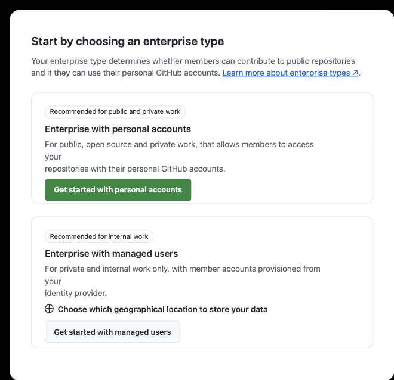

# 如何创建 GitHub Enterprise

GitHub Enterprise Cloud 在创建时需要先选择成员使用个人账户（personal accounts），还是由企业统一管理账户（managed users）。这项选择会影响身份认证、账号生命周期、公开协作和数据驻留能力，应在创建前完成评估。

本文说明两种 Enterprise 类型的区别，以及如何从 GitHub 的创建入口完成初始配置。

## 目录

- [一、创建前的准备](#一创建前的准备)
- [二、选择 Enterprise 类型](#二选择-enterprise-类型)
- [三、两种 Enterprise 类型的区别](#三两种-enterprise-类型的区别)
- [四、创建 Enterprise with personal accounts](#四创建-enterprise-with-personal-accounts)
- [五、创建 Enterprise with managed users](#五创建-enterprise-with-managed-users)
- [六、常见问题](#六常见问题)

---

## 一、创建前的准备

开始前，请确认：

1. 已使用正确的 GitHub 个人账户登录，并确认该账户有权启动 Enterprise 的购买或试用流程。Managed Users 创建后将使用独立的 setup user 完成身份系统初始化。
2. 已明确企业是否需要参与开源项目、创建公开仓库，或与企业外部的 GitHub 用户协作。
3. 如果考虑 Enterprise Managed Users（EMU），已经选定用于认证和用户预配的身份提供商（IdP），并具备配置 SAML 或 OIDC、SCIM 的能力。
4. 已确认是否有数据驻留要求。GitHub Enterprise Cloud with data residency 必须使用 Enterprise Managed Users。
5. 已准备企业名称、联系信息和 GitHub 页面要求的计费或试用信息。实际字段可能随购买方式和 GitHub 页面更新而变化。

> **重要：** Enterprise 类型不是普通的功能开关。已有 personal accounts 类型的 Enterprise 若要采用 Managed Users，需要创建新的 Enterprise 并执行迁移。请在导入组织和仓库前完成选型。

---

## 二、选择 Enterprise 类型

1. 登录 GitHub 后访问 [https://github.com/account/enterprises/new](https://github.com/account/enterprises/new)。
2. 页面会要求先选择 Enterprise 类型：
   - **Enterprise with personal accounts**：成员继续使用自己的 GitHub 个人账户。
   - **Enterprise with managed users**：企业通过 IdP 创建并管理专用的 managed user accounts。
3. 根据下一节的差异确认类型，再点击对应的 **Get started** 按钮。

---

## 三、两种 Enterprise 类型的区别

| 对比项 | Enterprise with personal accounts | Enterprise with managed users（EMU） |
|---|---|---|
| 账户归属 | 用户创建并拥有自己的 GitHub.com 个人账户 | 企业通过 IdP 预配专用的 managed user account |
| 登录方式 | 用个人账号登录 GitHub| 用户必须通过企业 IdP，使用 SAML 或 OIDC 认证 |
| 用户生命周期 | 用户管理自己的账户；企业管理其组织和仓库访问权限 | 企业通过 IdP 和 SCIM 管理创建、属性、停用及访问权限 |
| 用户名和资料 | 由用户维护 | 由 IdP 提供和控制，用户不能在 GitHub 自行修改姓名或邮箱 |
| 仓库可见性 | 可按企业策略使用 public、internal、private 仓库 | 企业内主要使用 internal、private 仓库，不能创建公开仓库 |
| 公开内容 | 可创建公开仓库并参与 GitHub 公共社区 | 不能创建公开仓库或 Gist；在 GitHub.com 上对企业外公共内容基本为只读 |
| 企业外协作 | 可参与其他企业、组织和开源仓库 | 不能向企业外仓库贡献，也不能被邀请到企业外组织或仓库 |
| 外部人员 | 可邀请其现有个人账户作为成员或 outside collaborator | 外部人员也必须由 IdP 预配，可按需使用 guest collaborator 角色 |
| 数据驻留 | 不适用于 GitHub Enterprise Cloud with data residency | 选择 GHE.com 区域数据驻留时必须使用此类型 |
| 管理成本 | 身份系统改造较少，适合已有 GitHub 用户和开放协作 | 控制更集中，但需要成熟的 IdP、SSO、SCIM 和入离职流程 |

### 适合选择 personal accounts 的情况

- 开发者需要参与开源项目、公开仓库或企业外部的私有仓库。
- 希望成员沿用已有 GitHub 身份、贡献记录和个人资料。
- 暂时没有成熟的 IdP 用户预配与回收流程。
- 企业可以接受“个人账户由用户拥有，企业只控制企业资源访问权”的边界。

### 适合选择 managed users 的情况

- 需要由企业统一创建、命名、停用和回收所有工作账户。
- 要求所有成员只能通过企业 IdP 登录，并应用统一的条件访问策略。
- 只开展企业内部的私有或 internal 仓库协作，不需要用工作账户参与开源或企业外项目。
- 需要 GitHub Enterprise Cloud with data residency，在指定区域保存企业代码和数据。
- 已具备稳定的 SAML 或 OIDC 认证、SCIM 预配和 IdP 分组管理能力。

EMU 用户若还需要参与开源项目，必须另行使用个人账户。团队应提前评估双账户切换对 Git、GitHub CLI、凭据和提交身份的影响。

---

## 四、创建 Enterprise with personal accounts

1. 在类型选择页点击 **Get started with personal accounts**。
2. 按页面提示填写 Enterprise 名称、标识、联系信息，以及试用或计费信息。
3. 检查服务条款和订单信息后提交创建请求。
4. 创建完成后进入 Enterprise settings。
5. 创建或邀请组织，并将现有 GitHub 个人账户添加到组织和团队。
6. 根据安全要求配置 SAML SSO、两步验证、仓库策略和企业级访问策略。

采用此类型时，成员仍然对自己的 GitHub 账户负责。员工离职时，企业应从组织和仓库中移除其访问权限，但不能删除该用户的个人账户。

---

## 五、创建 Enterprise with managed users

1. 在类型选择页先选择企业数据的地理存储位置。
2. 点击 **Get started with managed users**。
3. 按页面提示填写 Enterprise 名称、标识、联系信息，以及试用或计费信息。
4. 完成创建后，使用 GitHub 提供的初始设置用户进入 Enterprise。
5. 在 Enterprise settings 中配置身份认证：选择受支持的 IdP，并配置 SAML 或 OIDC。
6. 配置 SCIM 预配，将 IdP 用户或组分配到 GitHub Enterprise 应用。
7. 先用少量测试用户验证登录、用户名生成、组织成员关系和停用流程，再批量分配用户。

Managed user accounts 不应由管理员在 GitHub 中当作普通个人账户手工创建。IdP 是账户身份和生命周期的来源；组织、团队和仓库权限可以结合 IdP 分组统一管理。

---

## 六、常见问题

### 创建后能直接切换 Enterprise 类型吗？

不能把它当作可随时切换的选项。尤其是从 personal accounts 转为 Enterprise Managed Users 时，需要规划新的 Enterprise 和数据迁移，并与 GitHub Sales 或 Support 确认方案。

### 使用 personal accounts 就不能配置企业 SSO 吗？

可以配置 SAML SSO。成员仍使用自己的 GitHub 个人账户登录，再通过企业 IdP 授权访问企业资源；企业不会因此拥有这些个人账户。

### Managed Users 能参与开源项目吗？

managed user account 可以查看 GitHub.com 上的公开仓库，但不能在企业外 push、创建 Issue 或 Pull Request、评论、star、watch 或 fork。需要公开协作时，用户必须另用个人账户。

### 哪种类型更安全？

两种类型服务于不同的协作边界。EMU 提供更强的账户生命周期和身份控制，但会限制公开及跨企业协作；personal accounts 更开放，但企业必须重点管理 SSO、组织成员和离职访问回收。应依据实际协作方式、合规要求和运维能力选择，而不是只比较单项功能。

---
