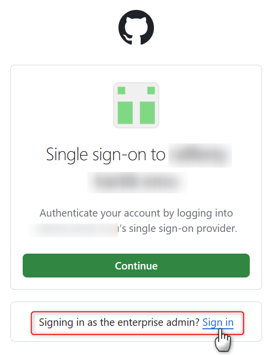
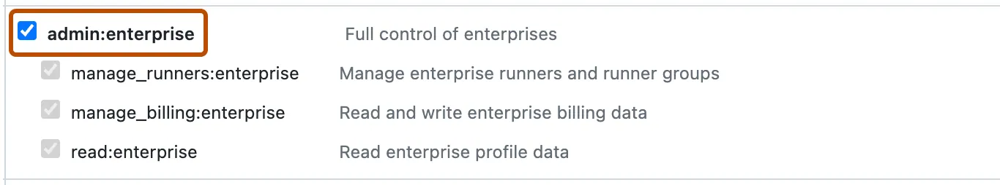
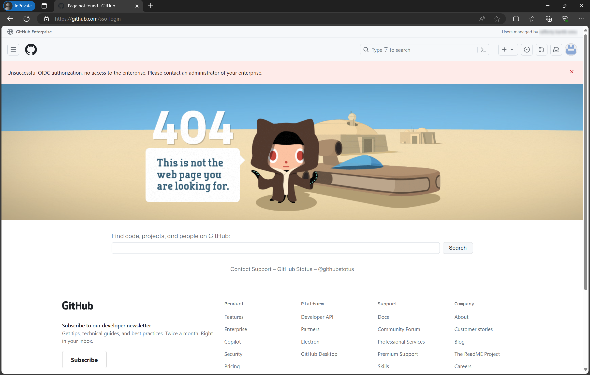
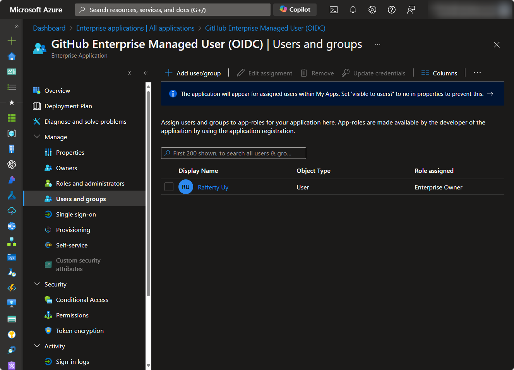
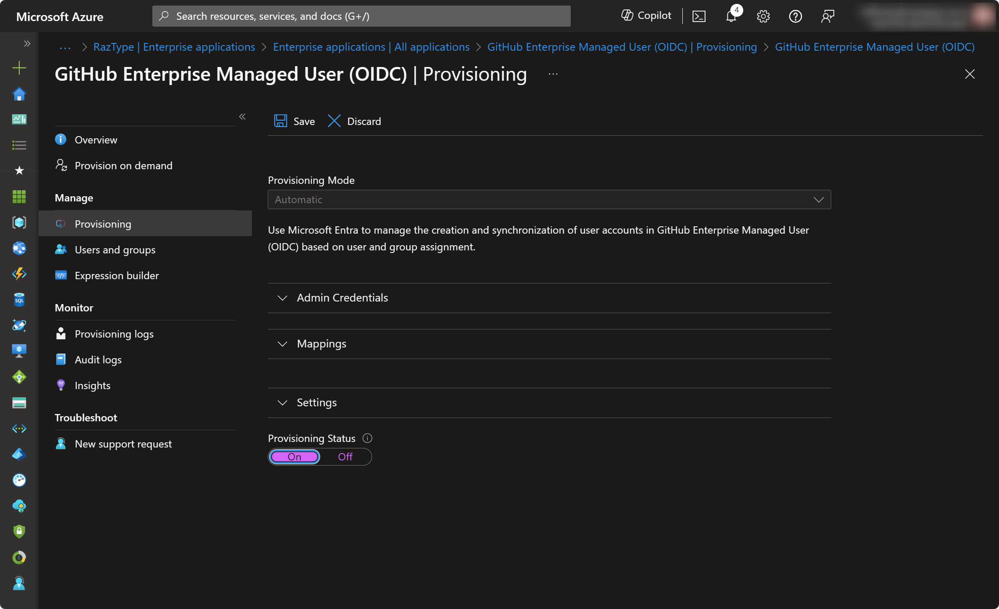
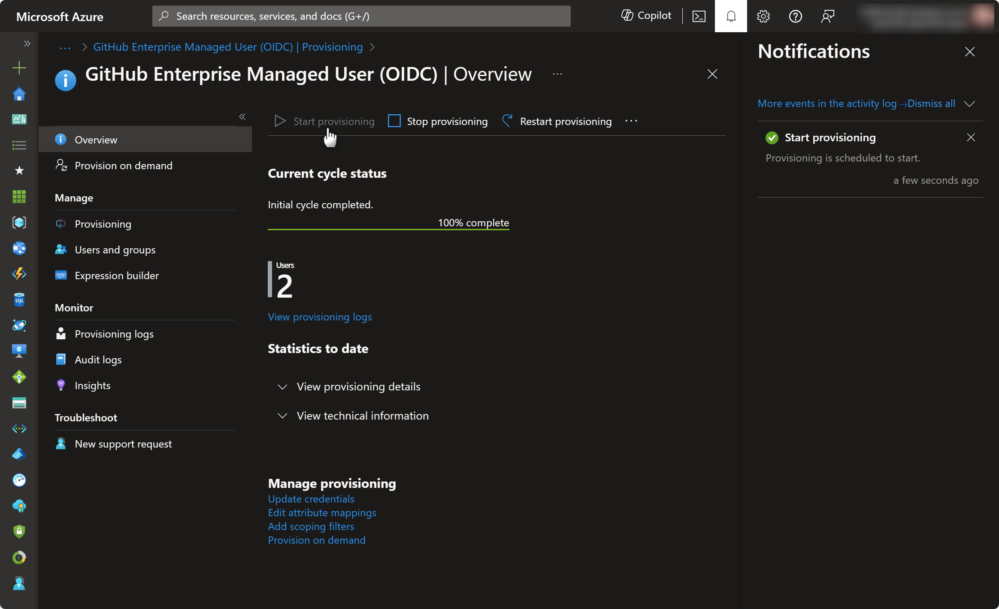
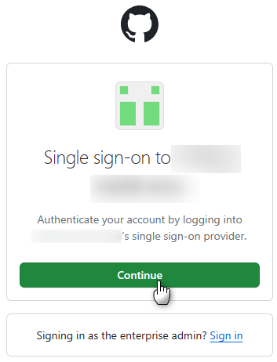
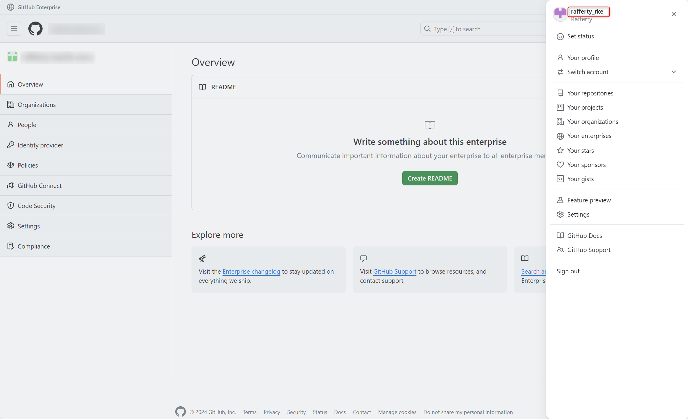

# 为 GitHub Enterprise 配置 Microsoft Entra ID（OIDC）

GitHub Enterprise Cloud 的 Enterprise Managed Users（EMU）要求所有成员账户由企业身份提供商（IdP）统一创建和管理。使用 Microsoft Entra ID 的 OIDC 集成后，用户登录由 Entra ID 完成，账户则通过 SCIM 自动预配到 Enterprise 中。

选择 OIDC 的主要原因是它支持 Entra ID 的条件访问策略（Conditional Access Policy, CAP），可以对 GitHub 的访问施加与企业其他应用一致的网络、设备和 MFA 要求。

本文说明从企业管理员 PAT 到自动预配启动的完整配置流程。

## 目录

- [一、前置条件](#一前置条件)
- [二、为企业管理员生成 PAT](#二为企业管理员生成-pat)
- [三、启用 OIDC 单点登录](#三启用-oidc-单点登录)
- [四、配置自动用户预配](#四配置自动用户预配)
- [五、验证 OIDC 配置](#五验证-oidc-配置)

---

## 一、前置条件

开始前，请确认：

1. 已创建 Enterprise with managed users 类型的 GitHub Enterprise Cloud，并掌握初始管理员账户 `{企业短代码}_admin`（例如 `contoso_admin`）的用户名和密码。
2. 拥有一个具备 **Cloud Application Administrator** 角色的 Microsoft Entra ID 账户，且该租户就是承载目标用户和组的租户。
3. 已确认企业的 slug（企业 URL 中 `https://github.com/enterprises/` 之后的部分）。
4. 已准备安全的位置保存新的恢复码（recovery codes）。

> **重要：** GitHub 的 OIDC 集成只支持 Microsoft Entra ID，且**一个 Entra ID 租户只能与一个 GitHub Enterprise 建立 OIDC 关联**。如果该租户已经和另一个 Enterprise 完成 OIDC 集成，则无法再为新的 Enterprise 配置 OIDC。

---

## 二、为企业管理员生成 PAT

后续配置 SCIM 自动预配时，需要用企业管理员的 personal access token（PAT）作为凭据。

1. 打开一个**隐私/无痕**浏览器窗口，访问 `https://github.com/enterprises/{enterprise_slug}`。
2. 在登录页面选择以企业管理员身份登录。

   

3. 使用 `{企业短代码}_admin` 的用户名和**密码**登录（不是恢复码）。
4. 依次点击右上角头像 → **Settings** → **Developer Settings** → **Personal access tokens** → **Tokens (classic)** → **Generate new token (classic)**。
5. 填写任意有效名称，勾选 `admin:enterprise` 权限范围。

   

6. 点击 **Generate token**。
7. 将生成的 PAT 复制到临时文本文件中保存，页面刷新后无法再次查看。
8. **保持该浏览器窗口不要关闭**，下一步仍需使用管理员身份。

> 建议为该 PAT 设置合理的过期时间，并在到期前更新 Entra ID 企业应用中的 Secret Token，否则自动预配会中断。

---

## 三、启用 OIDC 单点登录

1. 回到 `https://github.com/enterprises/{enterprise_slug}/settings`。
2. 进入 **Settings** → **Authentication Security**。
3. 勾选 **Require OIDC single sign-on**，然后点击 **Save**。
4. 页面会跳转到 Microsoft 登录，使用具备 Cloud Application Administrator 角色的 Entra ID 账户登录。
5. 下载并妥善保存新生成的恢复码。恢复码是 IdP 不可用时进入 Enterprise 的唯一途径。
6. 点击启用 OIDC 认证并 **Continue**。
7. 完成后页面可能显示 `Unsuccessful OIDC authorization, no access to the enterprise` 并跳转到 404，这是**正常结果**：此时还没有任何用户被预配到 Enterprise，因此登录的 Entra ID 账户暂时没有访问权限。

   

8. 至此可以关闭以 `{企业短代码}_admin` 登录的浏览器窗口。

启用后，Entra ID 租户中会自动创建一个名为 **GitHub Enterprise Managed User (OIDC)** 的企业应用，用于后续的用户预配。

---

## 四、配置自动用户预配

用户和组通过 SCIM 从 Entra ID 预配到 GitHub Enterprise。未被预配的用户即使能通过 Entra ID 认证，也无法访问 Enterprise。

1. 打开新的浏览器窗口访问 [Azure 门户](https://portal.azure.com/)，使用具备 Cloud Application Administrator 角色的账户登录。
2. 进入 **Microsoft Entra ID** → **企业应用程序（Enterprise Applications）**。
3. 选择上一步自动创建的 **GitHub Enterprise Managed User (OIDC)** 应用。
4. 进入 **用户和组（Users and Groups）**，分配一个或多个 GitHub Enterprise Owner。请确保至少掌握其中一个 Enterprise Owner 账户的登录凭据。

   > 提示：也可以在此处一并添加其他使用 **User** 角色的用户和组。

   

5. 进入 **预配（Provisioning）** → **Provisioning**。
6. 将 **预配模式（Provisioning Mode）** 设置为 `Automatic`。
7. 在 **管理员凭据（Admin Credentials）** 中填写：
   - **租户 URL（Tenant URL）**：`https://api.github.com/scim/v2/enterprises/{enterprise_slug}`
   - **机密令牌（Secret Token）**：第二节中生成的 PAT
8. 点击 **测试连接（Test Connection）** 验证凭据。
9. 点击 **保存（Save）**。
10. 保存完成后，回到 **预配（Provisioning）** → **Provisioning**，将 **预配状态（Provisioning Status）** 设置为 `On`。

    

11. 在 **设置（Settings）** 中按需定义预配范围（Scope）：仅同步已分配的用户和组，或同步租户中的全部用户和组。
12. 点击 **保存（Save）**。
13. 进入 **概述（Overview）**，点击 **启动预配（Start provisioning）**。

    

自动预配作业约每 **40 分钟**运行一次。如果不想等待，可以使用 **按需预配（Provision on demand）** 立即为指定用户或组执行同步。

---

## 五、验证 OIDC 配置

1. 打开新的浏览器窗口访问 `https://github.com/enterprises/{enterprise_slug}`。
2. 在登录页面直接点击 **Continue**，以普通用户身份登录。

   

3. 如果无法登录，说明配置存在问题，请回到前面的步骤逐项检查。
4. 登录成功后，右上角的用户名应为 `{entra_id_username}_{企业短代码}` 的形式。

   

看到该用户名格式，说明该账户确实由 Entra ID 预配生成，OIDC 集成已经生效。
