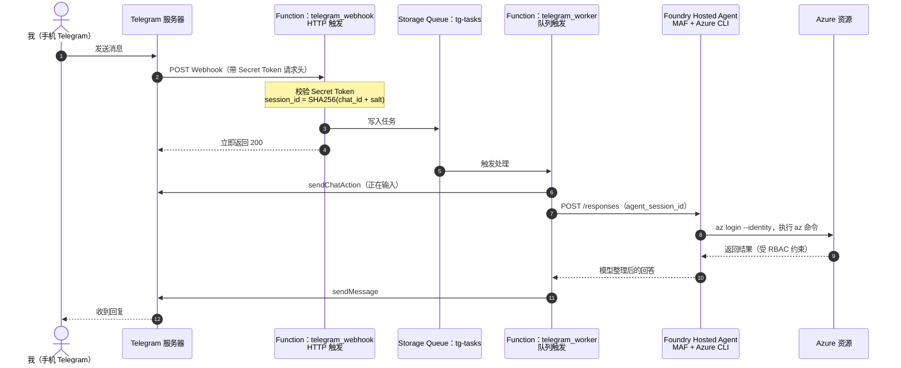

# 用 Telegram 和 Foundry Hosted Agent 搭建低成本个人助理

国庆出游期间，我突然需要临时处理几个 Azure 上的操作，手边只有手机。原来常用的OpenClaw正好关机了。这一下变的很棘手。这件事让我重新考虑：个人助理能不能不依赖一台常开的电脑，平时不花钱，需要时在手机上发一条消息就能工作？

本文记录一次实践：用 **Microsoft Foundry Hosted Agent** 运行基于 Microsoft Agent Framework（MAF）的 Agent，在容器里通过托管身份调用 Azure CLI；再用 **Azure Functions + Storage Queue** 把 Telegram 消息转交给它。整条链路没有常驻服务器，也不需要数据库保存会话。

## 目录

- [一、为什么要做这个](#一为什么要做这个)
- [二、Foundry Hosted Agent 的主要特点](#二foundry-hosted-agent-的主要特点)
- [三、整体架构](#三整体架构)
- [四、实现 Agent 并部署到 Foundry](#四实现-agent-并部署到-foundry)
- [五、实现 Telegram 网关](#五实现-telegram-网关)
- [六、创建 Bot 并联调](#六创建-bot-并联调)

---

## 一、为什么要做这个

### 1.1 自建助理依赖一台常开的机器

之前我用 OpenClaw 做个人助理，它运行在自己的机器上。最近用得少，就把机器关了。平时这没什么问题，但国庆出游时需要访问 Azure 做一些操作，就没有办法了：

- 机器关着，助理不在线。
- 手机上没有 Azure CLI，也不方便登录门户做多步操作。
- 为了偶尔几次使用让一台机器一直开着，并不划算。

我真正需要的是：**平时不用时几乎不产生费用，需要时从手机发一条消息就能工作。**

### 1.2 Meta Muse 与 OpenAI Dots 带来的启发

2026 年 9 月，个人 AI Agent 领域迎来了两个标志性的产品发布：

- **Meta Muse**：主打在后台自主执行多步任务（例如订行程、安排日程）。按照 Meta 的介绍，Muse 运行在一个隔离的 **Muse Secure VM** 中，通过沙箱内的专属浏览器与外部服务交互。
- **OpenAI Dots**：在 9 月底的 DevDay 上亮相，主打持久化（persistent）的数字协作者。每个 Dot 运行在云端独立的计算机与浏览器沙箱中，即使用户离线或本地设备关机，也能在后台持续执行研究、监控与应用协同任务。

这两个产品的共性揭示了下一代个人助理的核心架构趋势：**从单纯的“单次问答对话”走向“在独立沙箱环境中代用户持续执行任务的常驻代理”。** 本地设备开机与否不再是瓶颈，核心工作都在云端隔离环境中完成。

不过，商业产品并不完全契合我的个人运维场景：它们要么存在地区限制（如 Muse 首批仅限美加），要么绑定专属订阅生态。

真正值得借鉴的是它们的底层架构思想：**云端独立隔离沙箱、用户离线也能执行、细粒度权限管控**。这促使我考虑在自己的 Azure 订阅内搭一套小规模版本：既拥有独立的 MicroVM 沙箱和托管身份，又能做到低成本、按需唤醒与安全可控。

### 1.3 目标

| 需求 | 方案 |
| --- | --- |
| 手机上随时可用 | Telegram Bot |
| 不维护常驻服务器 | Azure Functions 消费计划 + Foundry Hosted Agent 自动关停 |
| 能执行 Azure 操作 | Agent 容器内预装 Azure CLI，使用托管身份登录 |
| 权限可控 | Agent 有独立的 Entra ID 身份，按资源组授予 RBAC 角色 |
| 不引入数据库 | 由 Telegram `chat_id` 确定性计算 session ID |

---

## 二、Foundry Hosted Agent 的主要特点

### 2.1 代码优先的容器托管

Hosted Agent 是 Foundry Agent Service 的一种运行方式：开发者把 Agent 代码和依赖打包成容器镜像，推送到 Azure Container Registry，由 Foundry 负责运行、伸缩和接入。

它不限定 Agent 框架，只要求容器实现 Foundry 的通信协议。本文使用 **Responses 协议**，对外接口兼容 OpenAI `/responses` 的请求格式。MAF 提供了 `agent-framework-foundry-hosting` 包，几行代码就能把一个 MAF Agent 暴露为 Responses 服务。

因为镜像由自己构建，Dockerfile 里可以安装任意命令行工具。本文在镜像中预装了 Azure CLI。

### 2.2 Session 隔离：每个会话一个微虚拟机

每次调用 Hosted Agent，请求都会归属到一个 **session**，由 `agent_session_id` 标识：

- 不传 `agent_session_id`，平台自动创建一个新的 session。
- 传入已有的 `agent_session_id`，请求会被路由到同一个 session。

每个 session 运行在独立的隔离沙箱（MicroVM）中，拥有自己的进程空间和文件系统。我在容器内读取环境变量做了验证：

| 请求 | 容器内的 `FOUNDRY_AGENT_SESSION_ID` | 平台注入的 `IDENTITY_HEADER` |
| --- | --- | --- |
| 第 1 次，不指定 session | `3ad66b5c…` | `/w5oZyf…` |
| 第 2 次，传入 `3ad66b5c…` | `3ad66b5c…` | `/w5oZyf…`（相同） |
| 第 3 次，不指定 session | `2ddc2c56…`（新） | `cZYymM…`（不同） |

第 2 次请求命中了原来的沙箱，第 3 次则得到了一个全新的实例。对个人助理来说，这意味着不同 Telegram 会话之间的文件、登录缓存和进程状态互不可见。

### 2.3 Entra ID 身份控制

每个 Hosted Agent 创建后，平台会在 Microsoft Entra ID 中为它生成专属身份，在创建版本的返回结果里可以看到：

```json
"instance_identity": {
  "client_id": "461dd980-…",
  "principal_id": "461dd980-…"
}
```

这个身份在 Agent 的多个版本之间保持不变。容器内获取令牌的方式和普通 Azure VM 不同：

- 传统 IMDS 地址 `169.254.169.254` 在沙箱内无法访问（`Connection refused`）。
- 平台改为注入 `IDENTITY_ENDPOINT` 和 `IDENTITY_HEADER` 两个环境变量，指向沙箱专用的令牌端点。
- Python 的 `DefaultAzureCredential`、`ManagedIdentityCredential`，以及 Azure CLI 的 `az login --identity`，都能识别这两个变量并自动取得令牌。

这里涉及两个不同的身份，不要混淆：

| 身份 | 用途 | 本文授予的角色 |
| --- | --- | --- |
| Foundry 项目的托管身份 | 平台在启动容器前从 ACR 拉取镜像 | 对 ACR 的 `AcrPull` |
| Agent 实例身份 | 容器内代码和 Azure CLI 访问 Azure 资源 | 对 `rg-hosted` 的 `Reader` |

Agent 能做什么完全由 RBAC 决定。我让 Agent 查询另一个未授权的资源组，Azure 直接返回：

```text
(AuthorizationFailed) The client '461dd980-…' does not have authorization to perform action
'Microsoft.Resources/subscriptions/resourcegroups/read' over scope '…/resourcegroups/rg-foundry'
```

### 2.4 自动关停与状态保留

Hosted Agent 的计算资源按需分配：

| 阶段 | 触发条件 | 计算资源 | `$HOME` 等持久化数据 |
| --- | --- | --- | --- |
| 运行 | 有请求 | 运行并计费 | 正常读写 |
| 空闲关停 | 一段时间无请求，默认 15 分钟，可配置为 2～60 分钟 | 释放，不再计费 | 保存，下次请求时恢复 |
| 过期删除 | 根据官方文档，连续 30 天未访问 | 释放 | 删除 |

只有 `$HOME` 目录和通过 `/files` 端点上传的文件会随 session 保留。写到 `/tmp` 或应用目录的数据，在关停后会丢失。需要长期保存的数据，应写到 Blob Storage 等外部存储。

### 2.5 Session 隔离与对话历史（Multi-turn Resume）

这一点容易混淆：
- **`agent_session_id`** 管理的是**微虚拟机沙箱和文件系统**：它确保后续请求路由到同一个容器实例，复用 Azure CLI 的登录缓存和本地数据。
- **对话历史（Conversation Context）** 则依托 Responses 协议的 **`previous_response_id` 链条**：调用端在发起新请求时，把上一轮的响应 ID 作为 `previous_response_id` 传回，底层 MAF 和模型便能在云端无缝 Resume 上下文。

在 Telegram 网关中，我们利用现有的 Azure Storage Account 记录各个会话最新的响应 ID，在不引入额外数据库的前提下，既实现了沙箱复用，又获得了自然的多轮对话记忆。

---

## 三、整体架构

### 3.1 请求链路



### 3.2 组件职责

| 组件 | 形态 | 职责 | 空闲时的费用 |
| --- | --- | --- | --- |
| Telegram Bot | Telegram 官方 | 手机端入口，推送 Webhook | 无 |
| `telegram_webhook` | Azure Functions，HTTP 触发 | 校验来源、计算 session ID、写入队列、快速返回 | 消费计划，无请求不计费 |
| `tg-tasks` | Storage Queue | 解耦 Webhook 与耗时较长的 Agent 调用 | 按操作计费，极低 |
| `telegram_worker` | Azure Functions，队列触发 | 调用 Hosted Agent，把结果发回 Telegram | 消费计划，无请求不计费 |
| Hosted Agent | Foundry | 在隔离沙箱中运行 MAF Agent 和 Azure CLI | 空闲自动关停 |

### 3.3 为什么要拆成两个函数

Telegram 希望 Webhook 尽快返回 2xx，否则会重试推送。而一次 Agent 调用包括冷启动、模型推理和执行 Azure CLI，常常需要十几秒以上。

如果在 Webhook 里同步等待 Agent，既可能触发 Telegram 重试，造成同一条消息被处理多次，也会让 HTTP 请求长时间挂起。拆成“HTTP 函数只入队、队列函数做实际工作”之后，Webhook 在毫秒级返回，耗时部分交给后台执行。

### 3.4 用确定性哈希代替数据库

常规做法是用数据库保存 `chat_id → agent_session_id` 的映射。而平台允许调用方指定 `agent_session_id`，因此可以直接计算：

```text
agent_session_id = SHA256("telegram:chat:" + chat_id + ":" + SESSION_SALT)
```

- 同一个 Telegram 会话的 `chat_id` 固定，算出的 session ID 也固定。
- 任何一个新启动的 Function 实例都能独立算出同样的值，不需要共享状态。
- `SESSION_SALT` 保存在 Function 的配置中，外部无法从 `chat_id` 推算出 session ID。
- 更换 `SESSION_SALT`，所有用户会进入新的 session，相当于一次性重置。

---

## 四、实现 Agent 并部署到 Foundry

以下命令中使用的资源名称：

| 用途 | 名称 |
| --- | --- |
| 资源组 | `rg-hosted`（East US 2） |
| 容器镜像仓库 | `crhosted202610` |
| 存储账号 | `sthosted202610` |
| Function App | `fn-tghosted202610` |
| Foundry 项目端点 | `https://<foundry-account>.services.ai.azure.com/api/projects/<project>` |
| 模型部署 | `gpt-6-luna` |
| Agent 名称 | `agent-azcli-probe` |

### 4.1 准备基础资源

```bash
az group create -n rg-hosted -l eastus2

az acr create -g rg-hosted -n crhosted202610 --sku Basic

az storage account create -g rg-hosted -n sthosted202610 \
  -l eastus2 --sku Standard_LRS
```

授予 **Foundry 项目托管身份** 拉取镜像的权限：

```bash
ACR_ID=$(az acr show -n crhosted202610 --query id -o tsv)

az role assignment create \
  --assignee <foundry-project-principal-id> \
  --role AcrPull \
  --scope $ACR_ID
```

注意这里必须是**项目**的托管身份（只给 Foundry 账户授权是不够的），平台在启动容器前使用项目托管身份从 ACR 拉取镜像。

### 4.2 编写 Agent

Agent 代码基于 MAF 的本地工具示例修改，核心是一个执行 Azure CLI 命令的工具：

```python
FORBIDDEN_CHARS = {";", "&&", "||", "|", "&", "`", "$"}


@tool(approval_mode="never_require")
async def execute_az_command(
    command: Annotated[str, Field(description="The complete az command to execute, e.g. 'az group show -n rg-hosted'.")]
) -> str:
    """Execute an Azure CLI command. Logs in via Managed Identity if needed."""
    clean_cmd = command.strip()

    # 拒绝命令拼接和变量展开
    for ch in FORBIDDEN_CHARS:
        if ch in clean_cmd:
            return f"Security Error: Command contains forbidden character/operator '{ch}'."

    args = shlex.split(clean_cmd)
    if not args or args[0] != "az":
        return "Security Error: Command must start with 'az'."

    # 未登录时，使用沙箱注入的托管身份登录
    check = await asyncio.create_subprocess_exec(
        "az", "account", "show",
        stdout=asyncio.subprocess.PIPE, stderr=asyncio.subprocess.PIPE,
    )
    await check.communicate()
    if check.returncode != 0:
        login = await asyncio.create_subprocess_exec(
            "az", "login", "--identity", "--allow-no-subscriptions",
            stdout=asyncio.subprocess.PIPE, stderr=asyncio.subprocess.PIPE,
        )
        await login.communicate()

    # 不经过 shell，直接执行参数列表
    proc = await asyncio.create_subprocess_exec(
        *args, stdout=asyncio.subprocess.PIPE, stderr=asyncio.subprocess.PIPE,
    )
    stdout, stderr = await proc.communicate()
    return f"Exit Code: {proc.returncode}\nSTDOUT:\n{stdout.decode()}\nSTDERR:\n{stderr.decode()}"
```

入口代码：

```python
def main():
    client = FoundryChatClient(
        project_endpoint=os.environ["FOUNDRY_PROJECT_ENDPOINT"],
        model=os.environ.get("AZURE_AI_MODEL_DEPLOYMENT_NAME", "gpt-6-luna"),
        credential=DefaultAzureCredential(),
    )

    agent = Agent(
        client=client,
        instructions=(
            "You are an Azure Cloud Diagnostic Assistant running as a Microsoft Foundry Hosted Agent. "
            "You authenticate to Azure using the container's Managed Identity ('az login --identity'). "
            "Use execute_az_command to run Azure CLI commands and report results accurately."
        ),
        tools=[login_with_managed_identity, execute_az_command, probe_container_identity],
        default_options={"store": False},
    )

    ResponsesHostServer(agent).run()
```

`FOUNDRY_PROJECT_ENDPOINT` 由平台在运行时注入，不需要自己配置。`probe_container_identity` 是调试用的工具，会输出环境变量、IMDS 可达性和令牌获取情况，2.2、2.3 节的验证数据就来自它。

### 4.3 在镜像中安装 Azure CLI

```dockerfile
FROM ghcr.io/astral-sh/uv:0.11.7 AS uv
FROM python:3.13-slim

RUN apt-get update && apt-get install -y --no-install-recommends \
    curl ca-certificates gnupg jq \
    && curl -sL https://aka.ms/InstallAzureCLIDeb | bash \
    && rm -rf /var/lib/apt/lists/*

COPY --from=uv /uv /uvx /bin/

WORKDIR /app/user_agent
COPY pyproject.toml uv.lock uv.toml ./
RUN uv sync --frozen --no-dev --no-install-project

COPY . .
EXPOSE 8088
CMD ["/app/user_agent/.venv/bin/python", "main.py"]
```

用 ACR 远程构建，本地不需要 Docker：

```bash
az acr build -r crhosted202610 -t agent-azcli-probe:v4 .
```

### 4.4 创建 Hosted Agent 版本

准备 `payload.json`：

```json
{
  "definition": {
    "kind": "hosted",
    "cpu": "1",
    "memory": "2Gi",
    "container_configuration": {
      "image": "crhosted202610.azurecr.io/agent-azcli-probe:v4"
    },
    "protocol_versions": [
      { "protocol": "responses", "version": "2.0.0" }
    ],
    "environment_variables": {
      "AZURE_AI_MODEL_DEPLOYMENT_NAME": "gpt-6-luna"
    }
  }
}
```

调用 REST API 创建版本：

```bash
PROJECT_ENDPOINT="https://<foundry-account>.services.ai.azure.com/api/projects/<project>"

az rest --method post \
  --uri "$PROJECT_ENDPOINT/agents/agent-azcli-probe/versions?api-version=v1" \
  --body @payload.json \
  --resource "https://ai.azure.com"
```

返回中的 `status` 先是 `creating`，通常几十秒后变为 `active`：

```bash
az rest --method get \
  --uri "$PROJECT_ENDPOINT/agents/agent-azcli-probe/versions/<version>?api-version=v1" \
  --resource "https://ai.azure.com" \
  --query "{status: status, version: version}"
```

如需调整空闲关停时间，可以在 `definition` 中增加 session 配置，取值范围为 120～3600 秒。字段名称请以当前 API 文档为准，本文使用的是默认值。

### 4.5 给 Agent 身份授权

从创建版本的返回结果中取 `instance_identity.principal_id`，按需要授予角色。本文只授予资源组级别的只读权限：

```bash
az role assignment create \
  --assignee <agent-instance-principal-id> \
  --role Reader \
  --scope /subscriptions/<subscription-id>/resourceGroups/rg-hosted
```

授权前，Agent 中的 `az login --identity` 虽然能成功，但只登录到租户级别，执行资源查询会报 `SubscriptionNotFound`。授权后，Azure CLI 立即能看到对应订阅，并能查询该资源组中的资源。

### 4.6 直接调用验证

在接入 Telegram 之前，先直接调用 Agent 端点：

```bash
cat > req.json <<'EOF'
{
  "model": "gpt-6-luna",
  "input": "请使用托管身份登录，并执行 az account show 展示当前账号信息。"
}
EOF

az rest --method post \
  --uri "$PROJECT_ENDPOINT/agents/agent-azcli-probe/endpoint/protocols/openai/responses?api-version=v1" \
  --body @req.json \
  --resource "https://ai.azure.com"
```

返回的 `output` 中依次包含工具调用、工具输出和最终回答。工具输出里的 `az account show` 结果显示：

```json
"user": {
  "assignedIdentityInfo": "MSI",
  "name": "systemAssignedIdentity",
  "type": "servicePrincipal"
}
```

说明 Azure CLI 确实以 Agent 的托管身份运行。返回顶层的 `agent_session_id` 就是本次请求所在的 session。

---

## 五、实现 Telegram 网关

### 5.1 项目结构

```text
serverless-telegram/
├── function_app.py      # 两个函数：webhook 与 worker
├── host.json
├── requirements.txt     # azure-functions、httpx
└── .funcignore
```

### 5.2 计算 session ID

```python
SESSION_SALT = os.environ.get("SESSION_SALT")


def compute_session_id(chat_id: int) -> str:
    raw_key = f"telegram:chat:{chat_id}:{SESSION_SALT}"
    return hashlib.sha256(raw_key.encode("utf-8")).hexdigest()
```

### 5.3 Webhook 函数：校验、入队、快速返回

```python
@app.route(route="telegram-webhook", methods=["POST"], auth_level=func.AuthLevel.ANONYMOUS)
@app.queue_output(arg_name="msg", queue_name="tg-tasks", connection="AzureWebJobsStorage")
def telegram_webhook(req: func.HttpRequest, msg: func.Out[str]) -> func.HttpResponse:
    # Telegram 会在每次推送时带上注册 Webhook 时设置的 secret_token
    if req.headers.get("X-Telegram-Bot-Api-Secret-Token", "") != TELEGRAM_SECRET_TOKEN:
        return func.HttpResponse("Unauthorized", status_code=403)

    body = req.get_json()
    message = body.get("message") or body.get("edited_message")
    if not message or not message.get("text"):
        return func.HttpResponse('{"ok": true}', status_code=200, mimetype="application/json")

    chat_id = message["chat"]["id"]
    msg.set(json.dumps({
        "chat_id": chat_id,
        "text": message["text"],
        "session_id": compute_session_id(chat_id),
    }))
    return func.HttpResponse('{"ok": true}', status_code=200, mimetype="application/json")
```

函数本身是匿名访问，来源校验依靠 `X-Telegram-Bot-Api-Secret-Token` 请求头。不带或带错这个值的请求返回 403。

### 5.4 Worker 函数：上下文记忆、调用 Agent 并回复

```python
@app.queue_trigger(arg_name="msg", queue_name="tg-tasks", connection="AzureWebJobsStorage")
async def telegram_worker(msg: func.QueueMessage):
    data = json.loads(msg.get_body().decode("utf-8"))
    chat_id, text, session_id = data["chat_id"], data["text"], data["session_id"]
    tg = f"https://api.telegram.org/bot{TELEGRAM_BOT_TOKEN}"

    # 支持手动重置上下文
    if text.strip().lower() in ["/reset", "/new", "/clear"]:
        clear_session(chat_id)
        async with httpx.AsyncClient(timeout=30.0) as client:
            await client.post(f"{tg}/sendMessage", json={"chat_id": chat_id, "text": "🔄 对话上下文已重置，已为您开启全新会话。"})
        return

    async with httpx.AsyncClient(timeout=180.0) as client:
        await client.post(f"{tg}/sendChatAction", json={"chat_id": chat_id, "action": "typing"})

        # 取出上一轮 response_id 延续对话
        last_resp_id = get_last_response_id(chat_id)
        payload = {"model": FOUNDRY_MODEL_NAME, "agent_session_id": session_id, "input": text}
        if last_resp_id:
            payload["previous_response_id"] = last_resp_id

        resp = await client.post(
            f"{FOUNDRY_ENDPOINT}/agents/{FOUNDRY_AGENT_NAME}/endpoint/protocols/openai/responses?api-version=v1",
            json=payload,
            headers={"api-key": FOUNDRY_API_KEY, "Content-Type": "application/json"},
        )

        # 若上一轮上下文已过期，自动剥离指针无感重试一次
        if resp.status_code != 200 and last_resp_id:
            payload.pop("previous_response_id", None)
            resp = await client.post(
                f"{FOUNDRY_ENDPOINT}/agents/{FOUNDRY_AGENT_NAME}/endpoint/protocols/openai/responses?api-version=v1",
                json=payload,
                headers={"api-key": FOUNDRY_API_KEY, "Content-Type": "application/json"},
            )

        resp_data = resp.json()
        new_resp_id = resp_data.get("id") or resp_data.get("response_id")
        if new_resp_id:
            save_last_response_id(chat_id, new_resp_id)

        # 只取 assistant 消息中的文本，忽略工具调用与 reasoning
        parts = [
            c.get("text", "")
            for item in resp_data.get("output", [])
            if item.get("type") == "message" and item.get("role") == "assistant"
            for c in item.get("content", [])
            if c.get("type") == "output_text"
        ]
        reply = "\n\n".join(parts) or "Agent 执行完成，未返回文本结果。"

        # Telegram 单条消息上限 4096 字符；Markdown 解析失败时退回纯文本
        for i in range(0, len(reply), 4000):
            chunk = reply[i:i + 4000]
            r = await client.post(f"{tg}/sendMessage",
                                  json={"chat_id": chat_id, "text": chunk, "parse_mode": "Markdown"})
            if r.status_code != 200:
                await client.post(f"{tg}/sendMessage", json={"chat_id": chat_id, "text": chunk})
```

Markdown 降级是必要的：模型输出中经常有未闭合的 `*`、`_` 或反引号，Telegram 的 Markdown 解析器遇到这些会直接返回 400。另外，通过现有的 `AzureWebJobsStorage` 将 `last_response_id` 保存在 `tg-sessions` 容器中，让每次对话都能自然记住上文，遇到异常或输入 `/reset` 时也能自动自愈。

### 5.5 创建 Function App 与队列

```bash
az storage queue create -n tg-tasks \
  --account-name sthosted202610 --auth-mode login

az functionapp create \
  -g rg-hosted -n fn-tghosted202610 \
  --consumption-plan-location eastus2 \
  --runtime python --runtime-version 3.11 \
  --functions-version 4 --os-type linux \
  --storage-account sthosted202610
```

配置应用设置。Bot Token 在第六节创建 Bot 后再填：

```bash
az functionapp config appsettings set -g rg-hosted -n fn-tghosted202610 --settings \
  FOUNDRY_PROJECT_ENDPOINT="$PROJECT_ENDPOINT" \
  FOUNDRY_API_KEY="<foundry-api-key>" \
  FOUNDRY_AGENT_NAME="agent-azcli-probe" \
  FOUNDRY_MODEL_NAME="gpt-6-luna" \
  SESSION_SALT="<random-salt>" \
  TELEGRAM_SECRET_TOKEN="<your-secret-token>"
```

`TELEGRAM_SECRET_TOKEN` 可以自己设定，只允许字母、数字、`_` 和 `-`，长度 1～256。

### 5.6 部署代码

```bash
cd serverless-telegram
zip -r ../deploy.zip . -x "*__pycache__*"

az functionapp deployment source config-zip \
  -g rg-hosted -n fn-tghosted202610 \
  --src ../deploy.zip --build-remote true
```

`--build-remote true` 不能省略：Linux 消费计划下默认不会在服务端安装 `requirements.txt` 中的依赖，必须显式开启远程构建。

---

## 六、创建 Bot 并联调

### 6.1 创建 Telegram Bot

1. 在 Telegram 中搜索带官方认证标识的 `@BotFather`，点击 Start。
2. 发送 `/newbot`。
3. 输入显示名称，例如 `Azure 运维助手`。
4. 输入用户名，必须以 `bot` 结尾，例如 `my_az_assistant_bot`。
5. BotFather 返回形如 `123456789:AAH…` 的 Token。

Token 等同于这个 Bot 的完整控制权，不要提交到代码仓库。

### 6.2 写入 Token 并注册 Webhook

```bash
az functionapp config appsettings set -g rg-hosted -n fn-tghosted202610 \
  --settings TELEGRAM_BOT_TOKEN="<bot-token>"
```

然后告诉 Telegram 把消息推送到哪里：

```bash
curl -F "url=https://fn-tghosted202610.azurewebsites.net/api/telegram-webhook" \
     -F "secret_token=<your-secret-token>" \
     https://api.telegram.org/bot<bot-token>/setWebhook
```

返回 `{"ok":true,"result":true,"description":"Webhook was set"}` 即注册成功。这是一次性操作，Telegram 会一直记住这个地址。

检查 Webhook 状态：

```bash
curl https://api.telegram.org/bot<bot-token>/getWebhookInfo
```

重点看 `pending_update_count` 和 `last_error_message`。前者持续增长、后者有内容，说明 Telegram 推送失败。

### 6.3 限制谁能使用这个 Bot

Telegram Bot 默认是公开的：任何人搜到它都能发消息。前面的 Secret Token 只能证明请求**来自 Telegram**，不能证明发消息的人**是我**。如果不加限制，陌生人也能让 Agent 以它的托管身份执行 Azure CLI 命令。

因此需要在 Webhook 中加入用户白名单（校验 `from.id` 或 `chat.id`）：

```python
ALLOWED_USER_IDS = {
    int(x) for x in os.environ.get("ALLOWED_USER_IDS", "").split(",") if x.strip()
}

# 在 telegram_webhook 中，校验发送者身份
sender_id = message.get("from", {}).get("id")
chat_id = message.get("chat", {}).get("id")
if ALLOWED_USER_IDS and (sender_id not in ALLOWED_USER_IDS and chat_id not in ALLOWED_USER_IDS):
    logging.warning(f"Rejected message from sender_id {sender_id}, chat_id {chat_id}")
    return func.HttpResponse(json.dumps({"ok": True, "notice": "Access denied"}), status_code=200, mimetype="application/json")
```

被拒绝时仍返回 200，避免 Telegram 反复重试。

自己的 User ID 可以在给 Bot 发一条测试消息后，从 Function 日志中找到（在私聊中 `from.id` 与 `chat.id` 相同，且在 Telegram 中永久不变）：

```bash
az functionapp config appsettings set -g rg-hosted -n fn-tghosted202610 \
  --settings ALLOWED_USER_IDS="<your-user-id>"
```

### 6.4 端到端验证

先用 `curl` 模拟 Telegram 推送，分别验证合法请求、未授权请求和伪造请求：

```bash
# 1. 带正确的 Secret Token 与白名单 User ID：返回 200 和 session_id
curl -i -X POST https://fn-tghosted202610.azurewebsites.net/api/telegram-webhook \
  -H "Content-Type: application/json" \
  -H "X-Telegram-Bot-Api-Secret-Token: <your-secret-token>" \
  -d '{"message": {"from": {"id": <your-user-id>}, "chat": {"id": <your-user-id>}, "text": "hello"}}'

# 2. 未授权用户（模拟陌生人）：返回 200 与 Access denied，不触发 Agent
curl -i -X POST https://fn-tghosted202610.azurewebsites.net/api/telegram-webhook \
  -H "Content-Type: application/json" \
  -H "X-Telegram-Bot-Api-Secret-Token: <your-secret-token>" \
  -d '{"message": {"from": {"id": 999999999}, "chat": {"id": 999999999}, "text": "hello"}}'

# 3. 伪造请求（不带 Secret Token）：返回 403
curl -i -X POST https://fn-tghosted202610.azurewebsites.net/api/telegram-webhook \
  -H "Content-Type: application/json" \
  -d '{"message": {"chat": {"id": 123456}, "text": "hello"}}'
```

然后在手机上给 Bot 发消息，例如：

> 帮我查看资源组 rg-hosted 下的所有资源，以表格形式展示。

输入框上方先出现“正在输入”，随后收到 Agent 执行 `az resource list` 后整理的结果。

排查问题时，可以实时查看 Function 日志：

```bash
az functionapp log tail -g rg-hosted -n fn-tghosted202610
```

至此，整套个人助理链路搭建完成：不需要常驻开着电脑，在手机 Telegram 上发一条消息，就能让一个权限受控、运行在隔离沙箱里的 Agent 代我操作 Azure 资源。平时不产生算力费用，真正做到了按需响应与低成本。
